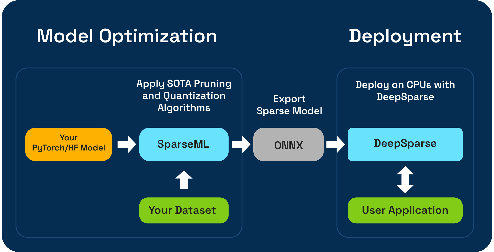

<!--
Copyright (c) 2021 - present / Neuralmagic, Inc. All Rights Reserved.

Licensed under the Apache License, Version 2.0 (the "License");
you may not use this file except in compliance with the License.
You may obtain a copy of the License at

   http://www.apache.org/licenses/LICENSE-2.0

Unless required by applicable law or agreed to in writing,
software distributed under the License is distributed on an "AS IS" BASIS,
WITHOUT WARRANTIES OR CONDITIONS OF ANY KIND, either express or implied.
See the License for the specific language governing permissions and
limitations under the License.
-->


<div style="display: flex; flex-direction: column; align-items: center;">
  <h1>
    
    &nbsp;&nbsp;DeepSparse
  </h1>
  <h4> An inference runtime offering GPU-class performance on CPUs and APIs to integrate ML into your application</h4>
  <div align="center">
    <a href="https://docs.neuralmagic.com/deepsparse/">
      
    </a>
    <a href="https://join.slack.com/t/discuss-neuralmagic/shared_invite/zt-q1a1cnvo-YBoICSIw3L1dmQpjBeDurQ/">
      
    </a>
    <a href="https://github.com/neuralmagic/deepsparse/issues/">
      
    </a>
    <a href="https://github.com/neuralmagic/deepsparse/actions/workflows/quality-check.yaml">
      
    </a>
    <a href="https://github.com/neuralmagic/deepsparse/releases">
      
    </a>
    <a href="https://github.com/neuralmagic/deepsparse/blob/main/CODE_OF_CONDUCT.md">
      
    </a>
    <a href="https://www.youtube.com/channel/UCo8dO_WMGYbWCRnj_Dxr4EA">
      
    </a>
    <a href="https://medium.com/limitlessai">
      
    </a>
    <a href="https://twitter.com/neuralmagic">
      
    </a>
  </div>
</div>


DeepSparse is a CPU inference runtime that takes advantage of sparsity within neural networks to execute inference quickly. Coupled with SparseML, an open-source optimization library, DeepSparse enables you to achieve GPU-class performance on commodity hardware.

<p align="center">
   
</p>

For details of training an inference-optimized sparse model for deployment with DeepSparse, [check out SparseML](https://github.com/neuralmagic/sparseml).

## Installation

DeepSparse is available in two editions: 
1. DeepSparse Community is free for evaluation, research, and non-production use with our [DeepSparse Community License](https://neuralmagic.com/legal/engine-license-agreement/).
2. DeepSparse Enterprise requires a [trial license](https://neuralmagic.com/deepsparse-free-trial/) or [can be fully licensed](https://neuralmagic.com/legal/master-software-license-and-service-agreement/) for production, commercial applications.

#### Install via Docker (Recommended)

DeepSparse Community is available as a container image hosted on [GitHub container registry](https://github.com/neuralmagic/deepsparse/pkgs/container/deepsparse).

```bash
docker pull ghcr.io/neuralmagic/deepsparse:1.4.2
docker tag ghcr.io/neuralmagic/deepsparse:1.4.2 deepsparse-docker
docker run -it deepsparse-docker
```

- [Checkout the Docker page](docker/) for more details.

#### Install via PyPI
DeepSparse Community is also available via PyPI. We recommend using a virtual enviornment.

```bash
pip install deepsparse
```

[Check out the Installation page](docs/user-guide/installation.md) for optional dependencies.

## Hardware Support and System Requirements

[Supported Hardware for DeepSparse](docs/user-guide/hardware-support.md)

DeepSparse is tested on Python versions 3.7-3.10, ONNX versions 1.5.0-1.12.0, ONNX opset version 11 or higher, and manylinux compliant systems. Please note that DeepSparse is only supported natively on Linux. For those using Mac or Windows, running Linux in a Docker or virtual machine is necessary to use DeepSparse.

## Benchmarking Performance

DeepSparse's key feature is its performance on commodity CPUs. 

For dense unoptimized models, DeepSparse is competitive with other CPU runtimes like ONNX Runtime. However, when optimization techniques like pruning and quantization are applied to a model, DeepSparse can achieve a significant speedup.

As an example, let's compare DeepSparse's performance on ONNX Runtime on BERT using a 90% pruned and quantized version hosted in [SparseZoo](https://sparsezoo.neuralmagic.com/models/nlp%2Fsentiment_analysis%2Fobert-base%2Fpytorch%2Fhuggingface%2Fsst2%2Fpruned90_quant-none) on an AWS `c6i.2xlarge` instance (4 cores) using the [benchmarking script](docs/user-guide/deepsparse-benchmarking.md).

#### ORT Baseline

Make sure you have ONNX Runtime Installed (`pip install onnxruntime`).

We can see ORT achieves 4.6 items/sec on BERT:

```bash
deepsparse.benchmark \
   zoo:nlp/sentiment_analysis/obert-base/pytorch/huggingface/sst2/base-none \
   -b 64 -i [64,384] -e onnxruntime

> Original Model Path: zoo:nlp/sentiment_analysis/obert-base/pytorch/huggingface/sst2/base-none
> Batch Size: 64
> Scenario: sync
> Throughput (items/sec): 4.6343 
```

#### DeepSparse Speedup

DeepSparse achieves 27.5 items/sec running the pruned-quantized version of BERT. ***This is a 6x speedup***!

```bash
deepsparse.benchmark \
   zoo:nlp/sentiment_analysis/obert-base/pytorch/huggingface/sst2/pruned90_quant-none \
   -b 64 -i [64,384] -e deepsparse

> Original Model Path: zoo:nlp/sentiment_analysis/obert-base/pytorch/huggingface/sst2/pruned90_quant-none
> Batch Size: 64
> Scenario: sync
> Throughput (items/sec): 27.5325 
```

Checkout the [Benchmarking User Guide](docs/user-guide/deepsparse-benchmarking.md) for more usage details.

## Deployment APIs

DeepSparse includes three deployment APIs:

- **Engine** is the lowest-level API. With Engine, you pass tensors and receive the raw logits.
- **Pipeline** wraps the Engine with pre- and post-processing. With Pipeline, you pass raw data and receive the prediction.
- **Server** wraps Pipelines with a REST API using FastAPI. With Server, you send raw data over HTTP and receive the prediction.

### Engine

The example below downloads a 90% pruned-quantized BERT model for sentiment analysis in ONNX format from SparseZoo, compiles the model, and runs inference on randomly generated input.

```python
from deepsparse import Engine
from deepsparse.utils import generate_random_inputs, model_to_path

# download onnx, compile
zoo_stub = "zoo:nlp/sentiment_analysis/obert-base/pytorch/huggingface/sst2/pruned90_quant-none"
batch_size = 1
compiled_model = Engine(model=zoo_stub, batch_size=batch_size)

# run inference (input is raw numpy tensors, output is raw scores)
inputs = generate_random_inputs(model_to_path(zoo_stub), batch_size)
output = compiled_model(inputs)
print(output)

# > [array([[-0.3380675 ,  0.09602544]], dtype=float32)] << raw scores
```

### DeepSparse Pipelines

Pipeline is the default API for interacting with DeepSparse. Similar to Hugging Face Pipelines, DeepSparse Pipelines wrap Engine with pre- and post-processing (as well as other utilities), enabling you to send raw data to DeepSparse and receive the post-processed prediction.

The example below downloads a 90% pruned-quantized BERT model for sentiment analysis in ONNX format from SparseZoo, sets up a pipeline, and runs inference on sample data.

```python
from deepsparse import Pipeline

# download onnx, set up pipeline
zoo_stub = "zoo:nlp/sentiment_analysis/obert-base/pytorch/huggingface/sst2/pruned90_quant-none"  
sentiment_analysis_pipeline = Pipeline.create(
  task="sentiment-analysis",    # name of the task
  model_path=zoo_stub,          # zoo stub or path to local onnx file
)

# run inference (input is a sentence, output is the prediction)
prediction = sentiment_analysis_pipeline("I love using DeepSparse Pipelines")
print(prediction)
# > labels=['positive'] scores=[0.9954759478569031]
```

#### Additional Resources 
- Checkout the [Use Cases Page](docs/use-cases) for more details on supported tasks.
- Checkout the [Pipelines User Guide](docs/user-guide/deepsparse-pipelines.md) for more usage details.

### DeepSparse Server

Server wraps Pipelines with REST APIs, enabling you to stand up model serving endpoint running DeepSparse. This enables you to send raw data to DeepSparse over HTTP and receive the post-processed predictions.

DeepSparse Server is launched from the command line, configured via arguments or a server configuration file. The following downloads a 90% pruned-quantized BERT model for sentiment analysis in ONNX format from SparseZoo and launches a sentiment analysis endpoint:

```bash
deepsparse.server \
  --task sentiment-analysis \
  --model_path zoo:nlp/sentiment_analysis/obert-base/pytorch/huggingface/sst2/pruned90_quant-none
```

Sending a request:

```python
import requests

url = "http://localhost:5543/predict" # Server's port default to 5543
obj = {"sequences": "Snorlax loves my Tesla!"}

response = requests.post(url, json=obj)
print(response.text)
# {"labels":["positive"],"scores":[0.9965094327926636]}
```

#### Additional Resources 
- Checkout the [Use Cases Page](docs/use-cases) for more details on supported tasks.
- Checkout the [Server User Guide](docs/user-guide/deepsparse-server.md) for more usage details.

## ONNX

DeepSparse accepts models in the ONNX format. ONNX models can be passed in one of two ways:

- **SparseZoo Stub**: [SparseZoo](https://sparsezoo.neuralmagic.com/) is an open-source repository of sparse models available for download. The examples on this page used this pathway.

- **Local ONNX File**: Users can provide their own ONNX models, whether dense or sparse. For example:

```bash
wget https://github.com/onnx/models/raw/main/vision/classification/mobilenet/model/mobilenetv2-7.onnx
```

```python
from deepsparse import Engine
from deepsparse.utils import generate_random_inputs
onnx_filepath = "mobilenetv2-7.onnx"
batch_size = 16

# Generate random sample input
inputs = generate_random_inputs(onnx_filepath, batch_size)

# Compile and run
compiled_model = Engine(model=onnx_filepath, batch_size=batch_size)
outputs = compiled_model(inputs)
print(outputs[0].shape)
# (16, 1000) << batch, num_classes
```

## Inference Models

DeepSparse offers different inference scenarios based on your use case.

**Single-stream** scheduling: the latency/synchronous scenario, requests execute serially. [`default`]


It's highly optimized for minimum per-request latency, using all of the system's resources provided to it on every request it gets.

**Multi-stream** scheduling: the throughput/asynchronous scenario, requests execute in parallel.


The most common use cases for the multi-stream scheduler are where parallelism is low with respect to core count, and where requests need to be made asynchronously without time to batch them.

[Check out the Scheduler User Guide](docs/user-guide/scheduler.md) for more details.

## Additional Resources
- [User Guide](docs/user-guide)
- [Use Cases](docs/use-cases)
- [Cloud Deployments and Demos](examples/)

#### Versions
- [DeepSparse](https://pypi.org/project/deepsparse) | stable
- [DeepSparse-Nightly](https://pypi.org/project/deepsparse-nightly/) | nightly (dev)
- [GitHub](https://github.com/neuralmagic/deepsparse/releases) | releases

#### Info
- [Blog](https://www.neuralmagic.com/blog/) 
- [Resources](https://www.neuralmagic.com/resources/)

## Community

### Be Part of the Future... And the Future is Sparse!

Contribute with code, examples, integrations, and documentation as well as bug reports and feature requests! [Learn how here.](https://github.com/neuralmagic/deepsparse/blob/main/CONTRIBUTING.md)

For user help or questions about DeepSparse, sign up or log in to our **[Deep Sparse Community Slack](https://join.slack.com/t/discuss-neuralmagic/shared_invite/zt-q1a1cnvo-YBoICSIw3L1dmQpjBeDurQ)**. We are growing the community member by member and happy to see you there. Bugs, feature requests, or additional questions can also be posted to our [GitHub Issue Queue.](https://github.com/neuralmagic/deepsparse/issues) You can get the latest news, webinar and event invites, research papers, and other ML Performance tidbits by [subscribing](https://neuralmagic.com/subscribe/) to the Neural Magic community.

For more general questions about Neural Magic, complete this [form.](http://neuralmagic.com/contact/)

### License

[DeepSparse Community](https://docs.neuralmagic.com/products/deepsparse) is licensed under the [Neural Magic DeepSparse Community License.](https://github.com/neuralmagic/deepsparse/blob/main/LICENSE-NEURALMAGIC)
Some source code, example files, and scripts included in the deepsparse GitHub repository or directory are licensed under the [Apache License Version 2.0](https://github.com/neuralmagic/deepsparse/blob/main/LICENSE) as noted.

[DeepSparse Enterprise](https://docs.neuralmagic.com/products/deepsparse-ent) requires a Trial License or [can be fully licensed](https://neuralmagic.com/legal/master-software-license-and-service-agreement/) for production, commercial applications.

### Cite

Find this project useful in your research or other communications? Please consider citing:

```bibtex
@InProceedings{
    pmlr-v119-kurtz20a, 
    title = {Inducing and Exploiting Activation Sparsity for Fast Inference on Deep Neural Networks}, 
    author = {Kurtz, Mark and Kopinsky, Justin and Gelashvili, Rati and Matveev, Alexander and Carr, John and Goin, Michael and Leiserson, William and Moore, Sage and Nell, Bill and Shavit, Nir and Alistarh, Dan}, 
    booktitle = {Proceedings of the 37th International Conference on Machine Learning}, 
    pages = {5533--5543}, 
    year = {2020}, 
    editor = {Hal Daumé III and Aarti Singh}, 
    volume = {119}, 
    series = {Proceedings of Machine Learning Research}, 
    address = {Virtual}, 
    month = {13--18 Jul}, 
    publisher = {PMLR}, 
    pdf = {http://proceedings.mlr.press/v119/kurtz20a/kurtz20a.pdf},
    url = {http://proceedings.mlr.press/v119/kurtz20a.html}
}

@article{DBLP:journals/corr/abs-2111-13445,
  author    = {Eugenia Iofinova and
               Alexandra Peste and
               Mark Kurtz and
               Dan Alistarh},
  title     = {How Well Do Sparse Imagenet Models Transfer?},
  journal   = {CoRR},
  volume    = {abs/2111.13445},
  year      = {2021},
  url       = {https://arxiv.org/abs/2111.13445},
  eprinttype = {arXiv},
  eprint    = {2111.13445},
  timestamp = {Wed, 01 Dec 2021 15:16:43 +0100},
  biburl    = {https://dblp.org/rec/journals/corr/abs-2111-13445.bib},
  bibsource = {dblp computer science bibliography, https://dblp.org}
}
```
