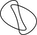

#  DeepSparse Engine

### CPU inference engine that delivers unprecedented performance for sparse models

<p>
    <a href="https://github.com/neuralmagic/comingsoon/blob/master/LICENSE">
        
    </a>
    <a href="https://docs.neuralmagic.com/deepsparse/">
        
    </a>
    <a href="https://github.com/neuralmagic/deepsparse/releases">
        
    </a>
    <a href="https://github.com/neuralmagic.com/comingsoon/blob/master/CODE_OF_CONDUCT.md">
        
    </a>
     <a href="https://www.youtube.com/channel/UCo8dO_WMGYbWCRnj_Dxr4EA">
        
    </a>
     <a href="https://medium.com/limitlessai">
        
    </a>
    <a href="https://twitter.com/neuralmagic">
        
    </a>
 </p>

## Overview

The DeepSparse Engine is a CPU runtime that delivers unprecedented performance by taking advantage of natural sparsity within neural networks to reduce compute required as well as accelerate memory bound processes.

This package includes a CPU inference engine, ONNX tooling, and model server if needed. It is focused on model deployment and scaling machine learning pipelines, fitting seamlessly into your existing deployment processes.

## Quick Tour


To expedite inference and benchmarking on real models, we include the `sparsezoo` package. SparseZoo hosts dense and sparse models, trained on repeatable optimization recipes.

Here is how to quickly perform inference with DeepSparse Engine on a pre-trained dense MobileNetV1 from SparseZoo.

```python
from deepsparse import compile_model
from sparsezoo.models import classification
​
# Download model and compile as optimized executable for your machine
model = classification.mobilenet_v1()
engine = compile_model(model)
​
# Fetch sample input and predict output using engine
inputs = model.data_inputs.sample_batch()
outputs = engine.run(inputs)
```

For a more in-depth read on available APIs and workflows, check out the [examples](examples/) and [DeepSparse Engine documentation](https://docs.neuralmagic.com/deepsparse/).


## Installation

This repository is tested on Python 3.6+, and ONNX 1.5.0+. It is recommended to install in a [virtual environment](https://docs.python.org/3/library/venv.html) to keep your system in order.

Install with pip using:

```bash
pip install deepsparse
```

Then if you want to explore the [examples](examples/), clone the repository and any install additional dependencies found in example folders.

## Algorithm Support

The DeepSparse Engine is validated to work on x86 Intel and AMD CPUs running Linux operating systems.

It is recommended to run on a CPU with AVX512 instructions available for optimal algorithms to be enabled. 

Here is a table detailing specific support for some algorithms over different microarchitectures:

|   x86 Extension   |          Microarchitectures         | Activation Sparsity | Kernel Sparsity | Sparse Quantization |
|:-----------------:|:-----------------------------------:|:-------------------:|:---------------:|:-------------------:|
|      AMD AVX2     |             Zen 2, Zen 3            |    not supported    |    optimized    |    not supported    |
|     Intel AVX2    |          Haswell, Broadwell         |    not supported    |    optimized    |    not supported    |
|    Intel AVX512   |         Skylake, Cannon Lake        |      optimized      |    optimized    |       emulated      |
| Intel AVX512-VNNI | Cascade Lake, Ice Lake, Cooper Lake |      optimized      |    optimized    |      optimized      |

## Notebooks

For some step-by-step examples, we have [notebooks](notebooks/) showing how to compile models with the DeepSparse Engine, check the predictions for accuracy, and benchmark them on your hardware.
  
## Available Models and Recipes

A number of pre-trained baseline and recalibrated models models in the [SparseZoo](https://docs.neuralmagic.com/sparsezoo/) can be used with the engine for higher performance. The types available for each model architecture are noted in its [SparseZoo model repository listing](https://docs.neuralmagic.com/sparsezoo/available-models).

## Resources and Learning More

- DeepSparse Engine [Documentation](https://docs.neuralmagic.com/deepsparse/), [Notebooks](notebooks/), [Examples](examples/)
- APIs to Invoke and Run the DeepSparse Engine
- Passing a Model to the Deep Sparse Engine and Deploying
- Debugging and Optimizing Performance
- [SparseML Documentation](https://docs.neuralmagic.com/sparseml/)
- [Sparsify Documentation](https://docs.neuralmagic.com/sparsify/)
- [SparseZoo Documentation](https://docs.neuralmagic.com/sparsezoo/)
- Neural Magic [Blog](https://www.neuralmagic.com/blog/), [Resources](https://www.neuralmagic.com/resources/), [Website](https://www.neuralmagic.com/)

## Contributing

We appreciate contributions to the code, examples, and documentation as well as bug reports and feature requests! [Learn how here](CONTRIBUTING.md).

## Join the Community

For user help or questions about the DeepSparse Engine, use our [GitHub Discussions](https://www.github.com/neuralmagic/deepsparse/discussions/). Everyone is welcome!

You can get the latest news, webinar and event invites, research papers, and other ML Performance tidbits by [subscribing](https://neuralmagic.com/subscribe/) to the Neural Magic community.

For more general questions about Neural Magic, please email us at [learnmore@neuralmagic.com](mailto:learnmore@neuralmagic.com) or fill out this [form](http://neuralmagic.com/contact/).

## License

The project's binary containing the DeepSparse Engine is licensed under the [Neural Magic Engine License 1.0](LICENSE-NEURALMAGIC). 

Example files and scripts included in this repository are licensed under the [Apache License Version 2.0](LICENSE) as noted.

## Release History

[Track this project via GitHub Releases.](https://github.com/neuralmagic/deepsparse/releases/)

## Citation

Find this project useful in your research or other communications? Please consider citing our [paper](http://proceedings.mlr.press/v119/kurtz20a.html):

```bibtex
@inproceedings{pmlr-v119-kurtz20a, 
    title = {Inducing and Exploiting Activation Sparsity for Fast Inference on Deep Neural Networks}, 
    author = {Kurtz, Mark and Kopinsky, Justin and Gelashvili, Rati and Matveev, Alexander and Carr, John and Goin, Michael and Leiserson, William and Moore, Sage and Nell, Bill and Shavit, Nir and Alistarh, Dan}, 
    booktitle = {Proceedings of the 37th International Conference on Machine Learning}, 
    pages = {5533--5543}, 
    year = {2020}, 
    editor = {Hal Daumé III and Aarti Singh}, 
    volume = {119}, 
    series = {Proceedings of Machine Learning Research},
    address = {Virtual}, 
    month = {13--18 Jul}, 
    publisher = {PMLR}, 
    pdf = {http://proceedings.mlr.press/v119/kurtz20a/kurtz20a.pdf},, 
    url = {http://proceedings.mlr.press/v119/kurtz20a.html}, 
    abstract = {Optimizing convolutional neural networks for fast inference has recently become an extremely active area of research. One of the go-to solutions in this context is weight pruning, which aims to reduce computational and memory footprint by removing large subsets of the connections in a neural network. Surprisingly, much less attention has been given to exploiting sparsity in the activation maps, which tend to be naturally sparse in many settings thanks to the structure of rectified linear (ReLU) activation functions. In this paper, we present an in-depth analysis of methods for maximizing the sparsity of the activations in a trained neural network, and show that, when coupled with an efficient sparse-input convolution algorithm, we can leverage this sparsity for significant performance gains. To induce highly sparse activation maps without accuracy loss, we introduce a new regularization technique, coupled with a new threshold-based sparsification method based on a parameterized activation function called Forced-Activation-Threshold Rectified Linear Unit (FATReLU). We examine the impact of our methods on popular image classification models, showing that most architectures can adapt to significantly sparser activation maps without any accuracy loss. Our second contribution is showing that these these compression gains can be translated into inference speedups: we provide a new algorithm to enable fast convolution operations over networks with sparse activations, and show that it can enable significant speedups for end-to-end inference on a range of popular models on the large-scale ImageNet image classification task on modern Intel CPUs, with little or no retraining cost.} 
}
```
