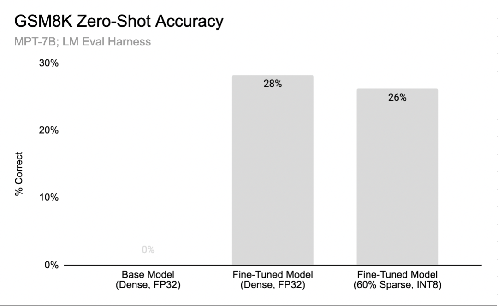
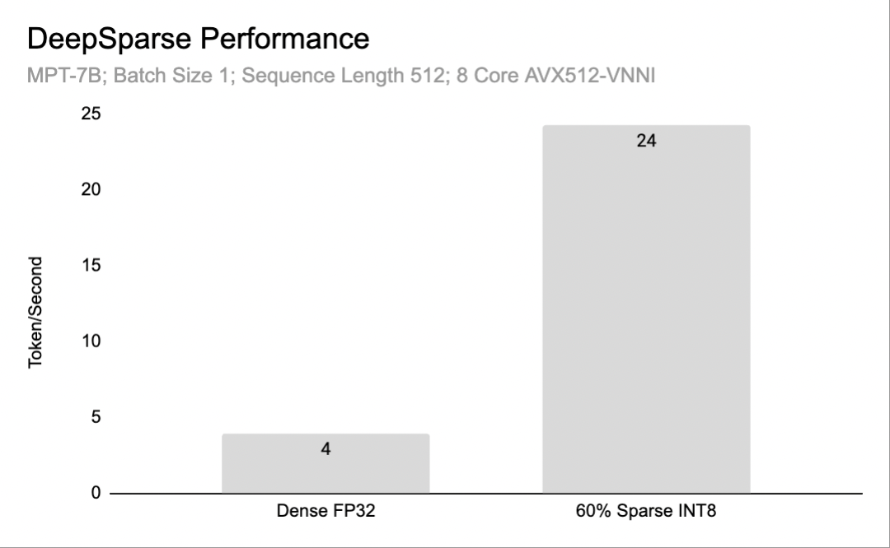

# **DeepSparse LLMs**

DeepSparse has support for performance inference of sparse large language models, starting with Mosaic's MPT. 

In this overview, we will discuss:
1. [The current status of our sparse fine-tuning research](#sparse-fine-tuning-research)
2. [Our LLM roadmap](#our-llm-roadmap)
3. [How to try text generation with DeepSparse](#try-it-now)

For detailed usage instructions, [see the text generation user guide](text-generation-pipeline.md).

## **Sparse Fine Tuning Research**

Sparsity is a powerful model compression technique, where weights are removed from the network with limited accuracy drop. 

Currently, we can prune a fine-tuned version of [MPT-7B](https://huggingface.co/mosaicml/mpt-7b) to ~60% sparsity with INT8 quantization with limitied accuracy drop using a technique called **Sparse Fine Tuning**, where we prune the network during the fine-tuning process.

> ***Note***: We currently can induce sparsity during domain adaptation fine-tuning only. Sparsifying a model that performs well on general tasks like [OpenLLM Leaderboard](https://huggingface.co/spaces/HuggingFaceH4/open_llm_leaderboard) is an area of active research.

### **Sparse Fine Tuning on Grade-School Math (GSM)**

Open-source LLMs are typically fine-tuned onto downstream datasets for two reasons:
* **Instruction Tuning**: show the LLM examples of how to respond to human input or prompts properly
* **Domain Adaptation**: show the LLM examples with information it does not currently understand

An example of how domain adaptation is helpful is solving the [Grade-school math (GSM) dataset](https://huggingface.co/datasets/gsm8k). 

GSM is a set of grade school word problems and a notoriously difficult task for LLMs, as evidenced by the 0% zero-shot accuracy of MPT-7B-base. By fine-tuning with a very small set of ~7k training examples, however, we can boost the model's accuracy on the test set to (--- UPDATE: xxx ---), demonstrating the power of fine-tuning to improve the models's quality!

The key insight from our paper is that we can prune the network during the fine-tuning process! We apply [SparseGPTm](https://arxiv.org/pdf/2301.00774.pdf) after fine-tuning and retrain for one extra epoch. The result is a 60% sparse-quantized model with limited accuracy drop on GSM:

<p align="center">
  
</p>

In DeepSparse, the 60% sparse-quantized model runs (--- UPDATE: xxx ---) faster than the dense baseline:

<p align="center">
  
</p>

### **How Is This Useful For Real World Use?**

While GSM is a toy dataset, it serves as an example of how LLMs can be adapted with a relatively small dataset to solve tasks which the general pretrained model cannot. Given the treasure-troves of domain-specific data held by companies, we expect to see many production models fine-tuned to enable more accurate, smaller models fit to business tasks. Using Neural Magic, you can deploy these fine-tuned models performantly on CPUs!

> **Note**: The code for sparse fine tuning with your data will be pushed publically in the coming weeks

## Our LLM Roadmap

We are investing to expand our offering, including:

* **Productizing Sparse Fine Tuning**: Enable external users to apply the sparse fine-tuning to business datasets
* **Supporting Llama2**: Apply sparse fine-tuning results to Llama2 model
* **Pushing to Higher Sparsity**: Improving our pruning algorithms to reach higher sparsity
* **Building General Sparse Model**: Create sparse model that can perform well on general tasks like OpenLLM leaderboard

## Try It Now

The following examples demonstrate how to use the MPT models on DeepSparse. [Checkout the user guide on `TextGeneration`](text-generation-pipeline.md) for detailed usage instructions.

Make sure you have the nightly build of DeepSparse installed:

```bash
pip install deepsparse-nightly[transformers]
```

### MPT-7B on GSM 

We can run inference on the 60% sparse-quantized MPT-7B GSM model ([available in SparseZoo](https://sparsezoo.neuralmagic.com/models/mpt-7b-gsm8k_mpt_pretrain-pruned60_quantized)) using DeepSparse's `TextGeneration` Pipeline:

```python
from deepsparse import TextGeneration

MODEL_PATH = "zoo:nlg/text_generation/mpt-7b/pytorch/huggingface/gsm8k/pruned60_quant-none"
pipeline = TextGeneration(model_path=MODEL_PATH)

prompt = "Natalia sold clips to 48 of her friends in April, and then she sold half as many clips in May. How many clips did Natalia sell altogether in April and May"
output = pipeline(prompt=prompt)
print(output.generations[0].text)

### >> Natalia sold 48/2 = <<48/2=24>>24 clips in May.
### >> Natalia sold 48 + 24 = <<48+24=72>>72 clips altogether in April and May.
### >> #### 72
```

### **MPT-7B on Dolly-HHRLHF**

We have also made a 50% sparse-quantized MPT-7B fine-tuned on the [Dolly-hhrlhf](https://huggingface.co/datasets/mosaicml/dolly_hhrlhf) instruction tuning dataset [available on SparseZoo](zoo:nlg/text_generation/mpt-7b/pytorch/huggingface/dolly/pruned50_quant-none).

> ***Note: The sparse Dolly model drops accuracy on OpenLLM leaderboard. It is meant as a demonstration.***

We can run inference on these models with the following:
```python
from deepsparse import TextGeneration

MODEL_PATH = "zoo:nlg/text_generation/mpt-7b/pytorch/huggingface/dolly/pruned50_quant-none"
pipeline = TextGeneration(model_path=MODEL_PATH)

prompt = "Below is an instruction that describes a task. Write a response that appropriately completes the request. ### Instruction: what is Kubernetes? ### Response:"
output = pipeline(prompt=prompt)
print(output.generations[0].text)

### >> Kubernetes is an open-source container orchestration system for automating deployment, scaling, and management of containerized applications.
```

## **Feedback / Roadmap Requests**

We are excited to add initial support for LLMs in the Neural Magic stack and plan to bring many ongoing improvements over the coming months. For questions or requests regarding LLMs, please reach out in any of the following channels:
- [Neural Magic Community Slack](https://join.slack.com/t/discuss-neuralmagic/shared_invite/zt-q1a1cnvo-YBoICSIw3L1dmQpjBeDurQ)
- [GitHub Issue Queue](https://github.com/neuralmagic/deepsparse/issues)
- [Contact Form](http://neuralmagic.com/contact/)
