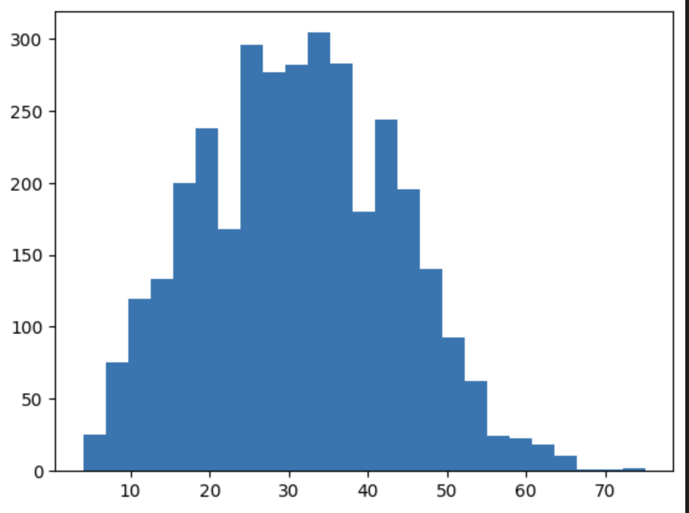

<!--
Copyright (c) 2021 - present / Neuralmagic, Inc. All Rights Reserved.

Licensed under the Apache License, Version 2.0 (the "License");
you may not use this file except in compliance with the License.
You may obtain a copy of the License at

   http://www.apache.org/licenses/LICENSE-2.0

Unless required by applicable law or agreed to in writing,
software distributed under the License is distributed on an "AS IS" BASIS,
WITHOUT WARRANTIES OR CONDITIONS OF ANY KIND, either express or implied.
See the License for the specific language governing permissions and
limitations under the License.
-->
# How to Use Bucketing With DeepSparse 
DeepSparse supports bucketing to lower latency and increase the throughput of deep learning pipelines. Bucketing sequences of different sizes increases inference speed.

Input lengths in NLP problems can vary. We usually select the maximum length where sentences longer that the maximum length are truncated and shorter ones are padded to reach the maximum length. This solution can be inefficient for real-wrld application leading to more memory utilization.  

Bucketing is a solution that places sequences of varying lengths in different buckets. It is more efficient because it reduces the amount of padding required. 

In this document, we will explore how to use bucketing with DeepSparse. 

## How Bucketing Works in DeepSparse 
DeepSparse handles bucketing natively to reduce the time you would otherwise spend building this preprocessing pipeline. Bucketing with DeepSparse leads to a performance boost compared to a pipeline without bucketing. When buckets are provided, DeepSparse will create different models for the provided input sizes.

For example, if your input data length ranges from 157 to 4063, with 700 being the median and you are using a model like BERT, whose maximum token length is 512, you can use these input shapes [256,320,384,448, 512]. This means that all tokens shorter than 256 will be padded to 256, while any tokens longer than 512 will be truncated to 512. Tokens longer than 256 will be padded to 320, and so on. 

At inference, each input is sent to the corresponding bucketed model. In this case, you’d have 5 models because you have defined 5 buckets. Bucketing reduces the amount of compute because you are no longer padding all the sequences to the maximum length in the dataset. You can decide on the bucket sizes by examining the distribution of the dataset and experimenting with different sizes. The best choice is the one that covers all the inputs in the range of the dataset. 

## Bucketing NLP Models with DeepSparse 
DeepSparse makes it easy to set up bucketing. You pass the desired bucket sizes, and DeepSparse will automatically set up the buckets. You can determine the optimal size of the buckets by analyzing the lengths of the input data and selecting buckets where most of the data lies. 

For example, here's the distribution of the [wnut_17](https://huggingface.co/datasets/wnut_17) dataset: 

Visualizing the data distribution enables you to choose the best bucket sizes to use. 

Define a token classification pipeline that uses no buckets, later you will compare it performance with one that uses buckets. The `deployment` folder contains the model configuration files for a token classification model obtained by:
```bash 
sparsezoo.download zoo:nlp/token_classification/bert-large/pytorch/huggingface/conll2003/base-none --save-dir ./dense-model
```
The folder contains:
- `config.json`
- `model.onnx`
- `tokenizer.json`

```python
from deepsparse import Pipeline
import deepsparse.transformers
from datasets import load_dataset
from transformers import AutoTokenizer
from tqdm import tqdm
import time

def run(model_path, batch_size, buckets):
    ### SETUP DATASETS - in this case, we download WNUT_17
    print("Setting up the dataset:")
    
    INPUT_COL = "sentences"
    dataset = load_dataset("wnut_17", split="train")
    sentences = []
    for sentence in dataset["tokens"]:
        string = ""
        for elt in sentence:
            string += elt
            string += " "
        sentences.append(string)
    dataset = dataset.add_column(INPUT_COL, sentences)
    
    ### TOKENIZE DATASET - (used to comptue buckets)
    tokenizer = AutoTokenizer.from_pretrained(model_path)
    def pre_process_fn(examples):
        return tokenizer(examples[INPUT_COL], add_special_tokens=True, return_tensors="np",padding=False,truncation=False)

    dataset = dataset.map(pre_process_fn, batched=True)
    dataset = dataset.add_column("num_tokens", list(map(len, dataset["input_ids"])))
    dataset = dataset.sort("num_tokens")
    max_token_len = dataset[-1]["num_tokens"]
    
    ### SPLIT DATA INTO BATCHES
    num_pad_items = batch_size - (dataset.num_rows % batch_size)
    inputs = ([""] * num_pad_items) + dataset[INPUT_COL]
    batches = []
    for b_index_start in range(0, len(inputs), batch_size):
        batches.append(inputs[b_index_start:b_index_start+batch_size])
    
    ### RUN THROUPUT TESTING
    print("\nCompiling models:")
    
    # compile model with buckets
    buckets.append(max_token_len)
    ds_pipeline = Pipeline.create(
        "token_classification",
        model_path=model_path, 
        batch_size=batch_size,
        sequence_length=buckets,
        )

    print("\nRunning test:")
    
    # run inferences on the dataset
    start = time.perf_counter()
    
    predictions = []
    for batch in tqdm(batches): 
        predictions.append(ds_pipeline(batch))
    
    # flatten and remove padded predictions
    predictions = [pred for sublist in predictions for pred in sublist.predictions]
    predictions = predictions[num_pad_items:]
    end = time.perf_counter()
    
    # compute throughput
    total_time_executing = (end - start) * 1000.0 
    items_per_sec = len(predictions) / total_time_executing
    
    print(f"Items Per Second: {items_per_sec}")
    print(f"Program took: {total_time_executing} ms")

run("token_classification", 64, [])
# Items Per Second: 0.3089200801858338
# Program took: 10986.66036198847 ms
```

Run the same script with varying input lengths: 
```python
batch_size = 64
buckets = [15,35,55,75]
run("token_classification", batch_size, buckets)
# Items Per Second: 0.4650720926682699
# Program took: 7297.793295932934 ms
```
The pipeline using buckets achieves 1.5 more items per second compared to the one without. 
