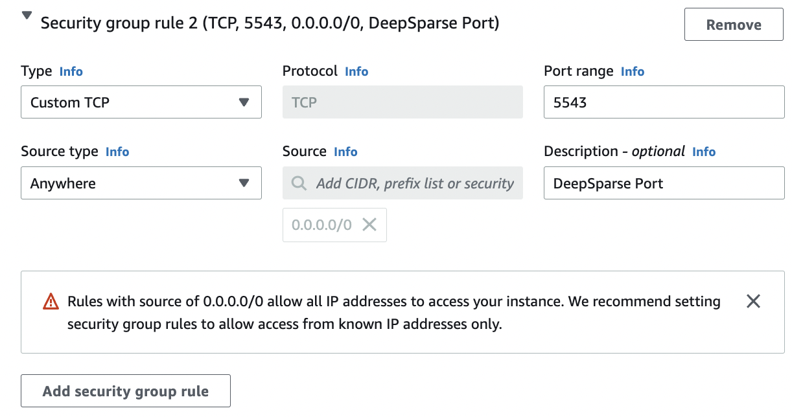
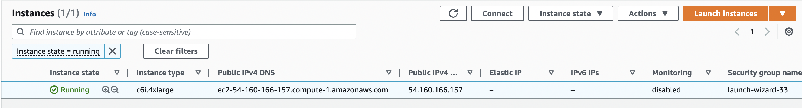

# **Getting Started with DeepSparse**

In this example, we will demonstrate how to benchmark and deploy a question answering model with a DeepSparse AMI.

## **Launch Your Instance**

To get started, [Sign in to the AWS Console](https://aws.amazon.com/console/), navigate to the EC2 dashboard, and select "Launch an instance."

- In the "Name and Tags" section, name your instance as desired.

- In the "Application and OS Images (Amazon Machine Image)" section, select the DeepSparse AMI.

- In the "Instance type" section, choose an x86 instance. We recommend the `c6i` family.

- In the "Key pair (login)" section, use an existing key or create a new key pair. You will need this key 
to SSH into the instance.

- In the "Network settings" section, click "Edit". At the bottom, click "Add security group rule."

- Add a security group rule with "Custom TCP" with "Source Type" equal to "Anywhere" and "Port" equal to 5543. DeepSparse Server will accept traffic on this port.

<p align="center">
    
</p>

- In the "Summary" section on the right-hand side, click "Launch Instance."

You should see a success message on your AWS console!

Open up a terminal and SSH into your instance, using your SSH key and the IPv4 address of your new instance. You can find your IPv4 address from the instances page.

<p align="center">
    
</p>

```
ssh -i path/to/your/sshkey.pem XXXXXX@your_ipv4_address
```

DeepSparse is installed on the AMI. You are ready to benchmark and deploy a model!

## **Benchmark Performance**

DeepSparse include a convienent benchmarking script to assess performance in a variety of scenarios.

As an example, let's take a look at throughput on a pruned-quantized version of BERT 
trained on SQuAD. DeepSparse is integrated with SparseZoo, an open source repository of 
sparse models, so we can use SparseZoo stubs to download an ONNX file for testing.

On an AWS `c6i.4xlarge` instance (8 cores), DeepSparse achieves >300 items/second at batch 64.

```bash
deepsparse.benchmark zoo:nlp/question_answering/bert-base/pytorch/huggingface/squad/pruned95_obs_quant-none -i [64,128] -b 64 -nstreams 1 -s sync

>> Original Model Path: zoo:nlp/question_answering/bert-base/pytorch/huggingface/squad/pruned95_obs_quant-none
>> Batch Size: 64
>> Scenario: sync
>> Throughput (items/sec): 323.7982
```

Run `deepsparse.benchmark --help` for full usage.

## **Deploy a Model**

DeepSparse offers two interfaces for deploying a model, a Python API called DeepSparse Pipelines and a REST API called DeepSparse Server. This gives you the flexibility to embed DeepSparse in an application or to deploy DeepSparse as a model service.

### **DeepSparse Pipelines**

DeepSparse Pipelines wrap model inference with task-specific pre- and post-processing. As a result, you can pass raw stings to a DeepSparse question answering pipeline and recieve the predicted answer, with tokenization and answer extraction handled for you.

Here's an example:
```python
from deepsparse import Pipeline

# downloads sparse BERT model from sparse zoo, compiles DeepSparse
qa_pipeline = Pipeline.create(
    task="question_answering", 
    model_path="zoo:nlp/question_answering/bert-base/pytorch/huggingface/squad/pruned95_obs_quant-none")

# run inference
prediction = qa_pipeline(
    question="What is my name?", 
    context="My name is Snorlax")
print(prediction)
# >> score=19.847949981689453 answer='Snorlax' start=11 end=18
```

### **DeepSparse Server**

DeepSparse Server wraps Pipelines with the FastAPI web framework and Uvicorn
web server, making it easy to stand up a model service running DeepSparse.
Since the Server is a wrapper around Pipelines, you can send raw input
to the DeepSparse endpoint and recieve the post-processed answers.

The Server is configured with YAML. The following creates a question-answering endpoint with a sparsified
BERT from [SparseZoo](https://sparsezoo.neuralmagic.com/models/nlp%2Fquestion_answering%2Fbert-base%2Fpytorch%2Fhuggingface%2Fsquad%2Fpruned95_obs_quant-none).

```yaml
loggers:
  python:

endpoints:
  - task: question_answering
    model: zoo:nlp/question_answering/bert-base/pytorch/huggingface/squad/pruned95_obs_quant-none
```

Download this config file and save it as `qa_server_config.yaml`
```
curl https://raw.githubusercontent.com/neuralmagic/deepsparse/rs/aws-ami-example/examples/aws-ami/qa_server_config.yaml > qa_server_config.yaml
```

Launch the server from the CLI. You should see Uvicorn running at port 5543.
```
deepsparse.server --config-file qa_server_config.yaml

>> Uvicorn running on http://0.0.0.0:5543 (Press CTRL+C to quit)
```

Recall that we configured the instance to expose port 5543 on your AWS instance to recieve internet traffic. As such, we can send a request to the model endpoint over the web. From your local machine, run the following, filling in the public IPv4 address of your instance.

```python
import requests

# fill in your IP address
ip_address = "YOUR_INSTANCE_PUBLIC_IP" # (e.g. 54.160.166.157)
endpoint_url = f"http://{ip_address}:5543/predict"

# question answering request
obj = {
    "question": "Who is Mark?",
    "context": "Mark is batman."
}

# send HTTP request
response = requests.post(endpoint_url, json=obj)
print(response.text)

# > {"score":17.623973846435547,"answer":"batman","start":8,"end":14}
```

## **Next Steps**

Check out [Neural Magic's documentation](https://docs.neuralmagic.com/) for details on optimizing models for inference with SparseML and deploying with DeepSparse.