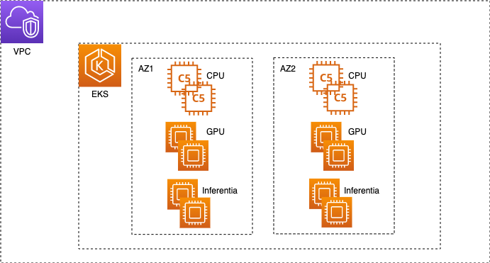

<!--
Copyright (c) 2021 - present / Neuralmagic, Inc. All Rights Reserved.

Licensed under the Apache License, Version 2.0 (the "License");
you may not use this file except in compliance with the License.
You may obtain a copy of the License at

   http://www.apache.org/licenses/LICENSE-2.0

Unless required by applicable law or agreed to in writing,
software distributed under the License is distributed on an "AS IS" BASIS,
WITHOUT WARRANTIES OR CONDITIONS OF ANY KIND, either express or implied.
See the License for the specific language governing permissions and
limitations under the License.
-->


# Run DeepSparse on Amazon EKS Clusters Using the [do-framework](https://bit.ly/do-framework)

<center> </br>

Fig. 1 - EKS cluster sample
</center>


## Overview

This example directory is a friendly fork of the [AWS-do-EKS](https://github.com/aws-samples/aws-do-eks) repository. It allows users to create an EKS cluster with the intention of running inference with DeepSparse. Additionally, files from the [AWS-do-Inference](https://github.com/aws-samples/aws-do-inference) repository are used for building, managing and deploying a Docker container running the DeepSparse Server in the EKS Cluster.

This deployment requires the following tools and libraries installed:

* The [AWS CLI](https://docs.aws.amazon.com/cli/latest/userguide/getting-started-install.html) version 2.X that is [configured](https://docs.aws.amazon.com/cli/latest/userguide/cli-configure-quickstart.html). The default region configured for this deployment is `us-east-1`.

* [Docker and the Docker CLI](https://docs.docker.com/get-docker/).

## Getting Started

```bash 
git clone https://github.com/neuralmagic/deepsparse.git
cd deepsparse/examples/aws-eks
```

## Build the EKS Cluster

1. Build an image that includes all necessary tools and scripts for creating and managing the EKS clusters:
`./build.sh`

2. Start container locally:
`./run.sh`

3. Open a bash shell in the container:
`./exec.sh`

4. In the bash shell, create the EKS Cluster on AWS:
`./eks-create.sh`

For more in-depth detail of each script and further configuration of the EKS cluster read the `Configure` section below.

## Deploy a Docker Container with the DeepSparse Server in the Cluster

After your EKS cluster is staged, which may take around ~40 minutes, in a seperate terminal shell, cd into `aws-do-inference` directory. Next, add your AWS **account ID** and **region** to the `registry` variable found in the `config.properties` file. 

To configure the DeepSparse model and task configuration, edit the following file: `/aws-do-inference/3-pack/server-config.yaml`

1. Build a base image with the `processor` of interest configured in the `config.properties` file. In this example, DeepSparse will run in the cluster behind a CPU `c5.2xlarge` instance:
`./build.sh`

2. Login to a private registry on AWS:
`./login.sh`

3. Aftewards, push the image to ECR:
`./build.sh push`

4. Build an image with the DeepSparse Server:
`./pack.sh`

5. Push image to ECR:
`./pack.sh push`

6. Deploy the container in the active EKS cluster:
`./deploy.sh`


In the open bash shell of your EKS Cluster, run the following command to see all of your running pods in the cluster:

`kubectl --namespace kube-system get pods`

To communicate with your cluster serving the DeepSparse Server from your local machine, first create a port forward:

`kubectl port-forward svc/pruned80-quant-none-vnni-cpu-0 8080:8080 -n kube-system`

Test the deployment by calling the DeepSparse Server to run sentiment analysis:

`curl -X POST http://localhost:8080/predict -H 'Content-Type: application/json' -d '{"sequences": "Snorlax loves my Tesla!"}'`

****

As described in the [Amazon EKS User Guide](https://docs.aws.amazon.com/eks/latest/userguide/create-cluster.html), creating an EKS cluster can be done using [eksctl](https://eksctl.io/usage/creating-and-managing-clusters/), the [AWS console](https://console.aws.amazon.com/eks/home#/clusters), or the [aws cli](https://docs.aws.amazon.com/cli/latest/userguide/cli-chap-install.html). There are also [other options](https://registry.terraform.io/modules/terraform-aws-modules/eks/aws/latest), however typically each tool has a learning curve and requires some proficiency.  
The Do framework strives to simplify DevOps and MLOps tasks by automating complex operations into intuitive action scripts. For example, instead of running an eksctl command with several command line arguments to create an EKS cluster, aws-do-eks provides an `eks-create.sh` script which wraps a collection of tools including eksctl and provides the end user with a simplified and intuitive experience. The only prerequisite needed to build and run this project is [Docker](https://docs.docker.com/get-docker/). The main use case of this project is to specify a desired cluster configuration, then create or manage the EKS cluster by executing a script. This process is described in further detail below.

## Configure
All necessary configuration items are centralized in two configuration files. The [`.env`](.env) file in the project's root contains all project-specific items and is used when building and running the project container. The [`wd/conf/eks.conf`](wd/conf/eks.conf) file contains all EKS specific configuration items and is used when running the action scripts to create, scale, or delete your EKS cluster. Heterogeneous clusters are supported. In `eks.conf` you can specify the list of nodegroups to be added to the cluster and at what scale. AWS Credentials can be configured at the instance level through an instance role or injected into the container that runs aws-do-eks using volume or secrets mounting. To configure credentials, run aws configure. Credentials you configure on the host will be mounted into the aws-do-eks container according to the VOL_MAP setting in `.env`.
Alternatively to [`eks.conf`](wd/conf/eks.conf) you may use a cluster manifest file [`wd/conf/eks.yaml`](wd/conf/eks.yaml). To use the manifest file instead of `eks.conf`, set the [`CONFIG` variable in eks.conf](/wd/conf/eks.conf#L16) to `yaml` instead of `conf`. The advantage of using a manifest file for defining the cluster is that it supports advanced options, which are not available through `eksctl`. For example, enabling of EFA networking is only supported via the manifest file. All supported options in the manifest are documented in the [`eks.yaml` schema](https://eksctl.io/usage/schema/).

## Build
This project follows the [Depend on Docker](https://github.com/iankoulski/depend-on-docker) template to build a container including all needed tools and utilities for creation and management of your EKS clusters. Please execute the [`./build.sh`](./build.sh) script to create the `aws-do-eks` container image. If desired, the image name or registry address can be modified in the project configuration file [`.env`](.env).

## Run
The [`./run.sh`](./run.sh) script starts the project container. After the container is started, use the [`./exec.sh`](./exec.sh) script to open a bash shell in the container. All necessary tools to allow creation, management, and operation of EKS are available in this shell. 

## EKS Create
Execute the [`./eks-create.sh`](Container-Root/eks/eks-create.sh) script to create the configured cluster. This operation will take a while as it involves creation of a VPC, Subnets, Autoscaling groups, the EKS cluster, its nodes and any other necessary resources. Upon successful completion of this process, your shell will be configured for `kubectl` access to the created EKS cluster. 

## EKS Status
To view the current status of the cluster execute the [`eks-status.sh`](Container-Root/eks/eks-status.sh) script. It will display the cluster information as well as details about any CPU, GPU, Inferentia nodegroups and fargate profiles in the cluster.

## EKS Scale
To set the sizes of your cluster node groups, update the [`eks.conf`](wd/conf/eks.conf) file, then run [`./eks-scale.sh`](Container-Root/eks/eks-scale.sh).

## EKS Delete
To decomission your cluster and remove all AWS resources associated with it, execute the [`./eks-delete.sh`](Container-Root/eks/eks-delete.sh) script. This is a destructive operation. If there is anything in your cluster that you need saved, please persist it outside of the cluster VPC before executing this script.

## Shell customiazations
When you open a shell into a running `aws-do-eks` container via `./exec.sh`, you will be able to execute `kubectl`, `aws`, and `eksctl` commands. There are other tools and shell customizations that are installed in the container for convenience.

### Tools and customizations
* [kubectx](https://github.com/ahmetb/kubectx) - show or set current Kubernetes context
* [kubens](https://github.com/ahmetb/kubectx) - show or set current namespace
* [kubetail](https://github.com/johanhaleby/kubetail/master/kubetail) - tail the logs of pods that have a name matching a specified pattern
* [kubectl-node-shell](https://github.com/kvaps/kubectl-node-shell) - open an interactive shell into a kubernetes node using a privileged mode (Do not use in production)
* [kubeps1](https://github.com/jonmosco/kube-ps1) - customize shell prompt with cluster info 

### Aliases
```
ll='ls -alh --color=auto'
k=kubectl
kc=kubectx
kn=kubens
kt=kubetail
ks=kube-shell
kon=kubeon
koff=kubeoff
```

## Other scripts

### Infrastructure
The [`eks`](Container-Root/eks) folder contains [`vpc`](Container-Root/eks/vpc), [`nodegroup`](Container-Root/eks/nodegroup), and [`fargateprofile`](Container-Root/eks/fargateprofile) subfolders. These subfolders contain module-level scripts that are used by the scripts in the main folder, however they can also be executed independently. To run one of those scripts independently, ensure that the environment variables tha are needed by the scripts are set before executing them. One way to do that is to source the eks.conf file. Running a module script individually will display information about any environment variables that are missing and could be defined with `export ENV_VAR=value`.

### Deployment
The [`deployment`](Container-Root/eks/deployment) folder contains scripts for deploying system-level capabilities like cluster-autoscaler, aws-load-balancer-controller, horizontal-pod-autoscaler, etc. to the EKS cluster. If you would like cluster-autoscaler deployed automatically when the cluster is created, set CLUSTER_AUTOSCALER_DEPLOY="true" in eks.conf. To deploy the cluster-autoscaler to an EKS cluster that has already been created, change your current directory to deployment/cluster-autoscaler, then execute [`./deploy-cluster-autoscaler.sh`](Container-Root/eks/deployment/cluster-autoscaler/deploy-cluster-autoscaler.sh). Follow a similar pattern for other deployments.

### Operations
The [`ops`](Container-Root/eks/ops) folder contains scripts for management and operation of workloads on the EKS cluster. The goal of these scripts is to provide shorthand for commonly used `kubectl` command lines. 

### Container
The project home folder offers a number of additional scripts for management of the aws-do-eks container.
* [`./login.sh`](./login.sh) - use the currently configured node aws settings to authenticate with the configured registry
* [`./push.sh`](./push.sh) - push aws-do-eks container image to configured registry
* [`./pull.sh`](./pull.sh) - pull aws-do-eks container image from a configured existing registry
* [`./status.sh`](./status.sh) - show current status of aws-do-eks container
* [`./start.sh`](./status.sh) - start the aws-do-eks container if is currently in "Exited" status
* [`./stop.sh`](./stop.sh) - stop and remove the aws-do-eks container
* [`./test.sh`](./test.sh) - run container unit tests

## Troubleshooting
* eksctl authentication errors - execute "aws configure --profile <profile_name>" and provide access key id and secret access key to configure access.
```
Create a new profile, different than default:
aws configure --profile <profile-name>

Update kubeconfig with profile::
aws eks update-kubeconfig --region <region> --name <cluster-name> --profile <profile-name>

Check that <profile-name> is in ~/.kube/config

user:
    exec:
      apiVersion: client.authentication.k8s.io/v1alpha1
      args:
      - --region
      - <region>
      - eks
      - get-token
      - --cluster-name
      - <cluster-name>
      command: aws
      env:
      - name: AWS_PROFILE
        value: <profile-name>
```

* timeouts from eksctl api - the cloudformation apis used by eksctl are throttled, normally eksctl will retry when a timeout occurs
* context deadline exceeded - when executing eksctl commands you may see this error message. In this case please retry running the same command after the failure occurs. The cloud formation stack may have completed successfully already, but that information may not be known to eksctl. Running the command again updates the status and checks if all necessary objects have been created. 

## Security

See [CONTRIBUTING](CONTRIBUTING.md#security-issue-notifications) for more information.

## License

This library is licensed under the MIT-0 License. See the [LICENSE](LICENSE) file.

## References

* [Docker](https://docker.com)
* [Kubernetes](https://kubernetes.io)
* [Amazon Web Services (AWS)](https://aws.amazon.com/)
* [Amazon EC2 Instance Types](https://aws.amazon.com/ec2/instance-types/)
* [Amazon Elastic Kubernetes Service (EKS)](https://aws.amazon.com/eks)
* [AWS Fargate](https://aws.amazon.com/fargate)
* [eksctl](https://docs.aws.amazon.com/eks/latest/userguide/eksctl.html)
* [eksctl yaml schema](https://eksctl.io/usage/schema/)
* [Depend on Docker Project](https://github.com/iankoulski/depend-on-docker)
