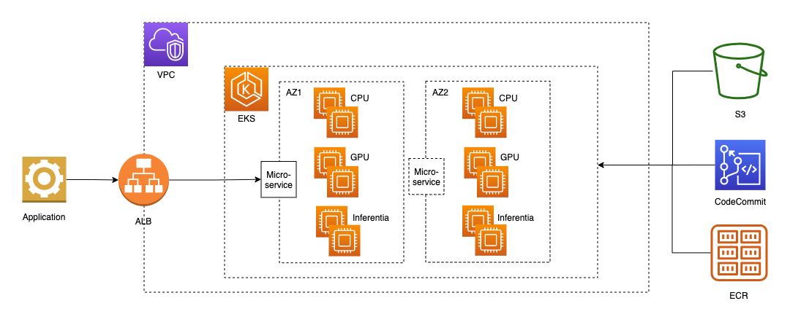

<!--
Copyright (c) 2021 - present / Neuralmagic, Inc. All Rights Reserved.

Licensed under the Apache License, Version 2.0 (the "License");
you may not use this file except in compliance with the License.
You may obtain a copy of the License at

   http://www.apache.org/licenses/LICENSE-2.0

Unless required by applicable law or agreed to in writing,
software distributed under the License is distributed on an "AS IS" BASIS,
WITHOUT WARRANTIES OR CONDITIONS OF ANY KIND, either express or implied.
See the License for the specific language governing permissions and
limitations under the License.
-->

## DeepSparse Server Deployment 
This directory is based on a fork from the [AWS-do-Inference](https://github.com/aws-samples/aws-do-inference) repository containing an end-to-end example for running model inference locally on Docker or at scale on EKS for running inference on CPUs.

For this deployment, we use a [Sparse DistilBERT](https://huggingface.co/distilbert-base-multilingual-cased) NLP model from the [SparseZoo](https://sparsezoo.neuralmagic.com/) trained for the sentiment analysis task, however the project structure and workflow is generic and can be adapted for use with other models and tasks.

<div align="center">

<br/>
Fig. 1 - Sample EKS infrastructure for inference workloads
</div>
<br/>

The control scripts run in any location that has access to the cluster API. To eliminate latency concern related to the cluster ingress, load tests run in a pod within the cluster and send requests to the models directly through the cluster pod network.

## Prerequisites
It is assumed that an [EKS cluster exists](https://github.com/aws-samples/aws-do-eks) and contains nodegroups of the desired target instance types.
In addition it is assumed that the following basic tools are present: [docker](https://docs.docker.com/get-docker/), [kubectl](https://kubernetes.io/docs/tasks/tools/), [envsubst](https://command-not-found.com/envsubst), [kubetail](https://github.com/johanhaleby/kubetail), [bc](https://howtoinstall.co/en/bc).

## Operation
The project is operated through a set of action scripts as described below. To complete a full cycle from beginning-to-end, first configure the project, then follow steps 1 through 5 executing the corresponding action scripts. Each of the action scripts has a help screen, which can be invoked by passing "help" as argument: `<script>.sh help` 

### Configure
```
./config.sh
```
A centralized configuration file `config.properties` contains all settings that are customizeable for the project.
This file comes pre-configured with reasonable defaults that work out of the box. To set the `processor` target or 
any other setting edit the config file, or execute the `config.sh` script. 
Configuration changes take effect immediately upon execution of the next action script.

### 1. Build
```
./build.sh
```
This step builds a base container for the selected processor. 
A base container is required for any of the subsequent steps. 
This step can be executed on any instance type, regardless of processor target. 

Optionally, if you'd like to push the base image to a container registry, execute `./build.sh push`.
Pushing the base image to a container registry is required if you are planning to run the test step against models deployed to Kubernetes. 
If you are using a private registry and you need to login before pushing, execute `./login.sh`. This script will login to AWS ECR, 
other private registry implementations can be added to the script as needed.

### 2. Trace
```
./trace.sh
```
Compiles the model into a TorchScript serialized graph file (`.pt`). This step requires the model to run on the target processor.
Therefore it is necessary to run this step on an instance that has the target processor available. 

Upon successful compilation, the model will be saved in a local folder named `trace-{model_name}`.

#### Note
It is recommended to use the [AWS Deep Learning AMI](https://docs.aws.amazon.com/dlami/latest/devguide/what-is-dlami.html) to launch the instance where your model will be traced.

* To trace a model for GPU, run the trace step on a [GPU instance](https://aws.amazon.com/ec2/instance-types/#Accelerated_Computing) launched with the [AWS DLAMI](https://docs.aws.amazon.com/dlami/latest/devguide/launch.html).

* To trace a model for Inferentia, run the trace step on an [Inferentia instance](https://aws.amazon.com/ec2/instance-types/#Accelerated_Computing) launched with the [AWS DLAMI with Neuron](https://docs.aws.amazon.com/dlami/latest/devguide/tutorial-inferentia-launching.html) and activate the [Neuron compiler conda environment](https://docs.aws.amazon.com/dlami/latest/devguide/tutorial-inferentia-pytorch-neuron.html)


### 3. Pack
```
./pack.sh
````
Packs the model in a container with FastAPI, also allowing for multiple models to be packed within the same container.
FastAPI is used as an example here for simplicity and performance, however it can be interchanged with any other model server. 
For the purpose of this project we pack several instances of the same model in the container, however a natural extension
of the same concept is to pack different models in the same container.

To push the model container image to a registry, execute `./pack.sh push`. 
The model container must be pushed to a registry if you are deploying your models to Kubernetes.

### 4. Deploy
```
./deploy.sh
```
This script runs your models on the configured runtime. The project has built-in support for both
local Docker runtimes and Kubernetes. The deploy script also has several sub-commands that facilitate
the management of the full lifecycle of your model server containers.
* `./deploy.sh run` - (default) runs model server containers
* `./deploy.sh status [number]` - show container / pod / service status. Optionally show only specified instance number
* `./deploy.sh logs [number]` - tail container logs. Optionally tail only specified instance number
* `./deploy.sh exec <number>` - open bash into model server container with the specified instance number
* `./deploy.sh stop` - stop and remove deployed model contaiers from runtime

### 5. Test
```
./test.sh
```
The test script helps run a number of tests against the model servers deployed in your runtime environment.
* `./test.sh build` - build test container image
* `./test.sh push` - push test image to container registry
* `./test.sh pull` - pull the current test image from the container registry if one exists
* `./test.sh run` - run a test client container instance for advanced testing and exploration
* `./test.sh exec` - open shell in test container
* `./test.sh status`- show status of test container
* `./test.sh stop` - stop test container
* `./test.sh help` - list the available test commands
* `./test.sh run seq` - run sequential test. One request at a time submitted to each model server and model in sequential order.
* `./test.sh run rnd` - run random test. One request at a time submitted to a randomly selected server and model at a preset frequency.
* `./test.sh run bmk` - run benchmark test client to measure throughput and latency under load with random requests
* `./test.sh run bma` - run benchmark analysis - aggregate and average stats from logs of all completed benchmark containers

## Security

See [CONTRIBUTING](CONTRIBUTING.md#security-issue-notifications) for more information.

## License

This library is licensed under the MIT-0 License. See the LICENSE file.

## References

* [Huggingface](https://huggingface.co)
* [EKS](https://aws.amazon.com/eks)
* [aws-do-eks](https://github.com/aws-samples/aws-do-eks)
* [FastAPI](https://fastapi.tiangolo.com/)
* [AWS GPU](https://aws.amazon.com/nvidia/#_AWS_and_NVIDIA_Services)
* [AWS Inferentia](https://aws.amazon.com/machine-learning/inferentia/)
* [Instance Selector](https://instances.vantage.sh/?selected=inf1.6xlarge)
* [kubetail](https://github.com/johanhaleby/kubetail)
* [envsubst](https://www.gnu.org/software/gettext/manual/gettext.html#envsubst-Invocation)
* [AWS Machine Learning blog post](https://aws.amazon.com/blogs/machine-learning/serve-3000-deep-learning-models-on-amazon-eks-with-aws-inferentia-for-under-50-an-hour/)
