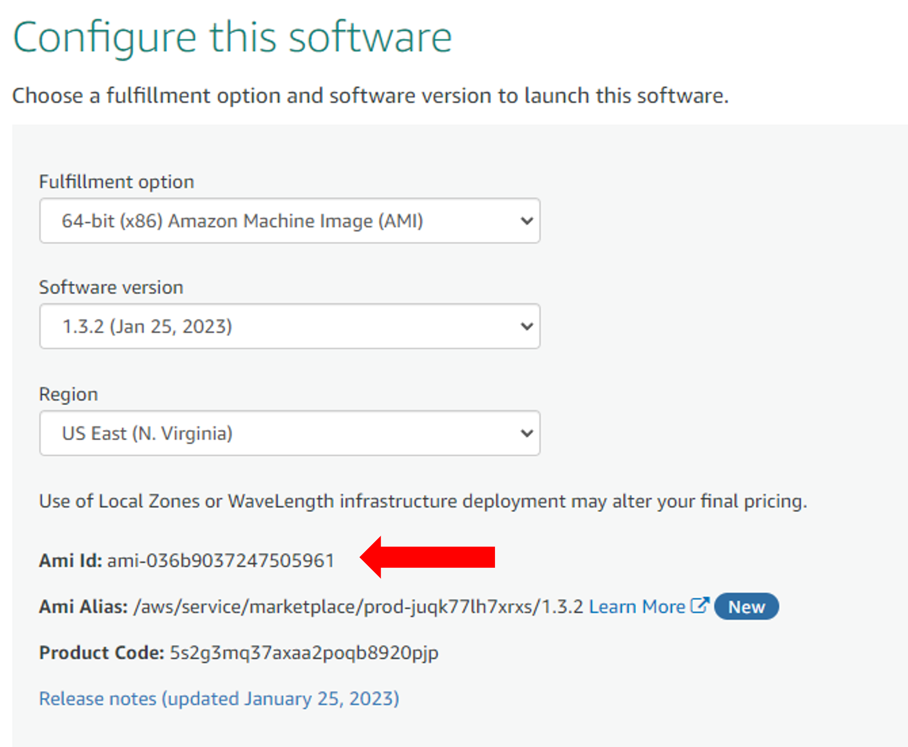

<!--
Copyright (c) 2021 - present / Neuralmagic, Inc. All Rights Reserved.

Licensed under the Apache License, Version 2.0 (the "License");
you may not use this file except in compliance with the License.
You may obtain a copy of the License at

   http://www.apache.org/licenses/LICENSE-2.0

Unless required by applicable law or agreed to in writing,
software distributed under the License is distributed on an "AS IS" BASIS,
WITHOUT WARRANTIES OR CONDITIONS OF ANY KIND, either express or implied.
See the License for the specific language governing permissions and
limitations under the License.
-->

# **Getting Started with DeepSparse via the AWS Marketplace**

Neural Magic’s DeepSparse Inference Runtime can be deployed directly from the AWS Marketplace. DeepSparse supports more than 60 different EC2 instance types and sizes, allowing you to quickly deploy the infrastructure that works best for your use case, based on cost and performance.

An EC2 instance integrated with DeepSparse can be launched via the AWS console or programmatically via Python. For the console workflow, please follow the guide in our [blog](https://neuralmagic.com/blog/neural-magics-deepsparse-inference-runtime-now-available-in-the-aws-marketplace/). If you are interested in configuring and launching an instance with DeepSparse in Python, follow the step-by-step guide below. 

You will need access to the [AWS CLI](https://docs.aws.amazon.com/cli/latest/userguide/getting-started-install.html) version 2.X that is [configured](https://docs.aws.amazon.com/cli/latest/userguide/cli-configure-quickstart.html) and the [Boto3](https://github.com/boto/boto3) library.


## Step 1: Subscribe to DeepSparse
[Subscribe](https://aws.amazon.com/marketplace/pp/prodview-zx6s55xbdjgoa) to the DeepSparse Inference Runtime from the AWS Markplace.


## Step 2: Configure your DeepSparse Runtime

Once you click *Continue to Subscribe*, you are directed to a page to complete selections for: 

- Fulfillment option 
- Software version 
- AWS Region


At this point, you may continue the instance configuration in the AWS console by clicking the *Continue to Launch* button or by running the following code snippet on your local machine. This code snippet launches an ec2 instance and returns the Public IPv4 DNS so you can SSH into the instance after it finishes staging. 

```python
import boto3

ec2_client = boto3.client('ec2')

def launch_ec2_instance(instance_name: str, image_id: str):

    response = ec2_client.run_instances(
        ImageId=image_id,  # Replace with your desired AMI ID
        InstanceType='c6i.xlarge',  # Replace with your desired instance type
        MinCount=1,
        MaxCount=1,
        SecurityGroupIds=['<sg-xxxxxxx>'],  # Replace with your desired security group ID(s)
        SubnetId='<subnet-xxxxxxxx>',  # Replace with your desired subnet ID
        KeyName='<key-name>',  # Replace with your key pair name
    )

    instance_id = response['Instances'][0]['InstanceId']
    ec2_client.create_tags(Resources=[instance_id], Tags=[{'Key': 'Name', 'Value': instance_name}])
    return instance_id
    
    
def wait_until_running(instance_id):
    waiter = ec2_client.get_waiter('instance_running')
    waiter.wait(InstanceIds=[instance_id])
    print("Instance is running.")


def get_public_ipv4_dns(instance_id):
    response = ec2_client.describe_instances(InstanceIds=[instance_id])
    public_ipv4_dns = response['Reservations'][0]['Instances'][0]['PublicDnsName']
    print("Public IPv4 DNS:", public_ipv4_dns)
    return public_ipv4_dns


if __name__ == "__main__":
    instance_id = launch_ec2_instance('DeepSparse', 'ami-036b9037247505961')
    wait_until_running(instance_id)
    get_public_ipv4_dns(instance_id)

```

**The AMI ID *ami-036b9037247505961* used in the example above assumes a configuration of software `version 1.3.2` in the `US East (N. Virginia)` region. If you prefer to enter different values in the configuration page, use the AMI id shown  and paste it into the code snippet**:




If you need guidance on how to select existing Security Group ids, run the following AWS CLI command and paste the appropriate `GroupId` value in the `SecurityGroupIds` argument.

```bash
aws ec2 describe-security-groups --query 'SecurityGroups[*].{GroupName: GroupName, GroupId: GroupId, VpcId: VpcId}'
```
If you need guidance on how to select existing Subnet ids, run the following AWS CLI command, and paste the appropriate id in the `SubnetId` argument.

```bash
aws ec2 describe-subnets --filters "Name=vpc-id,Values=vpc-042da23c75d628d10" "Name=default-for-az,
Values=true" --query 'Subnets[].SubnetId'
```

## **Step 3: SSH Into the Instance**

After running the code snippet, your Public IPv4 DNS will be printed out in terminal and should look like this: `ec2-18-234-83-194.compute-1.amazonaws.com`. Pass the IPv4 into the following CLI command to SSH into your running instance:

```bash
ssh -i path/to/your/sshkey.pem ec2-user@public-ipv4-dns
```

## **Step 4: Run DeepSparse**

Now that you have SSH'd into the instance, you can use all of the DeepSparse features such as benchmarking, pipelines and the server. Here's an example of benchmarking a pruned-quantized version of BERT trained on SQuAD:

```bash
deepsparse.benchmark
zoo:nlp/question_answering/bert-base/pytorch/huggingface/squad/pruned95_obs_quant-none -i [64,128] -b 64 -nstreams 1 -s sync
```
