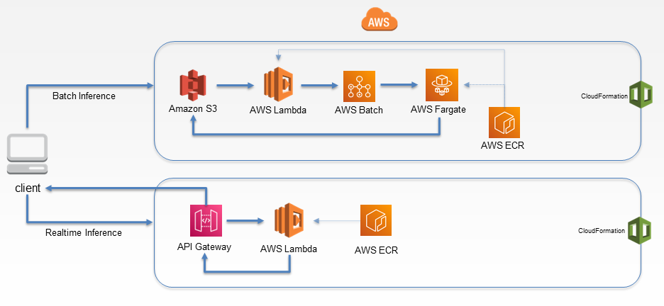

<!--
Copyright (c) 2021 - present / Neuralmagic, Inc. All Rights Reserved.

Licensed under the Apache License, Version 2.0 (the "License");
you may not use this file except in compliance with the License.
You may obtain a copy of the License at

   http://www.apache.org/licenses/LICENSE-2.0

Unless required by applicable law or agreed to in writing,
software distributed under the License is distributed on an "AS IS" BASIS,
WITHOUT WARRANTIES OR CONDITIONS OF ANY KIND, either express or implied.
See the License for the specific language governing permissions and
limitations under the License.
-->

# DeepSparse Inference Using AWS Serverless



This repository provides an engaging guide for users to create a serverless computing infrastructure, enabling them to deploy inference at scale effortlessly. By following this step-by-step tutorial, you'll be able to deploy a DeepSparse pipeline on AWS Lambda for real-time inference or on AWS Fargate for efficient batch inference processing. To make the experience more relatable and exciting, we demonstrate these concepts through a practical sentiment analysis use case. Join us on this journey and explore the powerful capabilities of serverless computing for deep learning inference on GitHub!

The scope of this application encompasses:
1. The construction of local Docker images.
2. The creation of an ECR repo in AWS.
3. Pushing the local images to ECR.
4. Deploying a:
   - **Realtime Inference Infrastructure** which creates a Lambda function via API Gateway in a Cloudformation stack.

   or

   - **Batch Inference Infrastructure** which creates a serverless environment on AWS Fargate via an AWS Batch job triggered by Lambda in a Cloudformation stack.

## Requirements
The following credentials, tools, and libraries are also required:
* The [AWS CLI](https://docs.aws.amazon.com/cli/latest/userguide/getting-started-install.html) version 2.X that is [configured](https://docs.aws.amazon.com/cli/latest/userguide/cli-configure-quickstart.html). Double check if the `region` that is configured in your AWS CLI matches the region passed in the SparseLambda class found in the `endpoint.py` file. Currently, the default region being used is `us-east-1`.
* Permissions for select AWS resources: ECR, API Gateway, Cloudformation, Lambda, ECS, S3, and Batch.
   - IAM permissions for batch and realtime inference are auto-generated at startup. For IAM permission roles and their policies, please refer to the `template.yaml` files in the `batch` and `realtime` directories.
* The AWS Serverless Application Model [(AWS SAM)](https://docs.aws.amazon.com/serverless-application-model/latest/developerguide/what-is-sam.html), an open-source CLI framework used for building serverless applications on AWS.
* [Docker and the `docker` cli](https://docs.docker.com/get-docker/).

## Model & Pipeline Configuration

To use a different sparse model for batch inference, please edit the model zoo stub in the Dockerfile here: `/batch/app_inf/Dockerfile`. To edit the model for realtime inference, edit here `/realtime/app/Dockerfile`. 

To change pipeline configuration (i.e., change task, engine etc.), edit the pipeline object in either `app.py` files. Both files can be found in the `/realtime/app/` and `/batch/app_inf/` directories.

## Quick Start

```bash 
git clone https://github.com/neuralmagic/deepsparse.git
cd deepsparse/examples/aws-serverless
pip install -r requirements.txt
```

After installation, you can choose to build either a batch or a realtime serverless infrastructure. Both options are detailed below.

## Option 1: Create Batch Inference Infra

Run the following command to build a batch inference infrastructure:

```bash
python endpoint.py create-batch
```

#### Batch Job Flow

After build, upload a CSV file to the `batch-input-deepsparse` S3 bucket (which was auto-generated) via the AWS console or from the following CLI command to start the batch job:

```bash
aws s3 cp <path/to/csv/file> s3://batch-input-deepsparse/ --recursive
```
This upload will trigger a Lambda function to start a batch job with a Fargate container running DeepSparse. The CSV file will be read and inputs will be passed into DeepSparse for prediction. Aftewards, the output will be automatically written to a CSV file called `outputs.csv` and pushed to the `batch-output-deepsparse` S3 bucket.

An example `sentiment-inputs.csv` file in the `sample` directory is available to familiarize yourself with the file structure the batch architecture is expecting to receive to perform sentiment analysis.

#### Fargate Compute Configuration

To edit the hardware configuration of the Fargate container, you can edit the default values in the `template.yaml` file in the `batch` directory.

Fargate is currently configured to deploy with 4 VCPUs and 8GB of RAM.

## Option 2: Create Realtime Inference Infra

Run the following command to build a realtime inference infrastructure.

```bash
python endpoint.py create-realtime
```

#### Call Realtime Endpoint

After the endpoint has been staged (~3 minute), AWS SAM will provide your API Gateway endpoint URL in CLI. You can start making requests by passing this URL into the LambdaClient object. Afterwards, you can run inference by passing in your text input:

```python
from client import LambdaClient

LC = LambdaClient("https://#########.execute-api.us-east-1.amazonaws.com/inference")
answer = LC.client({"sequences": "i like pizza"})

print(answer)
```

answer: `{'labels': ['positive'], 'scores': [0.9990884065628052]}`

On your first cold start, it will take a ~60 seconds to invoque your first inference, but afterwards, it should be in milliseconds.

## Delete Infrastructure

If you want to delete your batch or realtime infrastructure, run:

```bash
python endpoint.py destroy
```

If you want to delete batch or realtime infrastructure **AND** S3 buckets plus files, run:

```bash
python endpoint.py destroy-all
```