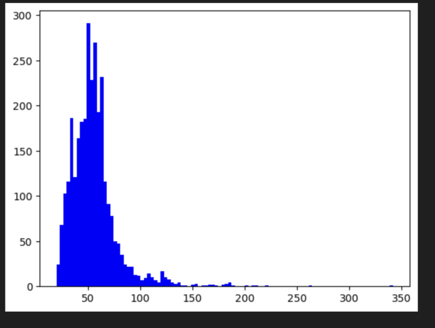

This repo contains example benchmarking scripts for computing throughput of DeepSparse with a sparse model and throughput of HuggingFace + PyTorch on a GPU with a dense model.

In this example, we run on the `ag_news` dataset with models downloaded from SparseZoo.

## Sparse Model DeepSparse

Install DeepSparse:

```bash
pip install deepsparse
```

Download Sparse Model:

```bash
sparsezoo.download zoo:nlp/text_classification/bert-large/pytorch/huggingface/mnli/pruned90_quant-none --save-dir ./sparse-model
```

Run DeepSparse Benchmark (creates buckets for token len 64, 128, and 256):

```bash
python benchmark_deepsparse.py
```

Note: DeepSparse uses static input shapes. Since the distribution of inputs for a dataset will be varied (multiple different sequence lengths), 
we can use bucketing where we compile DeepSparse with multiple input shapes and dynamically route inputs.
In the case of `ag_news` (the example dataset in this case), the distribution of token lengths looks like the following:


As such, we used buckets of length 64, 128, and 256. DeepSparse runs best with sequence lengths that are multiples of 16.

## Dense Model GPU

Install `transformers` and `datasets`:
```
pip install transformers[torch]
pip install datasets
pip install sparzeoo
```

Download Dense Model:
```bash
sparsezoo.download zoo:nlp/text_classification/bert-large/pytorch/huggingface/mnli/base-none --save-dir ./dense-model
```

Run HF Benchmark (on GPU):
```
python benchmark_huggingface.py 
```
