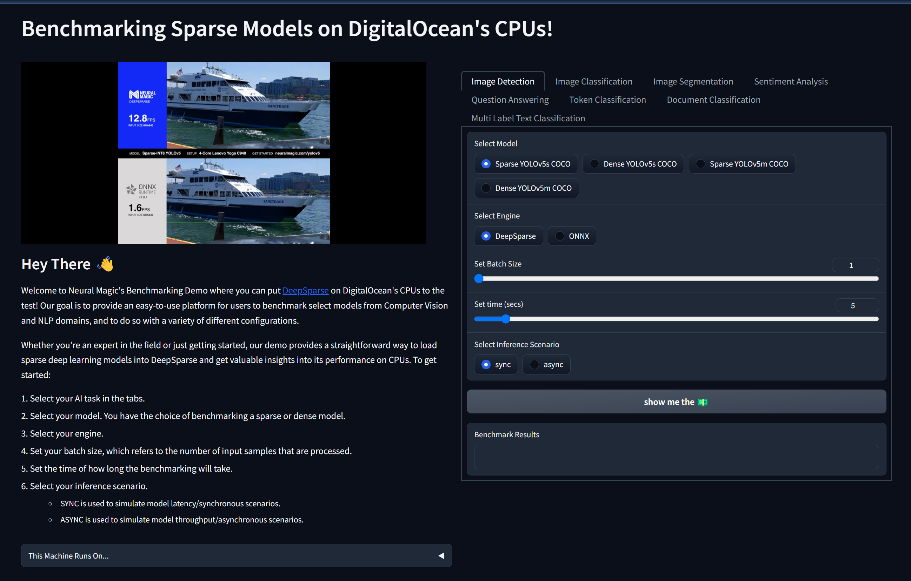

<!--
Copyright (c) 2021 - present / Neuralmagic, Inc. All Rights Reserved.

Licensed under the Apache License, Version 2.0 (the "License");
you may not use this file except in compliance with the License.
You may obtain a copy of the License at

   http://www.apache.org/licenses/LICENSE-2.0

Unless required by applicable law or agreed to in writing,
software distributed under the License is distributed on an "AS IS" BASIS,
WITHOUT WARRANTIES OR CONDITIONS OF ANY KIND, either express or implied.
See the License for the specific language governing permissions and
limitations under the License.
-->

# Benchmark UI



This demo gives users the ability to interact with 28 Sparse and Dense deep learning models from the Neural Magic Sparse Zoo. The Benchmark UI uses Gradio as its front-end and DeepSparse for running benchmarking on the back-end. In addition, the `vm.py` module includes an integration with the `python-digitalocean` client to spin up Droplets on DigitalOcean with the intention for users to host and benchmark DeepSparse models on DigitalOcean machines. Given this integration, the `app.py` module already includes a FastAPI mount for users who are more serious in hosting this demo on a VM like DO's Droplets or on any other instance from other cloud providers.

## Install

```bash
git clone https://github.com/neuralmagic/deepsparse.git
cd deepsparse/examples/benchmark-ui
pip install -r requirements.txt
```

## Local Start

Run the following command to spin up the Gradio demo locally. In addition, there is an option of using Gradio's public URL for sharing this demo with others.

```bash
python app.py
```

Output:

    >>> Running on local URL:  http://127.0.0.1:7860
    >>> Running on public URL: https://XXXXXXXXXXXXXX.gradio.live

If you wish to do further development or edit the demo, you can use the following command for Gradio to auto-update your edits:

```bash
gradio app.py
```

## Creating Droplet

In order to use this class, you need to obtain an API token from DigitalOcean's console in the `API` menu section and have SSH access to DigitalOcean Droplets. To create a Droplet, configure the `Droplet` class according to your needs and use the `create_droplet` method to spin up a VM. The following implementation spins up a DigitalOcean Premium CPU instance with 4vCPUs and 8GB RAM on Ubuntu 22.10:

```python
from vm import Droplet

DO = Droplet(
    token=<TOKEN>, # API Token
    name="ubuntu-c-4-intel-nyc1-01", # name of your Droplet
    region="nyc1", # region of your vm
    image="ubuntu-22-10-x64", # imageOS
    size_slug="c-4-intel", # slug for specific instance type
    backups=False # whether or not to create backup for vm
)

DO.create_droplet()
```

## Starting FastAPI and Uvicorn in Droplet

After Droplet creation, and setting up a Python environment, you can spin up a server with the following command:

```bash
uvicorn app:app --host 0.0.0.0
```

This will start the Gradio Demo via FastAPI on Uvicorn's default `port 8000`. To start demo in browser, call the `deepsparse` route with the IPv4 address of your VM in the URL:

    http://<ipaddress>:8000/deepsparse/

For further details on how to configure a Droplet for launching this demo you can follow the directions in the following Neural Magic blog.