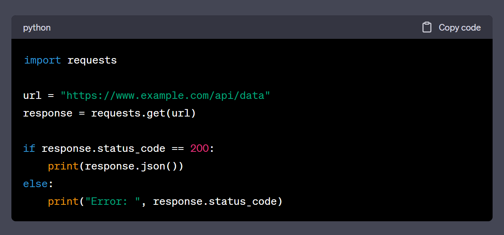
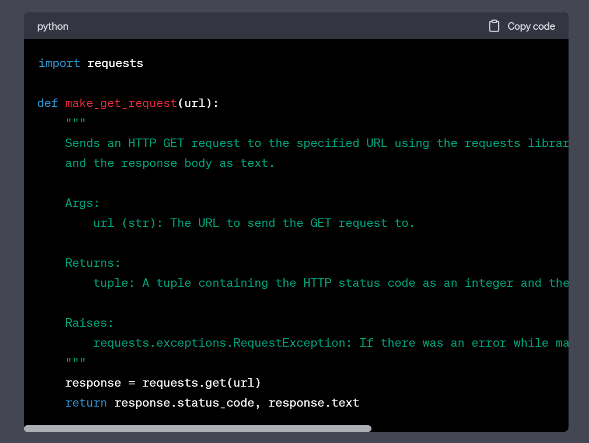
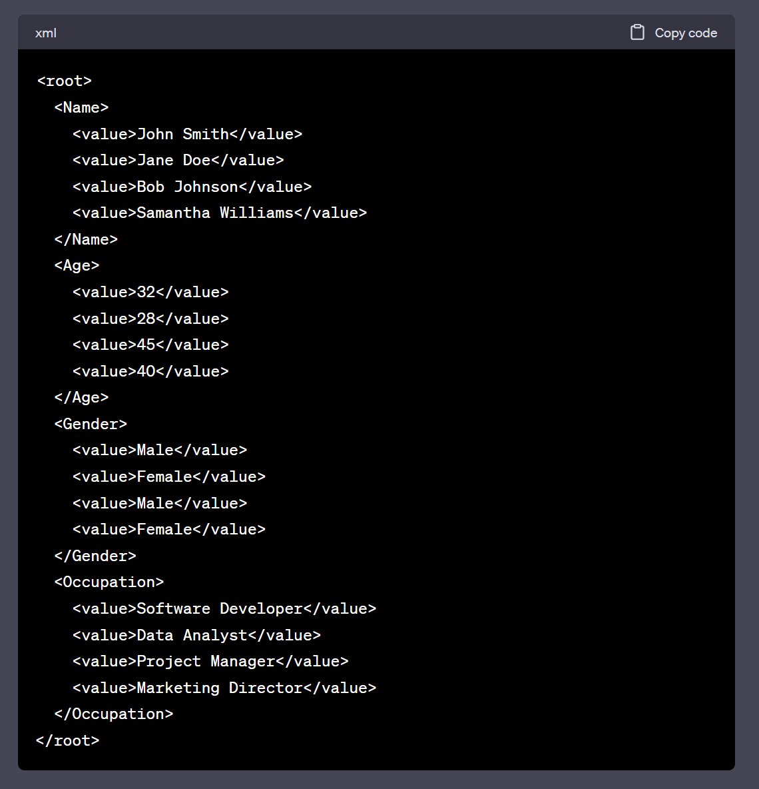
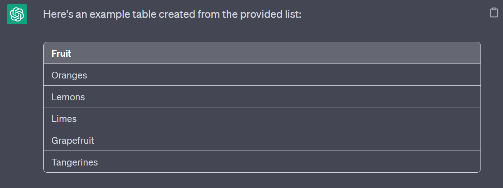
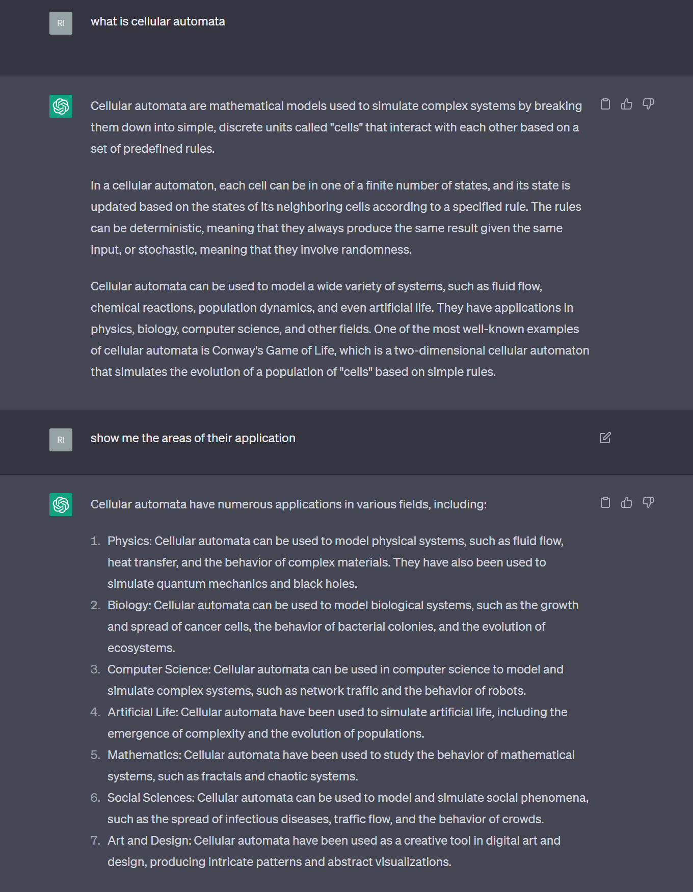

<!--
Copyright (c) 2021 - present / Neuralmagic, Inc. All Rights Reserved.

Licensed under the Apache License, Version 2.0 (the "License");
you may not use this file except in compliance with the License.
You may obtain a copy of the License at

   http://www.apache.org/licenses/LICENSE-2.0

Unless required by applicable law or agreed to in writing,
software distributed under the License is distributed on an "AS IS" BASIS,
WITHOUT WARRANTIES OR CONDITIONS OF ANY KIND, either express or implied.
See the License for the specific language governing permissions and
limitations under the License.
-->

# The ChatGPT Cheat Sheet 

This cheat sheet illustrates the diverse abilities of OpenAI’s ChatGPT (3.5 Turbo) for developers and content creators
to enhance their proficiency in large language model prompting across various domains including media
content creation, natural language processing, and programming.

Given the intrinsic randomness of ChatGPT, you may encounter slightly different answers when attempting to replicate the output shown in this guide. 


**Table of Contents**:
1. [NLP Tasks](#nlp-tasks)
2. [Code](#code)
3. [Structured Output Styles](#structured)
4. [Unstructured Output Styles](#unstructured)
5. [Media Types](#media)
6. [Meta ChatGPT](#meta)
7. [Expert Prompting](#expert)

## 1. NLP Tasks {#nlp-tasks}

### Text Generation
**Prompt:** write an intro paragraph to a mystery novel

**Answer:** 

    It was a dark and stormy night when the body was found. The small town of Millfield was in shock as the
    news spread that one of their own, local businessman, had been murdered in cold blood. The police were at
    a loss for leads and the residents of the town were on edge. But one person, a young and ambitious
    reporter, was determined to uncover the truth and find the killer. Little did she know, this case would
    lead her down a treacherous path of lies, deception, and hidden secrets that would shake the very
    foundations of the town. As she delves deeper into the investigation, she begins to realize that nothing
    is as it seems and that the killer may be closer than she ever imagined.


### Summarization
**Prompt:** summarize this text: It was a dark and stormy night when the body was found. The small town of
Millfield was in shock as the news spread that one of their own, local businessman, had been murdered in
cold blood. The police were at a loss for leads and the residents of the town were on edge. But one person,
a young and ambitious reporter, was determined to uncover the truth and find the killer. Little did she
know, this case would lead her down a treacherous path of lies, deception, and hidden secrets that would
shake the very foundations of the town. As she delves deeper into the investigation, she begins to realize
that nothing is as it seems and that the killer may be closer than she ever imagined.

**Answer:** 

    A young reporter in a small town investigates the murder of a local businessman and uncovers a web of
    lies, deception and hidden secrets that shake the foundations of the town. The police have no leads and
    the town is on edge. The reporter delves deeper into the investigation and realizes the killer may be
    closer than she imagined.

### Open Domain Question Answering
**Prompt**: when did Apollo 11 land on the moon

**Answer:**

    Apollo 11 landed on the moon on July 20, 1969.

### Paraphrasing
**Prompt:** rewrite this text: Apollo 11 landed on the moon on July 20, 1969

**Answer:**

    On July 20, 1969, the Apollo 11 mission successfully landed on the moon.

### Sentiment Analysis (few-shot or zero-shot)
**Prompt:** I like pizza, positive
I don't like pizza, negative
sometimes, I like pizza sometimes I don't, neutral
while the movie was good, I sometimes though it was a bit dry,

**Answer:**

    neutral

### Table to Text
**Prompt:** summarize the data in this table: I like pizza positive
I don't like bananas negative
Sometimes I like pizza but sometimes I don't neutral
While the movie in general was pretty good, I sometimes thought it was a bit dry neutral

**Answer:**

    This table contains four statements, two of them express a positive and negative opinion about two
    different subjects, Pizza and Bananas. Other two statements express a neutral opinion about the same
    subjects, Pizza and a movie.

### Text to Table
**Prompt:** create a table from this text: create a 2 column table where the first column contains the stock
ticker symbol for Apple, Google, Amazon, Meta, and the other column contains the names of the companies.

**Answer:**


### Token Classification (few-shot or zero-shot)
**Prompt:** classify the named entities in this text: George Washington and his troops crossed the Delaware
River on December 25, 1776 during the American Revolutionary War.

**Answer:**

    George Washington: Person
    Delaware River: Location
    December 25, 1776: Date
    American Revolutionary War: Event/War

### Dataset Generation (few-shot or zero-shot)
**Prompt:** generate more datapoints from this text:
"contains no wit , only labored gags "
0 (negative)
"that loves its characters and communicates something rather beautiful about human nature "
1 (positive)
"remains utterly satisfied to remain the same throughout "
0 (negative)

**Answer:**

    "has a convoluted plot that fails to engage the audience"
    0 (negative)
    "lacks emotional depth and fails to connect with the audience"
    0 (negative)

### Machine Translation
**Prompt:** translate this text into Portuguese: welcome to the matrix

**Answer:**

    Bem-vindo à matriz.

## 2. Code {#code}

### Code Generation
**Prompt:** show me how to make an http request in Python

**Answer:**

    Certainly! You can make an HTTP request in Python using the built-in requests module. Here's an example:



    In this example, we're importing the requests module and assigning a URL to the url variable. We then make an HTTP GET request to that URL using the requests.get() function and store the response in the response variable.

    We then check the status code of the response to make sure it was successful (a status code of 200 indicates success), and print the JSON content of the response using the response.json() method.

    If the status code is not 200, we print an error message along with the status code.

    This is just a basic example, but the requests module provides a lot of functionality for making HTTP requests and handling responses in Python.

### Code Explanation
**Prompt:** explain this python code:
from deepsparse import Pipeline
qa_pipeline = Pipeline.create(task="question-answering")
inference = qa_pipeline(question="What's my name?", context="My name is Snorlax")
{'score': 0.9947717785835266, 'start': 11, 'end': 18, 'answer': 'Snorlax'}

**Answer:**

    This code is using a library called "deepsparse" to create a pipeline for question-answering.

    from deepsparse import Pipeline imports the "Pipeline" class from the "deepsparse" library, which allows
    the user to define a pipeline for a specific task like question-answering.

    qa_pipeline = Pipeline.create(task="question-answering") creates a new pipeline object for the task of
    question-answering and assigns it to the variable "qa_pipeline".

    inference = qa_pipeline(question="What's my name?", context="My name is Snorlax") is passing the values of
    the question and context to the pipeline object "qa_pipeline" and storing the result in a variable called
    "inference". The inference variable stores a dictionary containing the score of the answer, the start and
    end index of the answer in the context, and the answer itself. The returned output would look like
    {'score': 0.9947717785835266, 'start': 11, 'end': 18, 'answer': 'Snorlax'}

    It appears that the pipeline is using some form of machine learning model to understand the question and
    context, and extract the answer from the context based on the question. The library "deepsparse" is meant
    for public use, this code is an example of how to use it to perform question-answering task.

### Docstrings Generation
**Prompt:** write a docstring description for this function:
import requests

def make_get_request(url):
&emsp;response = requests.get(url)
&emsp;return response.status_code, response.text

make_get_request('https://www.example.com')

**Answer:**

    Here's an example docstring description for the make_get_request function:



    In this docstring, we describe the purpose of the function and what it does. We also document the arguments it takes, the return value it provides, and provide an example usage of the function. This information can help other developers understand how to use the function and what to expect from it.

### Programming Language Conversion
**Prompt:** convert this code from Python to Javascript:
print("hello world")

**Answer:**

    console.log("hello world");

### Data Object Conversions (JSON, XML, CSV etc.)
**Prompt:** convert this JSON object into XML:
{"Name":{"0":"John Smith","1":"Jane Doe","2":"Bob Johnson","3":"Samantha
Williams"},"Age":{"0":32,"1":28,"2":45,"3":40},"Gender":{"0":"Male","1":"Female","2":"Male","3":"Female"},"O
ccupation":{"0":"Software Developer","1":"Data Analyst","2":"Project Manager","3":"Marketing Director"}}

**Answer:** 

    Here's an example XML representation of the provided JSON object:



    In this XML representation, we've used the <root> element to encapsulate the entire object. We've also used the key names (Name, Age, Gender, Occupation) as the XML element names, and created sub-elements with the values of each key as their child elements.

    Note that we've used the name <value> for each child element to represent the values in the JSON object. This is because XML requires each child element to have a unique name, and the values in the JSON object don't have any specific names. Alternatively, we could use a different naming convention for the child elements if we wanted to.

### Knowledge Graph Generation
**Prompt:** convert this text into nodes and edges: Babe Ruth joined the New York Yankees in 1920. The Boston
Red Sox sold his contract to the Yankees. He played for the Yankees from 1920 to 1934, and during that time
he established himself as one of the greatest players in baseball history.

**Answer:**

    Here is an example of how the text could be converted into nodes and edges:

    Nodes:
        •Babe Ruth
        •New York Yankees
        •Boston Red Sox
        •baseball history
    Edges:
        •Babe Ruth (node) joined (edge) New York Yankees (node) in 1920 (edge property)
        •Boston Red Sox (node) sold (edge) Babe Ruth's contract (edge property) to (edge) New York Yankees (node)
        •Babe Ruth (node) played for (edge) New York Yankees (node) from 1920 (edge property) to 1934 (edge property)
        •Babe Ruth (node) established himself as (edge) one of the greatest players (edge property) in baseball history (node)

    It's important to note that, the representation of the knowledge graph can be different depending on the
    purpose of the graph, and depending on the data available in the text.

### HTML to Text (Web Scraping)
**Prompt:** 
```text
convert this HTML to text: <h1 class="heading1" id="neural-magic-platform-documentation">Neural
Magic Platform Documentation</h1>
```

**Answer:**

    Neural Magic Platform Documentation

## 3. Structured Output Styles {#structured}

### List
**Prompt:** give me a list of 5 citrus fruits

**Answer:**

    Here is a list of 5 citrus fruits:

    ● Oranges
    ● Lemons
    ● Limes
    ● Grapefruit
    ● Tangerines

### Numbered List
**Prompt:** give me a numbered list of 5 citrus fruits

**Answer:**

    Sure, here is a numbered list of 5 citrus fruits:

    1. Oranges
    2. Lemons
    3. Limes
    4. Grapefruit
    5. Tangerines

### Headings and Subheadings
**Prompt:** convert this text into headings and subheadings: Babe Ruth joined the New York Yankees in 1920. The
Boston Red Sox sold his contract to the Yankees. He played for the Yankees from 1920 to 1934, and during
that time he established himself as one of the greatest players in baseball history.

**Answer:**

    Here is an example of how the text could be converted into headings and subheadings:
        1. Introduction
            ○ The text is about Babe Ruth and his time playing for the New York Yankees
            ○ The text covers his move from the Boston Red Sox to the Yankees and his time playing for the team
        2. Babe Ruth's move to the New York Yankees
            ○ Babe Ruth joined the New York Yankees in 1920
            ○ The Boston Red Sox sold his contract to the Yankees
        3. Babe Ruth's time with the New York Yankees
            ○ He played for the Yankees from 1920 to 1934
            ○ During that time he established himself as one of the greatest players in baseball history

    It's important to note that the text needs to be structured and well-organized in order to create clear
    and meaningful headings and subheadings.

### Tables
**Prompt:** create a table from this list: Oranges, Lemons, Limes, Grapefruit, Tangerines

**Answer:**



## 4. Unstructured Output Styles {#unstructured}

### Narrative Modes (1st, 2nd or in the 3rd person)
**Prompt:** write a paragraph on how to make brownies in the 1st person

**Answer:**

    Hey there, I'm excited to show you how to make delicious brownies from scratch.

    To make brownies, you will need the following ingredients:

        ● 1/2 cup (1 stick) of unsalted butter
        ● 1 cup of granulated sugar
        ● 2 large eggs
        ● 1 teaspoon of vanilla extract
        ● 1/2 cup of all-purpose flour
        ● 1/3 cup of unsweetened cocoa powder
        ● 1/4 teaspoon of salt

    Here's the step by step process:

        1. Preheat your oven to 350°F (175°C) and grease an 8-inch square baking pan.
        2. Melt the butter in a saucepan over medium heat. Once melted, remove from heat and stir in the sugar.
        3. Add the eggs and vanilla extract, and mix well.
        4. In a separate bowl, combine the flour, cocoa powder, and salt. Gradually add this to the butter mixture, stirring until well blended.
        5. Pour the batter into the prepared pan, and smooth the top with a spatula.
        6. Bake for 18-20 minutes, or until a toothpick inserted into the center comes out clean.
        7. Once done, remove from the oven and let it cool for a few minutes before cutting into squares and serving.

    And there you have it, a batch of delicious homemade brownies. I recommend serving them warm with a scoop of vanilla ice cream or a drizzle of chocolate sauce. Enjoy!

### Formal
**Prompt:** write a paragraph on the topic of cellular automata in a formal style

**Answer:**

    Cellular automata is a mathematical model that simulates the behavior of complex systems through the
    interaction of simple, locally interacting agents. This model is used to understand and predict the
    behavior of a wide range of systems, including but not limited to physics, chemistry, biology and computer
    science. The theory behind cellular automata is based on the concept of a collection of discrete cells,
    which can exist in a finite number of states, and whose evolution is determined by a set of rules that
    depend on the state of the cells and their neighbors. Its applications are varied and range from
    theoretical physics, to computer science, to the modeling of complex systems.

### Personas
**Prompt:** write a paragraph on the topic of cellular automata in the style of a social media influencer

**Answer:**

    Hey guys, have you heard about cellular automata? It's this super cool concept that simulates the behavior
    of complex systems through the interaction of simple agents. Think of it like a virtual world where tiny
    "cells" interact with each other to create amazing patterns and behaviors. It's like a mini universe in
    your computer! It's used in all sorts of fields like physics, chemistry, biology and computer science.
    It's so mind-blowing to think about all the possibilities that cellular automata holds. I'm obsessed and I
    think you will be too! #cellularautomata #science #futurism

### Custom Text Manipulation
**Prompt:** write a paragraph on the history of the calculator, include emojis at the end of every sentence, and
do not capitalize the first word in each sentence

**Answer:**
the first calculator was invented by william ovens in 1642. it was called the "pascal calculator" and was
designed to perform the four basic arithmetic operations. in the following centuries, many different types
of calculators were invented, including the slide rule and the abacus. however, it wasn't until the 1970s
that electronic calculators became widely available and affordable. the first electronic calculator was
the "hp-35" which was introduced in 1972 by hewlett-packard. it was a scientific calculator that could
perform trigonometric and logarithmic functions. 🤖📊 Since then, the calculator has become an essential
tool in many fields, including science, engineering, and finance. 💻🧮 Today, we have a wide variety of
calculators available, from basic models to advanced models with advanced features like graphing
capabilities and programming languages.📱💻

## 5. Media Types {#media}

### Write Social Media Posts
**Prompt:** write a tweet on futurism

**Answer:**

    "Exploring the future is both exciting and daunting. From AI to biotech, advances in technology are
    shaping our world in ways we never thought possible. Let's embrace change and shape the future together.
    #futurism #technology #innovation"

### Write Blogs
**Prompt:** write a blog on french cuisine

**Answer:**

    French cuisine is widely considered to be one of the most sophisticated and refined in the world. The
    French have a long history of culinary arts, dating back to the Middle Ages, and have developed a culinary
    tradition that is rich and diverse. French cuisine is characterized by its use of fresh, seasonal
    ingredients, expertly prepared and presented in a way that is both elegant and delicious.

    One of the most recognizable elements of French cuisine is the use of sauces. French sauces are typically
    made with a base of butter, cream, or stock, and are flavored with herbs, spices, and other ingredients.
    Some of the most famous French sauces include béarnaise, hollandaise, and béchamel. These sauces are often
    served with meats, seafood, and vegetables and are a hallmark of French cuisine.

    Another important element of French cuisine is the use of fresh, seasonal ingredients. The French are
    known for their commitment to using only the freshest and highest-quality ingredients in their cooking.
    This is why many French dishes are only available at certain times of the year, when the ingredients are
    at their peak.

    One of the most popular types of French cuisine is 'bistro' cuisine. These are casual, friendly
    restaurants that serve traditional French dishes in a relaxed atmosphere. Bistro cuisine often features
    simple, hearty dishes such as steak frites, mussels, and ratatouille, and is a great way to experience the
    flavors of France.

    French pastries and desserts are also famous around the world. French patisseries, or pastry shops, are
    known for their delicious croissants, macarons, tarts, and cakes. French desserts are often made with
    fresh fruits, cream, and chocolate and are a perfect way to end a meal.

### Write Emails
**Prompt:** write an email selling software to corporate executives

**Answer:**

Subject: Enhance Your Business Operations with Our Innovative Software

Dear [Executive's Name],

I hope this email finds you well. My name is [Your Name], and I am reaching out to introduce you to our
cutting-edge software that has the potential to revolutionize the way your business operates.

Our software is designed to streamline and automate various business processes, including but not limited
to inventory management, financial forecasting, and customer relationship management. With its
user-friendly interface and customizable features, it is easy for your team to navigate and tailor to your
specific needs.

What sets our software apart from the competition is its ability to integrate seamlessly with other
systems and platforms, allowing for smooth data transfer and real-time analysis. This results in increased
efficiency, reduced errors and ultimately improved decision-making capabilities.
We understand that every business is unique, and that's why our team is dedicated to providing
personalized solutions and exceptional customer service. We would love the opportunity to schedule a demo
and show you how our software can benefit your business.

Please let me know if this is something that interests you and we can schedule a time that works best for
you. I look forward to hearing from you soon.

Best regards,

[Your Name]

P.S. Our software comes with a 30-day free trial and flexible pricing options to fit any budget. Don't
hesitate to reach out if you have any questions or concerns.

### Write Poems
**Prompt:** write a poem about the soul and show rhyme and meter headings

**Answer:**

    The soul, a mystery deep and true
    A treasure to find, a journey to pursue
    Rhyme: AABB
    Meter: Iambic tetrameter
    It whispers to us, in the dark of the night
    Guiding us towards, the path that is right
    Rhyme: AABB
    Meter: Iambic tetrameter
    It is the essence, of who we truly are
    A light that shines, from the stars
    Rhyme: AABB
    Meter: Iambic tetrameter
    It is the music, that plays in our hearts
    The rhythm that keeps us, from falling apart

### Write Songs
**Prompt:** write a folk song about the sunset show guitar chords

**Answer:**

    Verse 1:
    G C G
    The sun sets in the west
    G C G
    And the sky turns a fiery red
    G C G
    I take my guitar in hand
    D G C G
    And play a song for the sunset show

    Chorus:
    C G D
    Oh the sunset show
    C G D
    Is a sight to behold
    C G D
    As the day comes to a close
    G C G
    I'll keep playing my guitar

### Write Resumes/Cover Letters
**Prompt:** write a software engineer resume

**Answer:**

    [Full Name]
    [Address]
    [Phone Number]
    [Email Address]

    Summary:

    Highly motivated and experienced software engineer with over 5 years of experience in the industry. Strong
    background in full-stack development and a proven track record of delivering high-quality, reliable and
    maintainable code. Skilled in multiple programming languages including Java, Python, and JavaScript.
    Strong problem-solving and analytical skills, with a passion for learning new technologies and staying
    current in the field.

    Education:

        ● Bachelor of Science in Computer Science, [University Name], [Graduation Date]
        ● Master of Science in Computer Science, [University Name], [Graduation Date]

    Technical Skills:

        ● Programming Languages: Java, Python, JavaScript, C++, C#
        ● Web Development: HTML, CSS, React, AngularJS, Node.js
        ● Database: MySQL, MongoDB, Oracle
        ● Tools and Frameworks: Git, JIRA, Scrum, Agile
        ● Operating Systems: Windows, Linux, MacOS

    Professional Experience:

    Software Engineer, [Company Name], [Dates of Employment]

        ● Worked on the development of a web-based application using React, Node.js, and MongoDB.
        ● Collaborated with the team to design and implement new features, improve performance and fix bugs.
        ● Contributed to the design and implementation of the application's RESTful API.
        ● Assisted with the deployment of the application to the production environment.
        ● Participated in code reviews and provided feedback to other team members.
        ● Mentored junior developers and provided guidance on best practices. 
    
    Software Developer, [Company Name], [Dates of Employment]

        ● Worked on the development of a mobile application using Java and Android SDK.
        ● Collaborated with the team to design and implement new features, improve performance and fix bugs.
        ● Assisted with the deployment of the application to the Google Play Store.
        ● Participated in code reviews and provided feedback to other team members.
    
    Additional Experience:

        ● Participated in various hackathons and coding competitions, winning several awards for creative and efficient solutions.
        ● Contributed to open-source projects on Github.

    Certifications:

    ● Oracle Certified Professional, Java SE 11 Developer
    ● Microsoft Certified: Azure Developer Associate
    ● AWS Certified Developer - Associate
    
    Professional Affiliations:

        ● Member of [Professional Organization Name]
        ● Member of [Professional Organization Name]

    Languages:

        English (native)
        Spanish (fluent)

## 6. Meta ChatGPT {#meta}

### Ask ChatGPT About Its Own Capabilities
**Prompt:** what ways can you structure text output?

**Answer:**

    As a language model, I can structure text output in a variety of ways, including:

        ● Paragraphs: I can generate text in the form of multiple paragraphs, which can be useful for longer pieces of writing such as articles or essays.
        ● Lists: I can generate lists of items, which can be useful for creating bullet points or enumerated lists.
        ● Headings and subheadings: I can use headings and subheadings to organize text and make it easier to read.
        ● Sentences: I can generate text one sentence at a time, which can be useful for generating responses to specific questions or prompts.
        ● Tables: I can generate table format text, which can be useful for displaying data in a structured format.
        ● Poems and songs: I can structure text in rhyme and meter, which can be useful for generating creative writing like poems and songs.
        ● Dialogue: I can generate text in the form of a conversation or dialogue between two or more characters.

    These are just a few examples of the ways that I can structure text output. The specific structure will
    depend on the prompt and task at hand.


### Update ChatGPT's Knowledge


### Ask ChatGPT to Expand on Answers


## 7. Expert Prompting {#expert}
**You can use several conditions discussed in this cheat sheet to prompt ChatGPT to obtain more granular output.**

### Prompt ChatGPT with Simultaneous Conditions
**Prompt:** write a paragraph on machine learning, in the 1st person, with emojis, with headings and subheadings

**Answer:**

    🤖 Hi there! I'm excited to talk to you about machine learning.

    🧠 Machine learning is a type of artificial intelligence (AI) that allows systems to learn and improve from experience without being explicitly programmed.

    📈 It is used in a wide range of applications, such as image recognition, natural language processing, and predictive analytics.

    🤖 Here's a breakdown of the different types of machine learning:
    
    1. Supervised Learning
        ● 🏫 In this type of learning, the model is trained on a labeled dataset, where the correct output is already known.
        ● 💻 Common examples include identifying objects in images or spam emails.
    2. Unsupervised Learning
        ● 󰡷 In this type of learning, the model is not given any labeled data and must find patterns and relationships on its
        own.
        ● 🤖 Common examples include clustering data or identifying patterns in customer behavior.
    3. Reinforcement Learning
        ● 🎮 In this type of learning, the model is rewarded for certain actions and learns through trial and error.
        ● 🤖 This is often used in gaming and robotics.

    🤖 I hope this gives you a better understanding of machine learning and its different types! Let me know if you have any questions.
