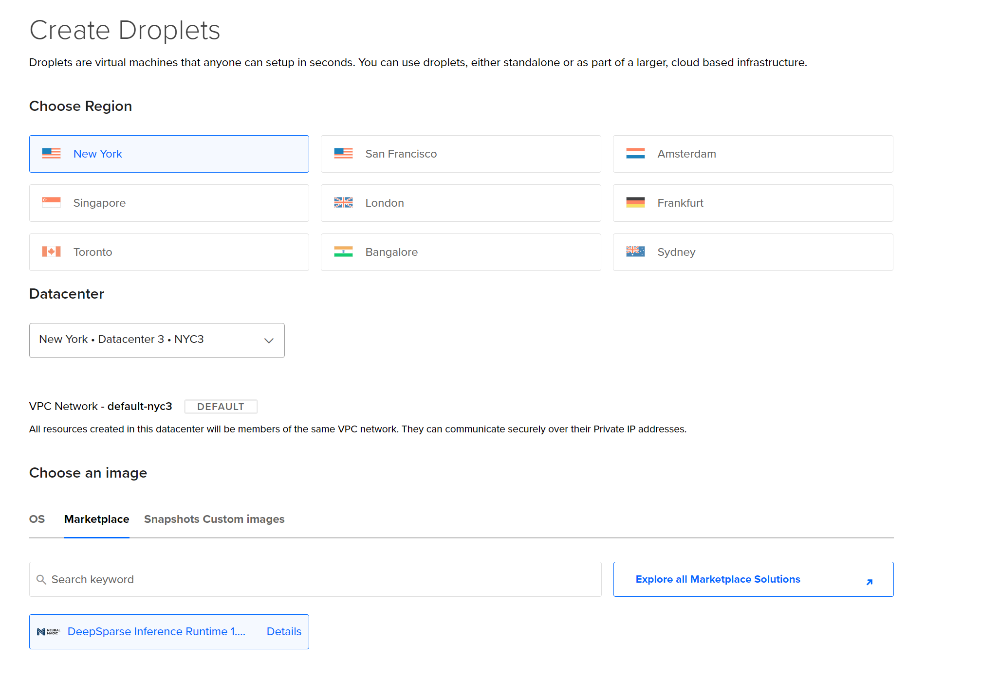

<!--
Copyright (c) 2021 - present / Neuralmagic, Inc. All Rights Reserved.

Licensed under the Apache License, Version 2.0 (the "License");
you may not use this file except in compliance with the License.
You may obtain a copy of the License at

   http://www.apache.org/licenses/LICENSE-2.0

Unless required by applicable law or agreed to in writing,
software distributed under the License is distributed on an "AS IS" BASIS,
WITHOUT WARRANTIES OR CONDITIONS OF ANY KIND, either express or implied.
See the License for the specific language governing permissions and
limitations under the License.
-->

# **Getting Started With DeepSparse in the DigitalOcean Marketplace**

Neural Magic's DeepSparse is an inference runtime that can now be deployed directly from the DigitalOcean Marketplace. DeepSparse supports various machine types on DigitalOcean, so you can quickly deploy the infrastructure that works best for your use case, based on cost and performance. For guidance on the robust performance of DeeSparse on compute optimized DigitalOcean Droplets, refer to this [blog](https://neuralmagic.com/blog/how-to-achieve-up-to-3x-ai-speedup-on-digitaloceans-premium-cpus/).

A Droplet integrated with DeepSparse can be launched via the DigitalOcean console, in Python or via CLI. For a frictionless deployment, make sure you have access to [SSH keys](https://docs.digitalocean.com/products/droplets/how-to/add-ssh-keys/).

## **Option 1: Create your Droplet in the Console**

**Step 1** Navigate to the [DeepSparse Marketplace](https://marketplace.digitalocean.com/apps/deepsparse-inference-runtime) page and click on the ***Create DeepSparse Inference Runtime Droplet*** button.

**Step 2** Configure your Droplet in the configuration page. The DeepSparse image is already attached:



**Step 3** Click the green *Create Droplet* button at the bottom of the web page.

## **Option 2: Create your Droplet in CLI**

You can use either cURL or [doctl](https://docs.digitalocean.com/reference/doctl/how-to/install/) for creating a Droplet via CLI. You will need to generate a personal [access token](https://docs.digitalocean.com/reference/api/create-personal-access-token/) for this flow. 

**Using cURL:**

**Step 1** Add your personal `access token` to the cURL command. Here's an example of launching DeepSparse using compute optimized Droplets (i.e. 4 vCPUs and 8GB RAM) in the `nyc3` region:

```bash
curl -X POST -H 'Content-Type: application/json' \
    -H 'Authorization: Bearer '<ACCESS-TOKEN>'' \
    -d '{"name":"deepsparse-droplet",
        "size":"c-4-intel",
        "region":"nyc3",
        "image":"neuralmagic-deepsparseinfere"}' \
    "https://api.digitalocean.com/v2/droplets"
```

**Using doctl:**

**Step 1** Connect with DigitalOcean by passing in your personal `access token`:

```bash
doctl auth init --access-token <ACCESS-TOKEN>
```

**Step 2** Add a SSH `fingerprint` to he doctl command. Here's an example of launching DeepSparse using compute optimized instances in the `nyc3` region:

```bash
doctl compute droplet create deepsparse-droplet \
    --image neuralmagic-deepsparseinfere \
    --size c-4-intel \
    --region nyc3 \
    --ssh-keys <FINGERPRINT>
```

**TIP**: Run this command to find a list of SSH fingerprints associated with your DigitalOcean account:

```bash
doctl compute ssh-key list
```

## **Option 3: Create your Droplet in Python**

Install the DigitalOcean [Python library](https://github.com/koalalorenzo/python-digitalocean):

```bash
pip install -U python-digitalocean
```

**Step 1** Add your `access token` to the following code snippet to launch your Droplet:

```python
from digitalocean import Droplet, Manager

manager = Manager(token=token)
keys = manager.get_all_sshkeys()

droplet = Droplet(
    token="<ACCESS-TOKEN>",
    name="deepsparse-droplet",
    region="nyc3",
    image="neuralmagic-deepsparseinfere",
    size_slug="c-4-intel",
    ssh_keys=keys,
    backups=False
)

droplet.create()
```

## **SSH Into the Instance**

After your Droplet boots up, SSH into the Droplet by passing in its public IP address:

```bash
ssh root@<IP-ADDRESS>
```

**TIP**: Run this command to find your Droplet's IP address:

```bash
doctl compute droplet list
```

## **Run DeepSparse**

Once logged in, you can use all of the DeepSparse features such as benchmarking, pipelines, and the server for either NLP or CV models. Here's an example of benchmarking a pruned-quantized version of BERT trained on SQuAD:

```bash
deepsparse.benchmark zoo:nlp/question_answering/bert-base/pytorch/huggingface/squad/pruned95_obs_quant-none --batch_size 1
```