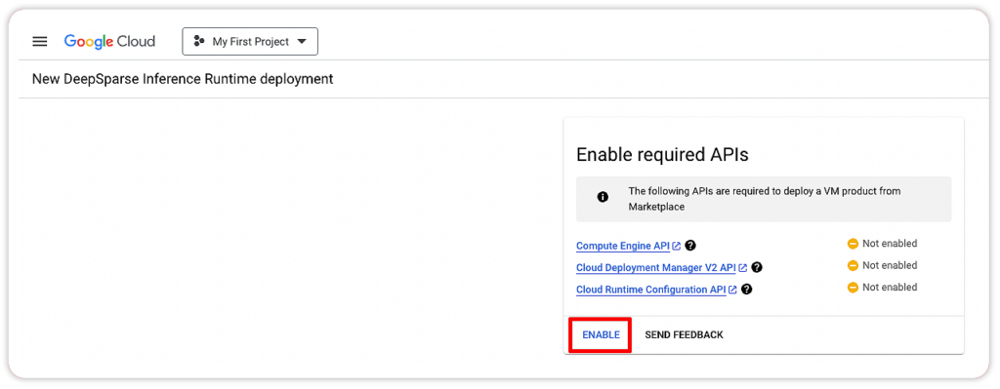

<!--
Copyright (c) 2021 - present / Neuralmagic, Inc. All Rights Reserved.

Licensed under the Apache License, Version 2.0 (the "License");
you may not use this file except in compliance with the License.
You may obtain a copy of the License at

   http://www.apache.org/licenses/LICENSE-2.0

Unless required by applicable law or agreed to in writing,
software distributed under the License is distributed on an "AS IS" BASIS,
WITHOUT WARRANTIES OR CONDITIONS OF ANY KIND, either express or implied.
See the License for the specific language governing permissions and
limitations under the License.
-->

# **Getting Started with DeepSparse in the GCP Marketplace**

Neural Magic's DeepSparse Inference Runtime can now be deployed directly from the Google Cloud Marketplace. DeepSparse supports various machine types on Google Cloud, so you can quickly deploy the infrastructure that works best for your use case, based on cost and performance. 

A Compute Engine VM integrated with DeepSparse can be launched via the GCP console or programmatically via Python. For the console workflow, please follow the guide in our [blog](https://neuralmagic.com/blog/neural-magics-deepsparse-inference-runtime-now-available-in-the-google-cloud-marketplace/). If you are interested in configuring and launching an instance with DeepSparse in Python, follow the step-by-step guide below. 

You will need to install the [Google Cloud Compute](https://github.com/googleapis/python-compute) and [Google API Core](https://github.com/boto/boto3) packages, and have [gcloud CLI](https://cloud.google.com/sdk/docs/install) installed:

```bash
pip install google-cloud-compute google-api-core
```

## **Step 1: Subscribe to DeepSparse**
Select a *Project* and [Subscribe](https://console.cloud.google.com/marketplace/product/neuralmagic-public/deepsparse-inference-runtime-vm?project=neuralmagic-public) to the  DeepSparse Inference Runtime from the Google Cloud Marketplace.


## **Step 2: Enable Required APIs**

After you click *Launch*, you will land on a page where you can enable any required APIs you don't already have enabled on your Google Cloud account. 




## **Step 3: Configure Your DeepSparse Runtime**

At this point, you may continue the instance configuration in the GCP console. However, if you prefer launching an instance using Python from your local machine, please refer to this [script](https://github.com/neuralmagic/deepsparse/tree/main/examples/gcp-marketplace/gcp.py). This module launches a virtual machine in the Compute Engine integrated with DeepSparse.

In the last line of the script, you can configure your instance by passing the project id you selected in Step 1 along with your prefered zone, instance name and machine type:

```python
if __name__ == "__main__":

    project_id = "<project-id>"
    zone = "us-central1-c"
    instance_name = "deepsparse"
    machine_type = "n2d-highcpu-8"
    source_image = (
        "projects/neuralmagic-public/global/images/deepsparse-cloud-142-ubuntu-2204"
    )
    ...

```

Afterwards, run the script in your local machine:

```bash
python gcp.py
```

## **Step 4: SSH Into the Instance**

After running the script, run the following gcloud CLI command to SSH into your running instance. Pass in the same variables from the function in Step 3 such as your instance name, zone and project id:

```bash
gcloud compute ssh <INSTANCE_NAME> --zone <ZONE> --project <PROJECT_ID>
```

## **Step 4: Run DeepSparse**

Now that you have SSH'd into the instance, you can use all of the DeepSparse features such as benchmarking, pipelines and the server. Here's an example of benchmarking a pruned-quantized version of BERT trained on SQuAD:

```bash
deepsparse.benchmark
zoo:nlp/question_answering/bert-base/pytorch/huggingface/squad/pruned95_obs_quant-none -i [64,128] -b 64 -nstreams 1 -s sync
```