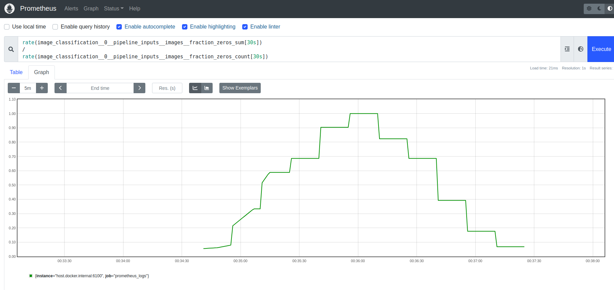
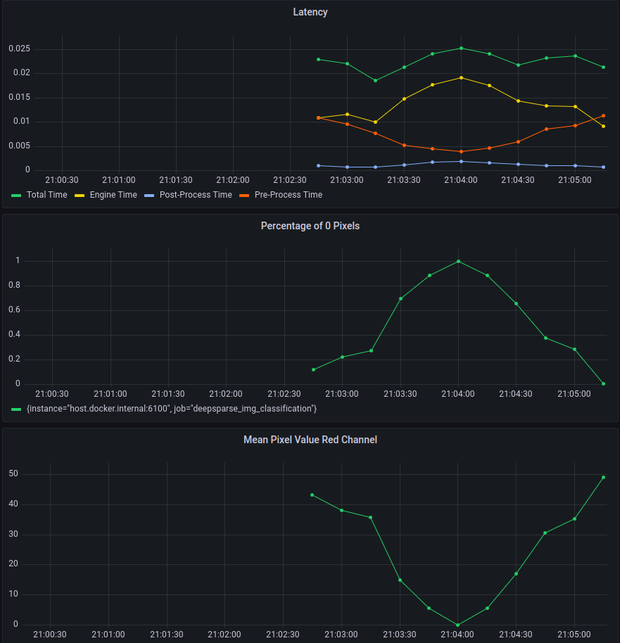

# DeepSparse + Prometheus/Grafana

This is a simple example that shows you how to connect DeepSparse Logging to the Prometheus/Grafana stack.

#### There are four steps:
- Configure DeepSparse Logging to log metrics in Prometheus format to a REST endpoint
- Point Prometheus to the appropriate endpoint to scape the data at a specified interval
- Run the toy client to perform inference
- Visualize data in Prometheus with dashboarding tool like Grafana

## 0. Setting Up
#### Installation

To run this tutorial, you need Docker, Docker Compose, and DeepSparse Server
- [Docker Installation](https://docs.docker.com/engine/install/)
- [Docker Compose Installation](https://docs.docker.com/compose/install/)
- DeepSparse Server is installed via PyPi (`pip install deepsparse[server]`)

#### Code
The repository contains all the code you need:

```bash
.
├── client 
│   ├── client.py           # simple client application for interacting with Server
│   └── goldfish.jpeg       # photo of a goldfish
|   └── all_black.jpeg      # photo with just black pixels
├── server-config.yaml      # specifies the configuration of the DeepSparse server
├── custom-fn.py            # custom function used for the logging
├── docker                  # specifies the configuration of the containerized Prometheus/Grafana stack
│   ├── docker-compose.yaml
│   └── prometheus.yaml
└── grafana                 # specifies the design of the Grafana dashboard
    └── dashboard.json
```
## 1. Spin up the DeepSparse Server

`server-config.yaml` specifies the config of the DeepSparse Server, including for logging:

```yaml
# server-config.yaml

loggers:
  prometheus:     # logs to prometheus on port 6100
    port: 6100

endpoints:
  - task: image_classification
    route: /image_classification/predict
    model: zoo:cv/classification/resnet_v1-50/pytorch/sparseml/imagenet/pruned95_quant-none
    data_logging:      
      pipeline_inputs.images[0]: # applies to the first image (of the form stage.property[idx])
        - func: fraction_zeros   # built-in function
          frequency: 1
          target_loggers:
            - prometheus
        - func: custom-fn.py:mean_pixel_red # custom function
          frequency: 1
          target_loggers:
            - prometheus
```

The config file instructs the server to create an image classification pipeline. Prometheus logs are declared to be exposed on port `6100`, system logging is turned on, and we will log the mean pixel of the red channel (a custom function) as well as the percentage of pixels that are 0 (a built-in function) for each image sent to the server.

Thus, once launched, the Server exposes two endpoints:
- port `6100`: exposes the `metrics` endpoint through [Prometheus python client](https://github.com/prometheus/client_python).
- port `5543`: exposes the endpoint for inference.

To spin up the Server execute:
```
deepsparse.server --config server-config.yaml
```

To validate that metrics are being properly exposed, visit `localhost:6100`. It should contain logs in the specific format meant to be used by the PromQL query language.

## 2. Setup Prometheus/Grafana Stack

For simplicity, we have provided `docker-compose.yaml` that spins up the containerized Prometheus/Grafana stack. In that file, we instruct `prometheus.yaml` (a [Prometheus config file](https://prometheus.io/docs/prometheus/latest/configuration/configuration/)) to be passed to the Prometheus container. Inside `prometheus.yaml`, the `scrape_config` has the information about the `metrics` endpoint exposed by the server on port `6100`.

Docker Compose File:

```yaml    
# docker-compose.yaml
    
version: "3"

services:
  prometheus:
    image: prom/prometheus
    extra_hosts:
      - "host.docker.internal:host-gateway"     # allow a direct connection from container to the local machine
    ports:
      - "9090:9090" # the default port used by Prometheus
    volumes:
      - ${PWD}/prometheus.yaml:/etc/prometheus/prometheus.yml # mount Prometheus config file

  grafana:
    image: grafana/grafana:latest
    depends_on:
      - prometheus
    ports:
      - "3000:3000" # the default port used by Grafana

```

Prometheus Config file:

```yaml
# prometheus.yaml
    
global:
  scrape_interval: 15s                      # how often to scrape from endpoint
  evaluation_interval: 30s                  # time between each evaluation of Prometheus' alerting rules

scrape_configs:
  - job_name: prometheus_logs               # your project name
    static_configs:
      - targets:
          - 'host.docker.internal:6100'     # should match the port exposed by the PrometheusLogger in the DeepSparse Server config file 
```
</details>

To start up a Prometheus stack to monitor the DeepSparse Server, run:

```bash
cd docker
docker-compose up
```

## 3. Launch the Python Client and Run Inference

`client.py` is a simple client that simulates the behavior of some application. In the example, we have two images:
  - `goldfish.jpeg`: sample photo of a Goldfish
  - `all-black.jpeg`: a photo that is all black (every pixel is a 0)  

The client sends requests to the Server, initially with "just" the Goldfish. Over time, we start to randomly
send the All Black image to the server with increasing probability. This simulates a data issue in the 
pipeline that we can detect with the monitoring system.

Run the following to start inference:

```bash
python client/client.py
```

It prints out which image was sent to the server.

## 4. Inspecting the Prometheus/Grafana Stack

### Prometheus

#### Confirm It Is Working

Visiting `http://localhost:9090/targets` should show that an endpoint `http://host.docker.internal:6100/metrics` is in state `UP`.

#### Query Prometheus with PromQL

If you do not want to use Grafana, you can start off by using Prometheus's native graphing functionality. 

Navigate to `http://localhost:9090/graph` and add the following `Expression`:

```
rate(image_classification__0__pipeline_inputs__images__fraction_zeros_sum[30s])
/
rate(image_classification__0__pipeline_inputs__images__fraction_zeros_count[30s])
```

You should see the following:



This graph shows the percentage of 0's. As the "corrupted" all black images were 
sent to the server in increasing probability, we can clearly see a spike in the graph, alerting us
that something strange is happening with the provided input.

For more details on working with the Prometheus Query Language PromQL, 
see [the official docs](https://prometheus.io/docs/prometheus/latest/querying/basics/).

### Grafana

#### Login

Visit `localhost:3000` to launch Grafana. Log in with the default username (`admin`) and password (`admin`). 

#### Add Prometheus Data Source
Setup the Prometheus data source (`Add your first data source` -> `Prometheus`). On this page, we just
need to update the `url` section. Since Grafana and Prometheus are running separate docker containers, 
put we need to put the IP address of the Prometheus container.

Run the following to lookup the `name` of your Prometheus container:
```
docker container ls
>>> CONTAINER ID   IMAGE                    COMMAND                  CREATED             STATUS             PORTS                                       NAMES
>>> 997521854d84   grafana/grafana:latest   "/run.sh"                About an hour ago   Up About an hour   0.0.0.0:3000->3000/tcp, :::3000->3000/tcp   docker_grafana_1
>>> c611c80ae05e   prom/prometheus          "/bin/prometheus --c…"   About an hour ago   Up About an hour   0.0.0.0:9090->9090/tcp, :::9090->9090/tcp   docker_prometheus_1
```

Run the following to lookup the IP address (replace `docker_prometheus_1` with your containers name):
```
docker inspect -f '{{range.NetworkSettings.Networks}}{{.IPAddress}}{{end}}' docker_prometheus_1
>>> 172.18.0.2
```

So, in our case, the `url` section should be: `http://172.18.0.2:9090`.

Click `Save & Test`. We should get a green check saying "Data Source Is Working".

#### Import A Dashboard

Now you should be ready to create/import your dashboard. 

Grafana's interface for adding metrics is very intuitive (and you can use PromQL), 
but we have a simple pre-made dashboard for this use case. 

Click `Dashboard` -> `Import` on the left-hand side bar. You should see an option to upload a file.
Upload `grafana/dashboard.json` and save. Then, you should see the following dashboard:


