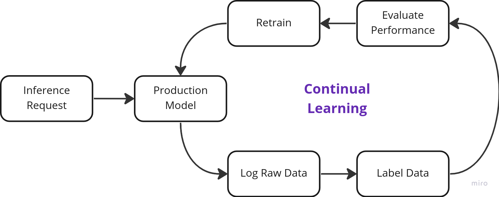
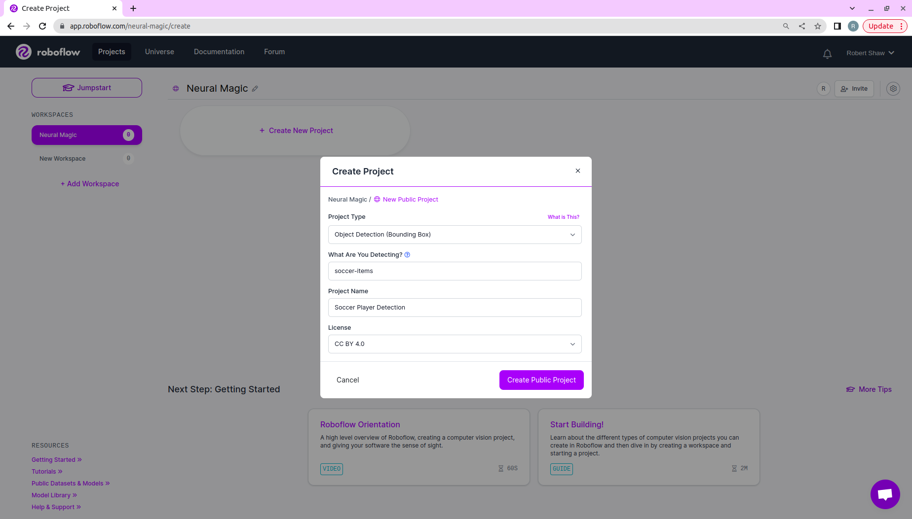
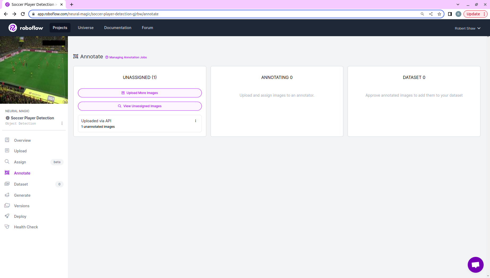
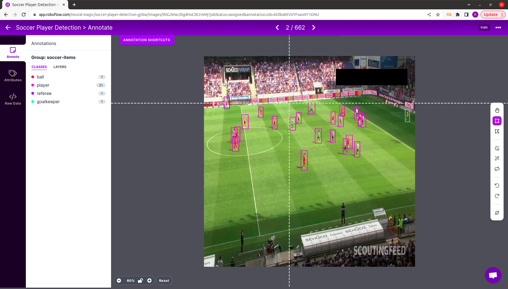
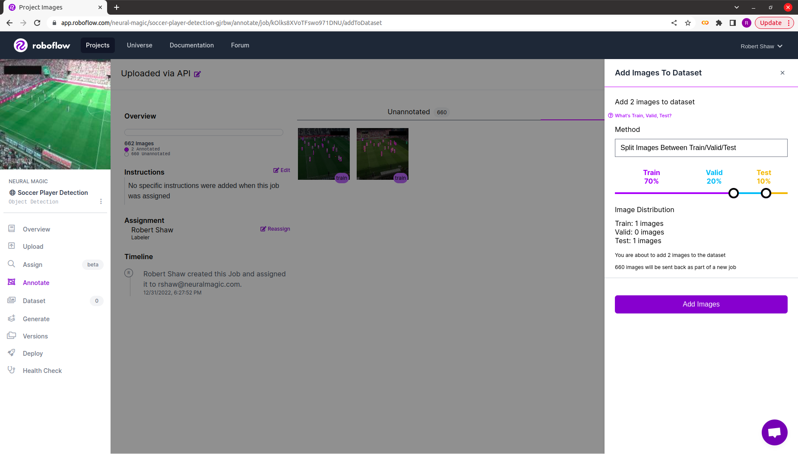
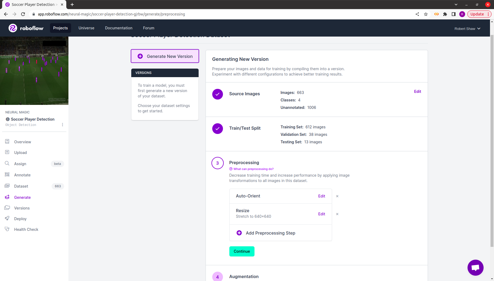
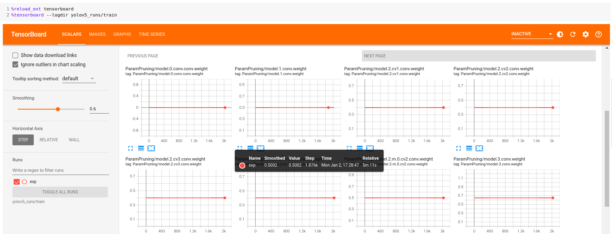
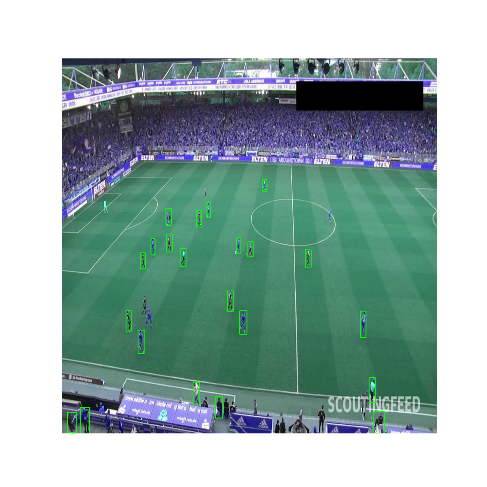
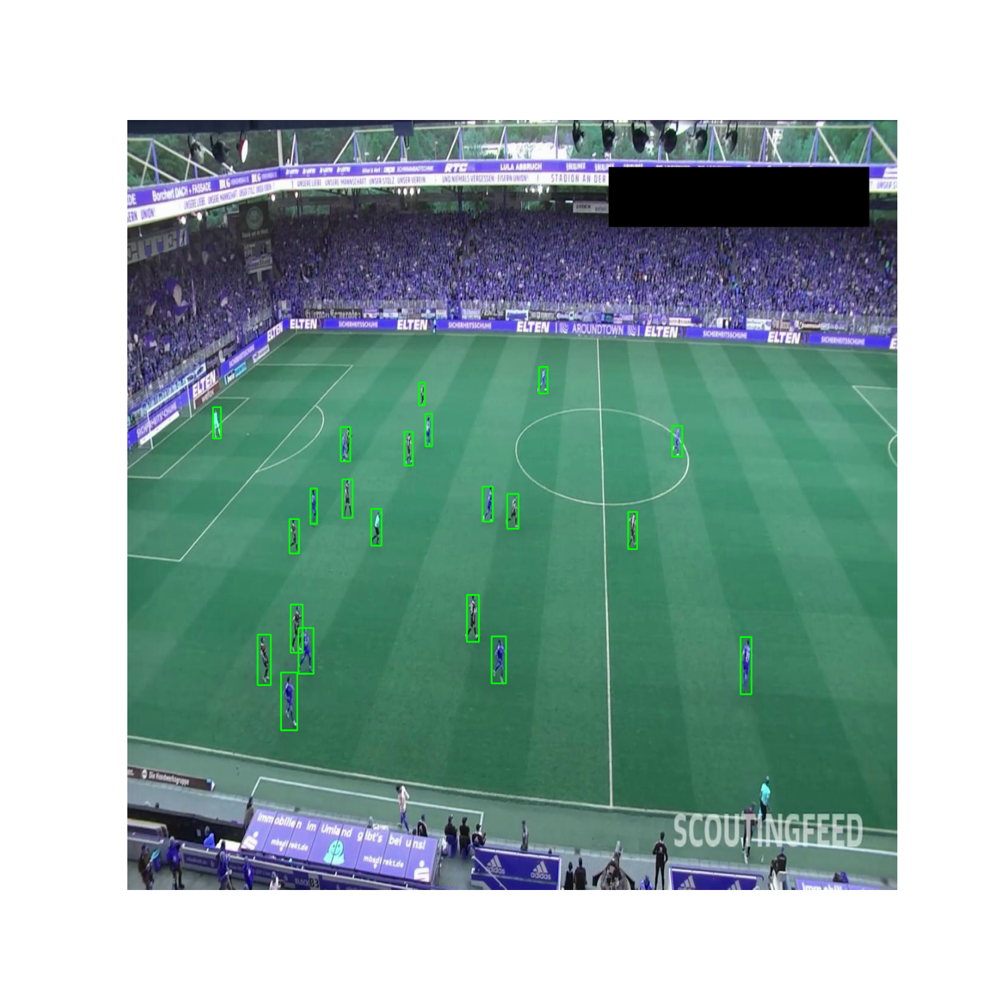

# **Neural Magic + Roboflow**

DeepSparse is more than the fastest deep learning inference runtime on CPUs - it also simplifies management of your production models. 

Let's take a look at how [DeepSparse Logging](https://docs.neuralmagic.com/user-guide/deepsparse-engine/logging)
can be integrated with Roboflow to create a Continual Learning system.  

## **What Is Continual Learning?**

The distribution of the incoming data to your production model will vary over time as the enviornment evolves. For example input images to a YOLOv5 model will look very different on a sunny day versus on a rainy day.

Since models are trained and validated on a snapshot of data, they can become stale as the distribution of inputs
shifts away from the data upon which the model was trained and validated ... ***often leading to poor accuracy in production***.

In order to combat these challenges, operations teams can adopt a **Continual Learning** mindset, where model performance is continually monitored, new 
data from production is continually gathered and labeled, and new versions of the model are continually trained. 

The workflow looks like this:

<p align="center">
    
</p>

Check out Full Stack Deep Learning's [awesome lecture](https://fullstackdeeplearning.com/course/2022/lecture-6-continual-learning/) 
for more details.

## **Tutorial Overview**

This example will demonstrate how to setup a Continual Learning system with Neural Magic and Roboflow
to train YOLOv5-s to detect soccer players in video clips.

There are 5 steps:
1. Deploy a YOLOv5-s model trained on COCO with DeepSparse
2. Log raw images from production to Roboflow
3. Label images with Roboflow
4. Retrain YOLOv5-s on the labeled production data with SparseML
5. Re-deploy the newly trained YOLOv5-s model with DeepSparse

Run the following to install the packages needed for the Tutorial. We recommend you
use a virtual enviornment with Python.

```bash
pip install deepsparse[server,yolo,onnxruntime]
pip install requests pillow requests-toolbelt
```

## **Step 1: Deploy YOLOv5-s with DeepSparse**

DeepSparse is a CPU inference runtime which achieves GPU-class performance on inference-optimized sparse models.

SparseZoo, Neural Magic's open-source model repository, holds sparse checkpoints for each version of YOLOv5 - making it easy to reach the 
performance of hardware accelerators in the object detection task.

### **Benchmarking DeepSparse's Performance**

To give you a sense of DeepSparse's exceptional performance, let's benchmark DeepSparse's performance against ONNX Runtime.

The following benchmarks were run on an AWS `c6i.8xlarge` instance (16 cores).

#### **ONNX Runtime Dense Performance Baseline**

Let's checkout ONNX Runtime's performance to generate a baseline.

Run the following to compute ORT's performance on standard, dense YOLOv5s at batch 32.
```bash
deepsparse.benchmark zoo:cv/detection/yolov5-s/pytorch/ultralytics/coco/base-none -s sync -b 32 -nstreams 1 -e onnxruntime

# Original Model Path: zoo:cv/detection/yolov5-s/pytorch/ultralytics/coco/base-none
# Batch Size: 32
# Scenario: sync
# Throughput (items/sec): 41.9025
```

We can see ONNX Runtime achieves 42 items/second.

#### **DeepSparse Sparse Performance**

Run the following to compute DeepSparse's throughput on a pruned-quantized YOLOv5s at batch 32.
```bash
deepsparse.benchmark zoo:cv/detection/yolov5-s/pytorch/ultralytics/coco/pruned65_quant-none -s sync -b 32 -nstreams 1

# Original Model Path: zoo:cv/detection/yolov5-s/pytorch/ultralytics/coco/pruned65_quant-none
# Batch Size: 32
# Scenario: sync
# Throughput (items/sec): 241.2452
```

We can see DeepSparse achieves 241 items/second. ***This is an 5.8x performance gain over ORT!***

### **Deploying YOLOv5-s with DeepSparse**

Now that we have demonstrated the performance gains from running with DeepSparse, let's deploy a model.

DeepSparse offers both a Pipeline and Server API, enabling you to add DeepSparse to a Python application
or to spin up a model service endpoint. In this case, we will use DeepSparse Server.

#### **Launching DeepSparse Server**

DeepSparse Server is launched as a CLI command and is configured with a YAML file. The following YAML file
launches a object detection endpoint with DeepSparse running a pruned-quantized version of YOLOv5-s trained
on COCO (identified by the SparseZoo stub).

```yaml
## server-config-no-roboflow-logging.yaml
loggers: 
    python:

endpoints:
  - task: yolo
    model: zoo:cv/detection/yolov5-s/pytorch/ultralytics/coco/pruned65_quant-none
    name: yolov5-s-coco
    route: /yolov5-s-coco/predict
```

Launch the Server. You should see Uvicorn report that it is running on `http://0.0.0.0:5543`.
```
deepsparse.server --config-file server/server-config-no-roboflow-logging.yaml
```

#### **Send Request to the Server**

Now that the model endpoint is running, we can send raw images over HTTP and recieve back 
the predicted bounding-boxes.

Download and unzip a dataset of soccer games from Roboflow Universe:
```
curl -L "https://universe.roboflow.com/ds/YZbicMV8Z4?key=WrbJD7E7Ky" > roboflow.zip; unzip roboflow.zip; rm roboflow.zip
```

The Python `request` package can be used to send a raw image to the `yolov5-s-coco/predict/from_files` route.
We can see that the response includes the bounding boxes, the classes, and the scores.

```python
import requests, json

ENDPOINT_URL = "http://localhost:5543/yolov5-s-coco/predict/from_files"
IMAGE_PATH = "test/images/4b770a_3_6_png.rf.f5d975605c1f73e1a95a1d8edc4ce5b1.jpg"

resp = requests.post(
  url=ENDPOINT_URL,
  files=[('request', open(IMAGE_PATH, 'rb'))]
)

print(json.loads(resp.text))
```

Run the following:
```
python client-send-one.py
```

## **Step 2: Log Production Data To Roboflow**

Now that we have DeepSparse Server up and running, let's configure DeepSparse to log images to Roboflow.

### **Set Up a Roboflow Project**

First, create a free account with [Roboflow](https://roboflow.com/) and create a new project.

<p align="center">
    
</p>

### **Create a Custom Roboflow Logger for DeepSparse**

[DeepSparse Logging](https://docs.neuralmagic.com/user-guide/deepsparse-engine/logging) enables you to log arbitrary data
at each stage of an inference pipeline to the logging system of your choice. DeepSparse has pre-made integrations with 
common monitoring stacks like Prometheus/Grafana, but also allows you to create custom loggers.

The `RoboflowLogger` is an example custom logger, created by inheriting from the `BaseLogger` abstract class and implementing the `log` method. Our 
implementation uses [Roboflow's Upload API](https://docs.roboflow.com/adding-data/upload-api#uploading-with-multipart-form-data-recommended) to send 
images to a Roboflow dataset.

Below, we will configure DeepSparse to call this `log` method within the inference pipeline. 

```python
from deepsparse.loggers import BaseLogger, MetricsCategories
import typing, PIL, io, requests, datetime
from requests_toolbelt.multipart.encoder import MultipartEncoder

class RoboflowLogger(BaseLogger):
    
    # the arguments to the construction will be defined in the config file
    def __init__(self, dataset_name: str, api_key: str):
        # per Roboflow docs
        self.upload_url = f"https://api.roboflow.com/dataset/{dataset_name}/upload?api_key={api_key}"
        super(RoboflowLogger, self).__init__()
    
    # this function will be called from DeepSparse Server, based on the config
    def log(self, identifier: str, value: typing.Any, category: typing.Optional[str]=None):
        if category == MetricsCategories.DATA:
            # unpacks value and converts to image in a buffer          
            img = PIL.Image.fromarray(value.images[0], mode="RGB")
            buffered = io.BytesIO()
            img.save(buffered, quality=90, format="JPEG")
            
            # packs as multipart
            img_name = f"production-image-{datetime.datetime.now()}.jpg"
            m =  MultipartEncoder(fields={'file': (img_name, buffered.getvalue(), "image/jpeg")})

            # uploads to roboflow
            r = requests.post(self.upload_url, data=m, headers={'Content-Type': m.content_type})
```

### **Configure DeepSparse Server to Use the Roboflow Logger**

With the `RoboflowLogger` created, let's update the Server configuration to log the pipeline inputs to Roboflow.

In the `loggers` section, we declare the `RoboflowLogger`, passing a local path its definition in `roboflow-logger.py`
the arguments to the constructor (`dataset_name` and `api_key`). You should update `server/server-config-roboflow-logging.yaml`
with the your Roboflow dataset name and your [Roboflow API Key](https://docs.roboflow.com/rest-api#obtaining-your-api-key).

```yaml
# server-config-roboflow-logging.yaml
loggers:
  roboflow_logger:
    path: server/roboflow-logger.py:RoboflowLogger
    api_key: YOUR_API_KEY
    dataset_name: YOUR_DATASET_NAME

endpoints:
  - task: yolo
    model: zoo:cv/detection/yolov5-s/pytorch/ultralytics/coco/pruned65_quant-none
    name: yolov5-s-coco
    route: /yolov5-s-coco/predict
    data_logging:
      pipeline_inputs:
        - func: identity
          frequency: 1        # << logs every image, set to frequency: 10000 to log 1/10000 images
          target_loggers:
            - roboflow_logger
```

> [Checkout the DeepSparse Logging documentation for more details on the Logging Syntax](https://docs.neuralmagic.com/user-guide/deepsparse-engine/logging).

We are now ready to start collecting data!

### **Collect Data**

Launch the Server with the new configuration file.
```
deepsparse.server --config-file server/server-config-roboflow-logging.yaml
```

Send a request to the Server as before:
```
python client-send-one.py
```

You should see the image ready to be annotated in Roboflow!

<p align="center">
    
</p>

#### **Simulating Production**

Let's simulate a production setting where we collect data from many client requests. The following script loops through 
the soccer images we previously downloaded from the Roboflow Universe and sends them to the model endpoint.

```python
import requests, json, os, time

# the dataset we downloaded had 3 subsets in 3 folders
paths = []
for folder_name in ['test', 'valid', 'train']:
    path = f"{folder_name}/images/"
    paths += [path + img_name for img_name in os.listdir(path)]
    
# same URL for the endpoint as before
ENDPOINT_URL = "http://localhost:5543/yolov5-s-coco/predict/from_files"

# send each image to the endpoint
print(f"Sending {len(paths)} images to the server")
for image_path in paths:    
    resp = requests.post(
      url=ENDPOINT_URL,
      files=[('request', open(image_path, 'rb'))]
    )
    print(resp)
    time.sleep(1)
```

Note that we included a 1s delay in between requests. In `server-config-roboflow-logging.yaml`, we configured DeepSparse to log 
every image (`frequency=1`) to a remote API for the purposes of the demo. Logging every image from a continuous stream will overload the Server 
and cause it to crash.

***In an actual productions setting, you will likely want to send only a sample of images up to the server if you are recieving requests continously. For example, you could set set `frequency=10000` to log 1 out of every 10000 images).***

Run the script with the following:

```bash
python3 client-send-all.py
```

Once this is complete, you should see 663 images ready to be labeled in Roboflow!

## Step 3: Label Images With Roboflow

*Note: This section shows the workflow for labeling images with Roboflow. There are 663 images
in the dataset, which can take time to label. Fortunately, there are labels for this dataset available in the 
Roboflow Universe, which we can upload directly to the project to save 
time for the purposes of this demo.*

Now that the unlabled images are in Roboflow, navigate to the Annotate tab in your Project on the Web UI.

<p align="center">
  
</p>

First, follow the prompts to assign the unlabeled images to a user (likely yourself).

Then, use the web UI to add bounding boxes to the images with the following four classes:
1. ball
2. goalkeeper
3. player
4. referee

<p align="center">
  
</p>

Finally, once you have labeled all of the images, add them to the dataset, splitting between Train, Test, and Validation.

<p align="center">
  
</p>

Once the 663 images have been uploaded, Roboflow provides the option to perform pre-processing, augmentation, and generation to the dataset.
In our case, we will train with images of size 640x640, so leave all of the default options in place.

<p align="center">
  
</p>

Your dataset is ready for training!

### **Shortcut: Uploading Labeled Images From Roboflow Universe**

The dataset we are using has labels in the [Roboflow Universe](https://universe.roboflow.com/roboflow-jvuqo/football-players-detection-3zvbc/dataset/2), so we can skip the manual labeling for the purposes of this demo.

Download the data with labels in the YOLOv5 format:
```bash
mkdir data-with-labels; cd data-with-labels; curl -L "https://universe.roboflow.com/ds/YZbicMV8Z4?key=WrbJD7E7Ky" > roboflow.zip; unzip roboflow.zip; rm roboflow.zip; cd ..
```

Install the Roboflow CLI with `npm`.
```
npm i -g roboflow-cli
```

Authenticate to Roboflow (follow the prompts on the webpage).
```
roboflow auth
```

Import the dataset to your project.
```
roboflow import data-with-labels
```

Open your project on the Roboflow web app
```
roboflow open
```

Once you navigate to your project, you should see the 663 images! 

Roboflow provides the option to perform pre-processing, augmentation, and generation to the dataset. In our case, we will train with images of size 640x640, so leave all of the default options in place.

<p align="center">
  
</p>

Your dataset is ready for training!

## **Step 4: Re-train the Model on Production Data**

In this step, we will use Neural Magic's SparseML and Roboflow's Datasets API to train a sparse version of YOLOv5 with the
data we gathered from production.

We have provided a [Colab Notebook](https://colab.research.google.com/drive/1e0zE6vGokh8LuXpDWhTzm-nelTHlrrFU)
with the full end-to-end training flow.

### **Download Data From Roboflow to Your Training Enviornment**

Roboflow has a convient CLI for downloading datasets.

Make sure the CLI is installed.
```bash
npm i -g roboflow-cli
```

Authenticate to Roboflow (follow the prompts on the webpage).
```bash
roboflow auth
```

Download the dataset. Your $DATASET_URL should look something like `neural-magic/soccer-player-detection-gjrbw/2`.
```bash
!roboflow download $DATASET_URL --format yolov5pytorch
```

Create a new directory called `runs` inside the folder that was downloaded.
```
cd $DOWNLOADED_FOLDER
mkdir runs
cd runs
```

You are ready to train!

### **Train a Sparse YOLOv5 with SparseML**

SparseML is an open-source optimization library which allows you to create sparse models trained on your dataset. One of the workflows enabled by 
SparseML is called Sparse Transfer Learning, which is similiar to typical transfer learning, except
you start from a sparse checkpoint and maintain the sparsity structure of the network while the fine-tuning occures.

SparseZoo contains sparse checkpoints for each version of YOLOv5 from N to X and SparseML is integrated with Ultralytics, so we can use a 
familiar CLI script to launch training.

#### **Kick Off Sparse Transfer Learning**

Run the following to pull down the pruned-quantized YOLOv5s checkpoint and start fine-tuning. The `--recipe` argument points to a YAML file in SparseZoo that instruct SparseML to maintain sparsity levels as the training occurs.

```bash
sparseml.yolov5.train \
  --weights zoo:cv/detection/yolov5-s/pytorch/ultralytics/coco/pruned65_quant-none?recipe_type=transfer_learn \
  --recipe zoo:cv/detection/yolov5-s/pytorch/ultralytics/coco/pruned65_quant-none?recipe_type=transfer_learn \
  --cfg "yolov5s.yaml" \
  --data $DATASET_PATH/data.yaml \
  --cache 'ram'
```

The training runs for 50 epochs, with final results by class looking like the following:

```
Class     Images     Labels          P          R     mAP@.5 mAP@.5:.95
  all         38        905      0.969      0.221      0.273      0.142
    0         38         35          1          0          0          0
    1         38         27          1          0     0.0757     0.0325
    2         38        754      0.874      0.886      0.899      0.476
    3         38         89          1          0      0.117     0.0611
```

The model has a hard time picking up on classes 0, 1, and 3 (ball, goalkeeper, and referee), but does a nice job of identifying the players!

Pulling up the TensorBoard (`--logdir yolov5_runs/train`), we can see that sparsity levels (as seen in the `ParamPruning` group) remain flat for every layer of the model as the fine-tuning occured - SparseML is doing its job!

<p align="center">
  
</p>

#### **Export to ONNX**

Run the following to convert the final PyTorch checkpoint to ONNX.
```
sparseml.yolov5.export_onnx --weights yolov5_runs/train/exp/weights/last.pt --dynamic
```

This creates an ONNX file representing the model at `yolov5_runs/train/exp/weights/last.onnx`. We will use 
this file when we redeploy the model with DeepSparse.

## **Step 5: Redeploy the New Model**

We will create a new configuration file for the server which contains two endpoints - one with the sparse YOLOv5s
trained on COCO and the sparse YOLOv5s fine-tuned on the production data.

Note that we provided a `last.onnx` file (which we trained in the manner described above) in the `server` directory.
You can swap a path to your ONNX file if desired.

```yaml
# server-config-multiple-endpoints.yaml
loggers: 
    python:

endpoints:
  - task: yolo
    model: zoo:cv/detection/yolov5-s/pytorch/ultralytics/coco/pruned65_quant-none
    name: yolov5-s-coco
    route: /yolov5-s-coco/predict
  
  - task: yolo
    model: server/last.onnx     # update with a path to your onnx file
    name: yolov5-s-finetuned
    route: /yolov5-s-finetuned/predict
```

Launch as before:
```
deepsparse.server --config-file server/server-config-multiple-endpoints.yaml
```

The following sends a request to each model endpoint and annotates the images with the bounding boxes, saving the output as files.

```
python client-multiple-endpoints.py
```

We can see that the fine-tuned model does a better job than the off-the-shelf COCO trained model!

YOLOv5s Trained on COCO        | YOLOv5s Finetuned on Production Data
:-----------------------------:|:------------------------------------:
 | 

## **Wrapping Up**

You have successfully created a data flywheel for continual learning with DeepSparse and Roboflow!

**Interested In Deploying DeepSparse To Production? [Start your 90 day free trial!](https://neuralmagic.com/deepsparse-free-trial/)**
