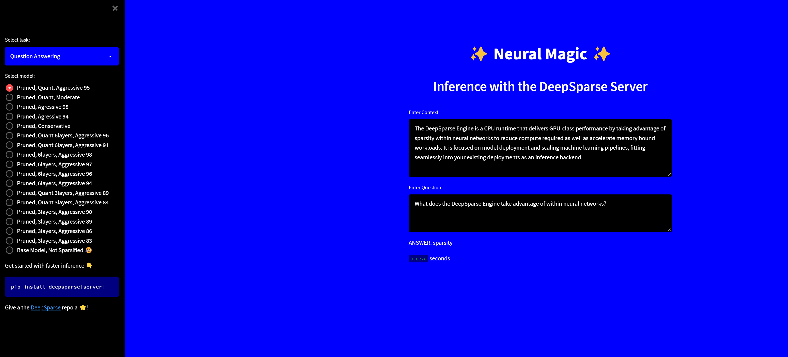

<!--
Copyright (c) 2021 - present / Neuralmagic, Inc. All Rights Reserved.

Licensed under the Apache License, Version 2.0 (the "License");
you may not use this file except in compliance with the License.
You may obtain a copy of the License at

   http://www.apache.org/licenses/LICENSE-2.0

Unless required by applicable law or agreed to in writing,
software distributed under the License is distributed on an "AS IS" BASIS,
WITHOUT WARRANTIES OR CONDITIONS OF ANY KIND, either express or implied.
See the License for the specific language governing permissions and
limitations under the License.
-->

        ███████╗██████╗  █████╗ ██████╗ ███████╗███████╗  ███████╗███████╗██████╗ ██╗   ██╗███████╗██████╗     ██╗   ██╗ ██╗
        ██╔════╝██╔══██╗██╔══██╗██╔══██╗██╔════╝██╔════╝  ██╔════╝██╔════╝██╔══██╗██║   ██║██╔════╝██╔══██╗    ██║   ██║ ██║
        ███████╗██████╔╝███████║██████╔╝███████╗█████╗    ███████╗█████╗  ██████╔╝██║   ██║█████╗  ██████╔╝    ██║   ██║ ██║
        ╚════██║██╔═══╝ ██╔══██║██╔══██╗╚════██║██╔══╝    ╚════██║██╔══╝  ██╔══██╗╚██╗ ██╔╝██╔══╝  ██╔══██╗    ██║   ██║ ██║
        ███████║██║     ██║  ██║██║  ██║███████║███████╗  ███████║███████╗██║  ██║ ╚████╔╝ ███████╗██║  ██║ ██╗ ╚██████╔ ██║
        ╚══════╝╚═╝     ╚═╝  ╚═╝╚═╝  ╚═╝╚══════╝╚══════╝  ╚══════╝╚══════╝╚═╝  ╚═╝  ╚═══╝  ╚══════╝╚═╝  ╚═╝ ╚═╝  ╚═════╝ ╚═╝
                                                                                                                

                        *** A Streamlit app for deploying the DeepSparse Server *** 

## <div>`INTRO`</div>

<samp>

<div>
SparseServer.UI allows you to serve a streamlit app running on top of the DeepSparse Server for comparing the latency speeds of sparse transformer models. The purpose of this app is for you to familiarize and compare the inference performance of transformers trained with various sparse approaches.
</div>

<br />

[Getting Started with the DeepSparse Server](https://github.com/neuralmagic/deepsparse/tree/main/src/deepsparse/server)

<br />



<br />

## <div>`INSTALLATION`</div>

```bash
git clone https://github.com/neuralmagic/deepsparse.git
cd deepsparse/examples/sparseserver-ui
pip install -r requirements.txt
```
<br />

The `config.yaml` file in the `server` directory includes a list of four BERT QA models for the DeepSparse Server to get started. If you prefer to add additional models to the `config.yaml` file, make sure to also add a `MultiPipelineClient` object to the `variants` attribute in the `settings.py` module.

Currently, the SparseZoo holds a vast list of BERT models, and the `big-config.yaml` file contains 19 models in case you want to load them 🤯. To load all of the 19 models at once, make sure you have at least 16GB of RAM available, otherwise you will get out of memory errors. In addition, uncomment the pipelines in the `settings.py` module.

For more details on question answering models, please refer to our [updated list](https://sparsezoo.neuralmagic.com/?domain=nlp&sub_domain=question_answering&page=1).

## <div>`START SERVER`</div>

To download and initialize the four models in the `config.yaml` file, run:
```bash
deepsparse.server --config_file server/config.yaml
```

After downloading, the DeepSparse Server should now be running on host `0.0.0.0` and port `5543`.

## <div>`START CLIENT`</div>

Open a new terminal (make sure you are in your environment) and run the following command to start the Streamlit app:

```bash
streamlit run client/app.py --browser.serverAddress="localhost"
```

This will start the Streamlit app on `localhost` and port `8501`.
Visit `http://localhost:8501` in your browser to view the demo.

### Testing

- 19 models should fit on 16GB RAM of a c2-standard-4 VM instance on GCP
- Ubuntu 20.04.4 LTS
- Python 3.8.10


## <div>`DOCKER COMPOSE`</div>

### Pre-requisite

- Docker
- Docker Compose

The SparseServer.UI demo is also available in a containerised docker format.


```bash
git clone https://github.com/neuralmagic/deepsparse.git
cd deepsparse/examples/sparseserver-ui
docker-compose up --build
```
<br />
This will automate the setup process and provide the streamlit app at 
`http://localhost:8501` and the deepserver at `http://localhost:5543` as described above.

<br />
Please note that the **build** flag is optional after the first build. 
</samp>