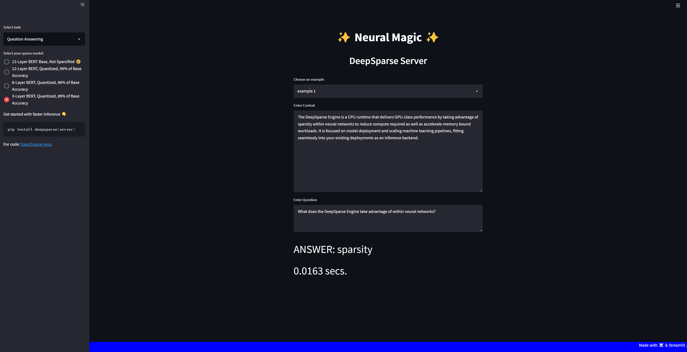

<!--
Copyright (c) 2021 - present / Neuralmagic, Inc. All Rights Reserved.

Licensed under the Apache License, Version 2.0 (the "License");
you may not use this file except in compliance with the License.
You may obtain a copy of the License at

   http://www.apache.org/licenses/LICENSE-2.0

Unless required by applicable law or agreed to in writing,
software distributed under the License is distributed on an "AS IS" BASIS,
WITHOUT WARRANTIES OR CONDITIONS OF ANY KIND, either express or implied.
See the License for the specific language governing permissions and
limitations under the License.
-->
 <sup><samp>[**NEURAL MAGIC**](https://neuralmagic.com)</samp></sup> 

        ███████╗██████╗  █████╗ ██████╗ ███████╗███████╗  ███████╗███████╗██████╗ ██╗   ██╗███████╗██████╗     ██╗   ██╗ ██╗
        ██╔════╝██╔══██╗██╔══██╗██╔══██╗██╔════╝██╔════╝  ██╔════╝██╔════╝██╔══██╗██║   ██║██╔════╝██╔══██╗    ██║   ██║ ██║
        ███████╗██████╔╝███████║██████╔╝███████╗█████╗    ███████╗█████╗  ██████╔╝██║   ██║█████╗  ██████╔╝    ██║   ██║ ██║
        ╚════██║██╔═══╝ ██╔══██║██╔══██╗╚════██║██╔══╝    ╚════██║██╔══╝  ██╔══██╗╚██╗ ██╔╝██╔══╝  ██╔══██╗    ██║   ██║ ██║
        ███████║██║     ██║  ██║██║  ██║███████║███████╗  ███████║███████╗██║  ██║ ╚████╔╝ ███████╗██║  ██║ ██╗ ╚██████╔ ██║
        ╚══════╝╚═╝     ╚═╝  ╚═╝╚═╝  ╚═╝╚══════╝╚══════╝  ╚══════╝╚══════╝╚═╝  ╚═╝  ╚═══╝  ╚══════╝╚═╝  ╚═╝ ╚═╝  ╚═════╝ ╚═╝
                                                                                                                    

                *** A Streamlit app for deploying the DeepSparse Server *** 


## <div>`INTRO`</div>

<samp>

<div>
SparseServer.UI allows you to serve a streamlit app running on top of the DeepSparse Server for comparing the latency speeds of sparse transformer models. Currently, the demo can safely load up to 18 BERT models fine-tuned on the question answering task on only 16GB of RAM. The purpose of this app is for you to familiarize and compare the inference performance of transformers trained with various sparse approaches.
</div>

<br />

[Getting Started with the DeepSparse Server](https://github.com/neuralmagic/deepsparse/tree/main/src/deepsparse/server)🔌

<br />



<br />

## <div>`INSTALL`</div>

```bash
git clone https://github.com/neuralmagic/deepsparse.git
cd examples/sparseserver-ui
pip install -r requirements.txt
```
<br />

The `starter-config.yaml` file in the `server` directory has a great started list of four models for DeepSparse Server to serve. 

Currently, it contains up to 18 BERT models, although 16 of these models are commented out so you can safely get started on two models, and later on, add more models at your own pace. 


If you wish to load all 18 models at once into memory, make sure you have 16GB of RAM available, otherwise you will get out of memory errors. Also, as you add additional models to the `config.yaml` file, make sure to also add a `MultiPipelineClient` object to the `variants` attribute in the `settings.py` module.

To add more question answering models please refer to our [updated list](https://sparsezoo.neuralmagic.com/?domain=nlp&sub_domain=question_answering&page=1).

## <div>`START SERVER`</div>

To download and initialize the two sample models in the `config.yaml` file, run:
```bash
deepsparse.server --config_file server/starter-config.yaml
```

The DeepSparse Server should now be running on host `0.0.0.0` and port `5543`.

## <div>`START CLIENT`</div>

Open a new terminal (make sure you are in your environment) and run the following command to start the Streamlit app:

```bash
streamlit run client/app.py \
    --theme.backgroundColor blue \
    --theme.secondaryBackgroundColor black \
    --theme.textColor white \
    --browser.serverAddress="localhost"
```
This will start the Streamlit app on host `localhost` and port `8501`.
Visit `http://localhost:8501` in your browser to view the demo.

### Testing

- 18 models were able to fit on 16GB RAM of a c2-standard-4 VM instance on GCP
- Ubuntu 20.04.4 LTS
- Python 3.8.10
</samp>
