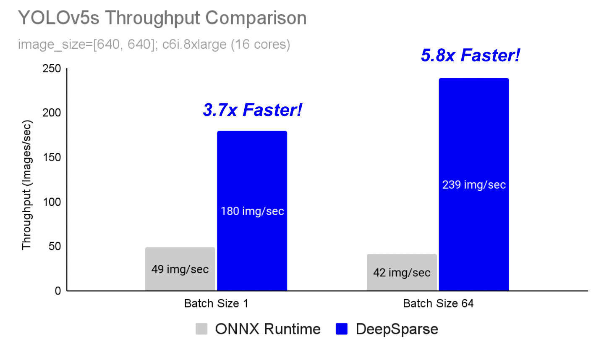

# DeepSparse

This guide explains how to deploy YOLOv5 with Neural Magic's DeepSparse.

## About DeepSparse

Welcome to software-delivered AI.

DeepSparse is an inference runtime with exceptional performance on CPUs. For instance, compared to ONNX Runtime's baseline, DeepSparse offers a 3.7x speed-up at batch size 1 and a 5.8x speed-up at batch size 64 for YOLOv5s!

<p align="center">
  
</p>

For the first time, your deep learning workloads can meet the performance demands of production without the complexity and costs of hardware accelerators.
Put simply, DeepSparse gives you the performance of GPUs and the simplicity of software:
- **Flexible Deployments**: Run consistently across cloud, data center, and edge with any hardware provider from Intel to AMD to ARM
- **Near-Infinite Scalability**: Scale vertically from 1 to 192 cores, out with standard Kubernetes, or fully-abstracted with Serverless
- **Easy Integration**: Clean APIs for integrating your model into an application and monitoring it in production

**[Start your 90 day Free Trial](https://neuralmagic.com/deepsparse-free-trial/?utm_campaign=free_trial&utm_source=ultralytics_github).**

### How Does DeepSparse Achieve GPU-Class Performance?

DeepSparse takes advantage of model sparsity to gain its performance speedup. 

Sparsification through pruning and quantization is a broadly studied technique, allowing reductions of 10x in the size and compute needed to 
execute a network, while maintaining high accuracy. DeepSparse is sparsity-aware, so it skips the multiply-adds by 0, shrinking amount of compute
in a forward pass. Since the sparse computation is memory bound, DeepSparse executes the network depth-wise, breaking the problem into Tensor Columns, 
vertical stripes of computation that fit in cache.

<p align="center">
  
</p>

Sparse computation, executed depth-wise in cache, allows DeepSparse to deliver GPU-class performance on CPUs!

### How Do I Create A Sparse Version of YOLOv5 Trained on My Data?

Neural Magic's open-source model repository, SparseZoo, contains pre-sparsified checkpoints of each YOLOv5 model. Using SparseML, which is integrated with Ultralytics, you can fine-tune a sparse checkpoint onto your data with a single CLI command.

[Checkout Neural Magic's YOLOv5 documentation for more details](https://docs.neuralmagic.com/use-cases/object-detection/sparsifying).

## DeepSparse Usage

We will walk through an example benchmarking and deploying a sparse version of YOLOv5s with DeepSparse.

### Install DeepSparse

Run the following to install DeepSparse. We recommend you use a virtual enviornment.

```bash
pip install deepsparse[server,yolo,onnxruntime]
```

### Collect an ONNX File

DeepSparse accepts a model in the ONNX format, passed either as:
- A SparseZoo stub which identifies an ONNX file in the SparseZoo
- A local path to an ONNX model in a filesystem

The examples below will use the pruned-quantized YOLOv5s and standard dense YOLOv5s checkpoints, identified by the following SparseZoo stubs:
```bash
zoo:cv/detection/yolov5-s/pytorch/ultralytics/coco/base-none
zoo:cv/detection/yolov5-s/pytorch/ultralytics/coco/pruned65_quant-none
zoo:cv/detection/yolov5-s/pytorch/ultralytics/coco/pruned35_quant-none-vnni # < pruned for VNNI machines
```

### Benchmark Performance

We will compare DeepSparse's throughput to ONNX Runtime's throughput on YOLOv5s, using DeepSparse's benchmarking script.

The benchmarks were run on an AWS `c6i.8xlarge` instance (16 cores). 

#### Batch 1 Performance Comparison

ONNX Runtime achieves 49 images/sec with dense YOLOv5s.

```bash
deepsparse.benchmark zoo:cv/detection/yolov5-s/pytorch/ultralytics/coco/base-none -s sync -b 1 -nstreams 1 -e onnxruntime

> Original Model Path: zoo:cv/detection/yolov5-s/pytorch/ultralytics/coco/base-none
> Batch Size: 1
> Scenario: sync
> Throughput (items/sec): 48.8549
> Latency Mean (ms/batch): 20.4613
> Latency Median (ms/batch): 20.4192
```

DeepSparse achieves 135 items/sec with a pruned-quantized YOLOv5s, **a 2.8x performance gain over ONNX Runtime!**

```bash
deepsparse.benchmark zoo:cv/detection/yolov5-s/pytorch/ultralytics/coco/pruned65_quant-none -s sync -b 1 -nstreams 1

> Original Model Path: zoo:cv/detection/yolov5-s/pytorch/ultralytics/coco/pruned65_quant-none
> Batch Size: 1
> Scenario: sync
> Throughput (items/sec): 135.0647
> Latency Mean (ms/batch): 7.3895
> Latency Median (ms/batch): 7.2398```
```

Since `c6i.8xlarge` instances have VNNI instructions, DeepSparse's throughput can be pushed further if weights are pruned in blocks of 4. DeepSparse achieves 180 items/sec with a 4-block pruned-quantized YOLOv5s, a **3.7x performance gain over ONNX Runtime!**

```bash
deepsparse.benchmark zoo:cv/detection/yolov5-s/pytorch/ultralytics/coco/pruned35_quant-none-vnni -s sync -b 1 -nstreams 1

> Original Model Path: zoo:cv/detection/yolov5-s/pytorch/ultralytics/coco/pruned35_quant-none-vnni
> Batch Size: 1
> Scenario: sync
> Throughput (items/sec): 179.6016
> Latency Mean (ms/batch): 5.5615
> Latency Median (ms/batch): 5.5458
```

#### Batch 64 Performance Comparison

In latency-insensitive scenarios with large batch sizes, DeepSparse's performance relative to ONNX Runtime is even stronger.

ONNX Runtime achieves 42 images/sec with dense YOLOv5s:

```bash
deepsparse.benchmark zoo:cv/detection/yolov5-s/pytorch/ultralytics/coco/base-none -s sync -b 64 -nstreams 1 -e onnxruntime

> Original Model Path: zoo:cv/detection/yolov5-s/pytorch/ultralytics/coco/base-none
> Batch Size: 64
> Scenario: sync
> Throughput (items/sec): 41.5560
> Latency Mean (ms/batch): 1538.6640
> Latency Median (ms/batch): 1538.0362
```

DeepSparse achieves 239 images/sec with pruned-quantized YOLOv5s, a **5.8x performance improvement over ORT**!

```bash
deepsparse.benchmark zoo:cv/detection/yolov5-s/pytorch/ultralytics/coco/pruned65_quant-none -s sync -b 64 -nstreams 1

> Original Model Path: zoo:cv/detection/yolov5-s/pytorch/ultralytics/coco/pruned65_quant-none
> Batch Size: 64
> Scenario: sync
> Throughput (items/sec): 239.0854
> Latency Mean (ms/batch): 267.6703
> Latency Median (ms/batch): 267.3194
```

### Deploy a Model

DeepSparse offers convenient APIs for integrating your model into an application.  

To try the deployment examples below, pull down a sample image for the example and save as `basilica.jpg` with the following command:
```bash
wget -O basilica.jpg https://raw.githubusercontent.com/neuralmagic/deepsparse/main/src/deepsparse/yolo/sample_images/basilica.jpg
```

#### Python API
  
`Pipelines` wrap pre-processing and output post-processing around the runtime, providing a clean inferface for adding DeepSparse to an application. 
The DeepSparse-Ultralytics integration includes an out-of-the-box `Pipeline` that accepts raw images and outputs the bounding boxes.

Create a `Pipeline` and run inference:

```python
from deepsparse import Pipeline

# list of images in local filesystem
images = ["basilica.jpg"]

# create Pipeline
model_stub = "zoo:cv/detection/yolov5-s/pytorch/ultralytics/coco/pruned65_quant-none"
yolo_pipeline = Pipeline.create(
    task="yolo",
    model_path=model_stub,
)

# run inference on images, recieve bounding boxes + classes
pipeline_outputs = yolo_pipeline(images=images, iou_thres=0.6, conf_thres=0.001)
print(pipeline_outputs)
```

#### HTTP Server
  
DeepSparse Server runs on top of the popular FastAPI web framework and Uvicorn web server. With just a single CLI command, you can easily setup a model 
service endpoint with DeepSparse. The Server supports any Pipeline from DeepSparse, including object detection with YOLOv5, enabling you to send raw 
images to the endpoint and recieve the bounding boxes.

Spin up the Server with the pruned-quantized YOLOv5s:

```bash
deepsparse.server \
    --task yolo \
    --model_path zoo:cv/detection/yolov5-s/pytorch/ultralytics/coco/pruned65_quant-none
```

An example request, using Python's `requests` package:
```python
import requests, json

# list of images for inference (local files on client side)
path = ['basilica.jpg'] 
files = [('request', open(img, 'rb')) for img in path]

# send request over HTTP to /predict/from_files endpoint
url = 'http://0.0.0.0:5543/predict/from_files'
resp = requests.post(url=url, files=files)

# response is returned in JSON
annotations = json.loads(resp.text) # dictionary of annotation results
bounding_boxes = annotations["boxes"]
labels = annotations["labels"]
```

## Get Started With DeepSparse

**Research or Testing?** DeepSparse Community is free for research and testing. Get started with our [Documentation](https://docs.neuralmagic.com/).

**Want to Try DeepSparse Enterprise?** [Start your 90 day free trial](https://neuralmagic.com/deepsparse-free-trial/?utm_campaign=free_trial&utm_source=ultralytics_github).
