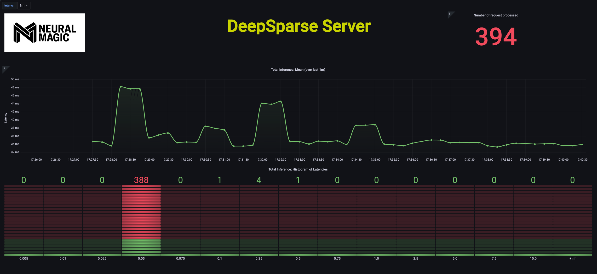

# Monitoring with DeepSparse + Prometheus/Grafana

DeepSparse Logging is compatible with Prometheus/Grafana, making it easy to stand up a model monitoring service.

This tutorial will show you how to connect DeepSparse Logging to the Prometheus/Grafana stack.

#### There are four steps:
- Configure DeepSparse Logging to log metrics in Prometheus format to a REST endpoint
- Point Prometheus to the appropriate endpoint to scape the data at a specified interval
- Run the toy client to perform inference
- Visualize data in Prometheus with dashboarding tool like Grafana

## 0. Setting Up
#### Installation

To run this tutorial, you need Docker, Docker Compose, and DeepSparse Server
- [Docker Installation](https://docs.docker.com/engine/install/)
- [Docker Compose Installation](https://docs.docker.com/compose/install/)
- DeepSparse Server is installed via PyPi (`pip install deepsparse server`)

#### Code
The repository contains all the code you need:

```bash
.
├── client 
│   ├── client.py           # simple client application for interacting with Server
│   └── piglet.jpg 
├── server_config.yaml      # specifies the configuration of the DeepSparse server
├── docker                  # specifies the configuration of the containerized Prometheus/Grafana stack
│   ├── docker-compose.yaml
│   └── prometheus.yaml
└── grafana                 # specifies the design of the Grafana dashboard
    └── dashboard.json
```
## 1. Spin up the DeepSparse Server

`server_config.yaml` specifies the config of the DeepSparse Server, including for logging. 

<details>
    <summary>Click to see what the config file looks like</summary>

```yaml
# server_config.yaml

num_cores: 2
num_workers: 2

loggers:                        # << relevant to logging
  prometheus:           
    port: 6100
    
system_logging: on              # << relevant to logging

endpoints:
  - task: image_classification
    batch_size: 1
    model: zoo:cv/classification/resnet_v1-50/pytorch/sparseml/imagenet/pruned95_quant-none
    name: image_classification_pipeline
    data_logging:               # << relevant to logging
        pipeline_inputs:
        ...
```
</details>

The config file instructs the server to create an image classification pipeline. Prometheus logs are declared to be exposed on port `6100`, system logging is turned on, and several data logs have been specified.

Thus, once launched, the Server also exposes two endpoints:
- port `6100`: exposes the `metrics` endpoint through [Prometheus python client](https://github.com/prometheus/client_python).
- port `5543`: exposes the endpoint for inference.

To spin up the Server execute:
```
deepsparse.server --config server_config.yaml
```

To validate that metrics are being properly exposed, visit `localhost:6100`. It should contain logs in the specific format meant to be used by the PromQL query language.

## 2. Setup Prometheus/Grafana Stack

For simplicity, we have provided `docker-compose.yaml` that spins up the containerized Prometheus/Grafana stack. In that file, we instruct `prometheus.yaml` (a [Prometheus config file](https://prometheus.io/docs/prometheus/latest/configuration/configuration/)to be passed to the Prometheus container. Inside `prometheus.yaml`, the `scrape_config` has the information about the `metrics` endpoint exposed by the server on port `6100`.

<details>
    <summary>Click to see Docker Compose File</summary>

```yaml    
# docker-compose.yaml
    
version: "3"

services:
  prometheus:
    image: prom/prometheus
    extra_hosts:
      - "host.docker.internal:host-gateway"     # allow a direct connection from container to the local machine
    ports:
      - "9090:9090" # the default port used by Prometheus
    volumes:
      - ${PWD}/prometheus.yaml:/etc/prometheus/prometheus.yml # mount Prometheus config file

  grafana:
    image: grafana/grafana:latest
    depends_on:
      - prometheus
    ports:
      - "3000:3000" # the default port used by Grafana

```
</details>

<details>
    <summary>Click to see Prometheus Config File</summary>
    
```yaml
# prometheus.yaml
    
global:
  scrape_interval: 15s                      # how often to scrape from endpoint
  evaluation_interval: 30s                  # time between each evaluation of Prometheus' alerting rules

scrape_configs:
  - job_name: prometheus_logs               # your project name
    static_configs:
      - targets:
          - 'host.docker.internal:6100'     # should match the port exposed by the PrometheusLogger in the DeepSparse Server config file 
```
</details>

To start up a Prometheus stack to monitor the DeepSparse Server, run:

```bash
cd docker
docker-compose up
```

## 3. Launch the Python Client and Run Inference

`client.py` is a simple client, that periodically sends requests to the Server. The client simulates the behavior of some application, 
that sends the raw inputs to the inference server and receives the outputs. 

Run the following to start inference:

```bash
python client/client.py client/piglet.jpg 5543
```
The first argument is the path to the sample image, while the second argument is the port number that matches the inference endpoint of the Server.

Note: It is very easy to create your own custom client, that communicates with the DeepSparse Server. 
In the separate [README](https://github.com/neuralmagic/deepsparse/tree/main/src/deepsparse/server),
we instruct the users how they can communicate with the Server (that serves one or multiple models) either through:
- a convinient Python API
- `curl` command from terminal
- [Swagger UI](https://swagger.io/tools/swagger-ui/)

## 4. Inspecting the Prometheus/Grafana Stack

You may visit `localhost:9090` to inspect whether Prometheus recognizes the `metrics` endpoint (`Status` -> `Targets`)


Visit `localhost:3000` to launch Grafana. Log in with the default username (`admin`) and password (`admin`). 
Setup the Prometheus data source (`Add your first data source` -> `Prometheus`). 

Now you should be ready to create/import your dashboard. If you decide to import the dashboard, either upload `grafana/dashboard.json` or 
paste its contents using Grafana's `import` functionality.


