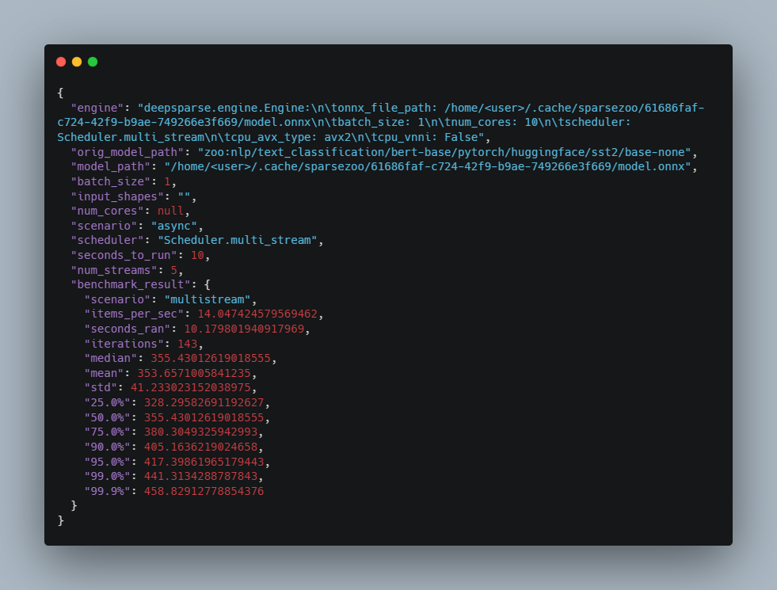

<!--
Copyright (c) 2021 - present / Neuralmagic, Inc. All Rights Reserved.

Licensed under the Apache License, Version 2.0 (the "License");
you may not use this file except in compliance with the License.
You may obtain a copy of the License at

   http://www.apache.org/licenses/LICENSE-2.0

Unless required by applicable law or agreed to in writing,
software distributed under the License is distributed on an "AS IS" BASIS,
WITHOUT WARRANTIES OR CONDITIONS OF ANY KIND, either express or implied.
See the License for the specific language governing permissions and
limitations under the License.
-->

## 📜 Benchmarking ONNX Models

`deepsparse.benchmark` is a command-line (CLI) tool for benchmarking the DeepSparse Engine with ONNX models. The tool will parse the arguments, download/compile the network into the engine, generate input tensors, and execute the model depending on the chosen scenario. By default, it will choose a multi-stream or asynchronous mode to optimize for throughput.

### Quickstart

After `pip install deepsparse`, the benchmark tool is available on your CLI. For example, to benchmark a dense BERT ONNX model fine-tuned on the SST2 dataset where the model path is the minimum input required to get started, run:

```
deepsparse.benchmark zoo:nlp/text_classification/bert-base/pytorch/huggingface/sst2/base-none
```
__ __
### Usage

In most cases, good performance will be found in the default options so it can be as simple as running the command with a SparseZoo model stub or your local ONNX model. However, if you prefer to customize benchmarking for your personal use case, you can run `deepsparse.benchmark -h` or with `--help` to view your usage options:

CLI Arguments:
```
positional arguments:

        model_path                    Path to an ONNX model file or SparseZoo model stub.

optional arguments:

        -h, --help                    show this help message and exit.

        -b BATCH_SIZE, --batch_size BATCH_SIZE
                                        The batch size to run the analysis for. Must be
                                        greater than 0.

        -shapes INPUT_SHAPES, --input_shapes INPUT_SHAPES
                                        Override the shapes of the inputs, i.e. -shapes
                                        "[1,2,3],[4,5,6],[7,8,9]" results in input0=[1,2,3]
                                        input1=[4,5,6] input2=[7,8,9].

        -ncores NUM_CORES, --num_cores NUM_CORES
                                        The number of physical cores to run the analysis on,
                                        defaults to all physical cores available on the system.

        -s {async,sync,elastic}, --scenario {async,sync,elastic}
                                        Choose between using the async, sync and elastic
                                        scenarios. Sync and async are similar to the single-
                                        stream/multi-stream scenarios. Elastic is a newer
                                        scenario that behaves similarly to the async scenario
                                        but uses a different scheduling backend. Default value
                                        is async.

        -t TIME, --time TIME            
                                        The number of seconds the benchmark will run. Default
                                        is 10 seconds.

        -w WARMUP_TIME, --warmup_time WARMUP_TIME
                                        The number of seconds the benchmark will warmup before
                                        running.Default is 2 seconds.

        -nstreams NUM_STREAMS, --num_streams NUM_STREAMS
                                        The number of streams that will submit inferences in
                                        parallel using async scenario. Default is
                                        automatically determined for given hardware and may be
                                        sub-optimal.

        -pin {none,core,numa}, --thread_pinning {none,core,numa}
                                        Enable binding threads to cores ('core' the default),
                                        threads to cores on sockets ('numa'), or disable
                                        ('none').

        -e {deepsparse,onnxruntime}, --engine {deepsparse,onnxruntime}
                                        Inference engine backend to run eval on. Choices are
                                        'deepsparse', 'onnxruntime'. Default is 'deepsparse'.

        -q, --quiet                     Lower logging verbosity.

        -x EXPORT_PATH, --export_path EXPORT_PATH
                                        Store results into a JSON file.
```
💡**PRO TIP**💡: save your benchmark results in a convenient JSON file!

Example CLI command for benchmarking an ONNX model from the SparseZoo and saving the results to a `benchmark.json` file:

```
deepsparse.benchmark zoo:nlp/text_classification/bert-base/pytorch/huggingface/sst2/base-none -x benchmark.json
```
Output of the JSON file:



#### Sample CLI Argument Configurations

To run a sparse FP32 MobileNetV1 at batch size 16 for 10 seconds for throughput using 8 streams of requests:

```
deepsparse.benchmark zoo:cv/classification/mobilenet_v1-1.0/pytorch/sparseml/imagenet/pruned-moderate --batch_size 16 --time 10 --scenario async --num_streams 8
```

To run a sparse quantized INT8 6-layer BERT at batch size 1 for latency:

```
deepsparse.benchmark zoo:nlp/question_answering/bert-base/pytorch/huggingface/squad/pruned_quant_6layers-aggressive_96 --batch_size 1 --scenario sync
```
__ __
### ⚡ Inference Scenarios

#### Synchronous (Single-stream) Scenario

Set by the `--scenario sync` argument, the goal metric is latency per batch (ms/batch). This scenario submits a single inference request at a time to the engine, recording the time taken for a request to return an output. This mimics an edge deployment scenario.

The latency value reported is the mean of all latencies recorded during the execution period for the given batch size.

#### Asynchronous (Multi-stream) Scenario

Set by the `--scenario async` argument, the goal metric is throughput in items per second (i/s). This scenario submits `--num_streams` concurrent inference requests to the engine, recording the time taken for each request to return an output. This mimics a model server or bulk batch deployment scenario.

The throughput value reported comes from measuring the number of finished inferences within the execution time and the batch size.

#### Example Benchmarking Output of Synchronous vs. Asynchronous

**BERT 3-layer FP32 Sparse Throughput**

No need to add *scenario* argument since `async` is the default option:
```
deepsparse.benchmark zoo:nlp/question_answering/bert-base/pytorch/huggingface/squad/pruned_3layers-aggressive_83
[INFO benchmark_model.py:202 ] Thread pinning to cores enabled
DeepSparse Engine, Copyright 2021-present / Neuralmagic, Inc. version: 0.10.0 (9bba6971) (optimized) (system=avx512, binary=avx512)
[INFO benchmark_model.py:247 ] deepsparse.engine.Engine:
        onnx_file_path: /home/mgoin/.cache/sparsezoo/c89f3128-4b87-41ae-91a3-eae8aa8c5a7c/model.onnx
        batch_size: 1
        num_cores: 18
        scheduler: Scheduler.multi_stream
        cpu_avx_type: avx512
        cpu_vnni: False
[INFO            onnx.py:176 ] Generating input 'input_ids', type = int64, shape = [1, 384]
[INFO            onnx.py:176 ] Generating input 'attention_mask', type = int64, shape = [1, 384]
[INFO            onnx.py:176 ] Generating input 'token_type_ids', type = int64, shape = [1, 384]
[INFO benchmark_model.py:264 ] num_streams default value chosen of 9. This requires tuning and may be sub-optimal
[INFO benchmark_model.py:270 ] Starting 'async' performance measurements for 10 seconds
Original Model Path: zoo:nlp/question_answering/bert-base/pytorch/huggingface/squad/pruned_3layers-aggressive_83
Batch Size: 1
Scenario: multistream
Throughput (items/sec): 83.5037
Latency Mean (ms/batch): 107.3422
Latency Median (ms/batch): 107.0099
Latency Std (ms/batch): 12.4016
Iterations: 840
```

**BERT 3-layer FP32 Sparse Latency**

To select a *synchronous inference scenario*, add `-s sync`:

```
deepsparse.benchmark zoo:nlp/question_answering/bert-base/pytorch/huggingface/squad/pruned_3layers-aggressive_83 -s sync
[INFO benchmark_model.py:202 ] Thread pinning to cores enabled
DeepSparse Engine, Copyright 2021-present / Neuralmagic, Inc. version: 0.10.0 (9bba6971) (optimized) (system=avx512, binary=avx512)
[INFO benchmark_model.py:247 ] deepsparse.engine.Engine:
        onnx_file_path: /home/mgoin/.cache/sparsezoo/c89f3128-4b87-41ae-91a3-eae8aa8c5a7c/model.onnx
        batch_size: 1
        num_cores: 18
        scheduler: Scheduler.single_stream
        cpu_avx_type: avx512
        cpu_vnni: False
[INFO            onnx.py:176 ] Generating input 'input_ids', type = int64, shape = [1, 384]
[INFO            onnx.py:176 ] Generating input 'attention_mask', type = int64, shape = [1, 384]
[INFO            onnx.py:176 ] Generating input 'token_type_ids', type = int64, shape = [1, 384]
[INFO benchmark_model.py:270 ] Starting 'sync' performance measurements for 10 seconds
Original Model Path: zoo:nlp/question_answering/bert-base/pytorch/huggingface/squad/pruned_3layers-aggressive_83
Batch Size: 1
Scenario: singlestream
Throughput (items/sec): 62.1568
Latency Mean (ms/batch): 16.0732
Latency Median (ms/batch): 15.7850
Latency Std (ms/batch): 1.0427
Iterations: 622
```