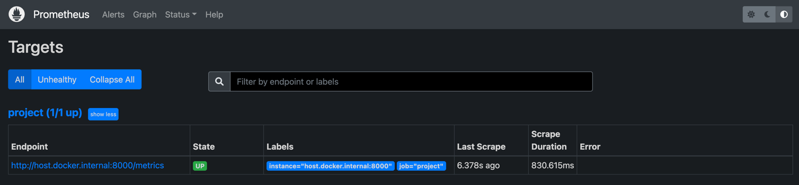
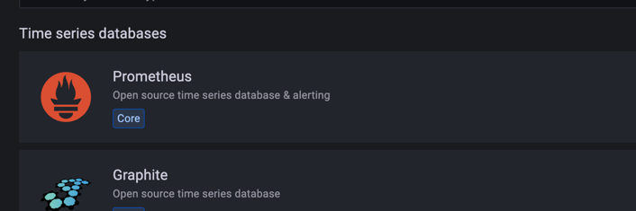

# Grafana <-> Prometheus logger integration

This is the brief overview of my learnings on how to integrate Grafana with Prometheus and Prometheus python client
to display logging information.
To spin up the MVP of the functionality run:

```bash
python example.py
````
working remotely 
## PrometheusLogger 
The logger now has a new constructor argument `grafana_monitoring: bool`, that specifies, whether the user wishes to use
Grafana with the logger. If yes, the logger calls a method that runs `docker-compose` as a subprocess. This starts two docker containers:
- Prometheus container (requires mounting a local .yaml config file)
- Grafana container

On the first run docker-compose should return a verbose set of logs proving that it is pulling the base images and spinning up both
containers. Eventually (e.g. when we rerun the `example.py` script), it will simply briefly signalise:
```bash
config_prometheus_prometheus_1 is up-to-date
config_prometheus_grafana_1 is up-to-date
```

**Note**: when setting up the docker containers user may face a following error: `ERROR: Couldn't connect to Docker daemon at http+docker://{...} - is it running?`.
If experiencing the problem, run `sudo chown $USER /var/run/docker.sock`.

## Exploring Prometheus
### Check connection to the python client
By default, Prometheus dashboard runs on `localhost:9090`. If you are running DeepSparse remotely, you need to enable
SSH port forwarding (locally):
```bash
ssh -N -f -L localhost:9090:localhost:9090 username@remote_address
```
Inside Prometheus, go to `Status` -> `Targets`. Inside you should see an "alive" endpoint, used by the python client to expose monitoring data.
This is the location from which Prometheus scrapes the information.

Note the address that starts with `http://host.docker.internal:{...}`.  The host (machine that runs DeepSparse) has a changing IP address 
(or none if you have no network access). It is Docker's recommendation is to connect to the special DNS name `host.docker.internal`, 
which resolves to the internal IP address used by the host.

### Making sense of the logged data
Once we are sure that the Prometheus can scrape the data exposed by the client, go to `Graph` and query expression
```bash
rate(total_inference_sample_pipeline_name_sum[5m])/rate(total_inference_sample_pipeline_name_count[5m])
```

This will gives the average (sum over counts) value of `total_inference` duration for pipeline `sample_pipeline_name`.
The average equals from `1.499` to `1.5`, which makes sense:
- the time bracket over which we take the average is large enough to give us good approximation
- `time_average` sums the results from three variables that have expected value `0.5` (`random.random()` generates a float in range `(0,1)`)
More detailed operations on the scraped data is out of scope of this writeup.

## Exploring Grafana
quieries metric from prometheus server; prometheus is not for visualisation
Analogously to Prometheus, Grafana service also runs on a pre-set port `3000`. Funny enough, after enabling port tunneling, I found that
to connect to Grafana, I need to visit `remote_addres:3000` and not `localhost:3000`.
Anyway, on the first visit of Grafana you will be asked to setup credentials. By default name and password are `admin`, but I suggest you to skip
the logging for now.
### Add the Prometheus data source
Go to `Add your first data source` -> `Prometheus`.


In `HTTP/URL` change the default address to `http://remote_address:9090` and hit `Save & test` (bottom of the page). You should see
`Data source is working` pop-up. Return to home page of the web UI
### Create a basic Grafana dashboard 
Go to `Create your first dashboard` -> `Add a new panel. From here, you can start building the dashboard.
