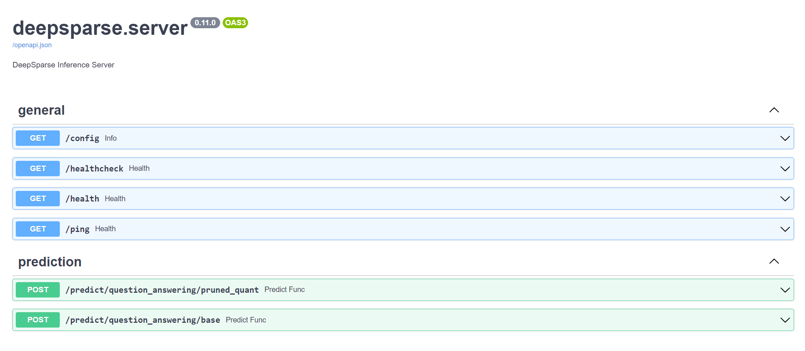

## DeepSparse Server 🔌

```bash
pip install deepsparse[server]
```

The DeepSparse inference server allows you to serve models and pipelines for deployment in HTTP. The server runs on top of the popular FastAPI web framework and Uvicorn web server.
The server supports any task from deepsparse. Pipeline including NLP, image classification, and object detection tasks.
An updated list of available tasks can be found
[here](https://github.com/neuralmagic/deepsparse/blob/main/PIPELINES.md)

 - Run `deepsparse.server --help` to lookup the available CLI arguments.

```
--host TEXT                     Bind socket to this host. Use --host 0.0.0.0
                                to make the application available on your
                                local network. IPv6 addresses are supported,
                                for example: --host '::'. Defaults to
                                0.0.0.0.

--port INTEGER                  Bind to a socket with this port. Defaults to
                                5543.

--workers INTEGER               Use multiple worker processes. Defaults to
                                1.

--log_level TEXT                Sets the logging level. Defaults to info.

--config_file TEXT              Configuration file containing info on how to
                                serve the desired models.

--task TEXT                     The task the model_path is serving. For
                                example, one of: question_answering,
                                text_classification, token_classification.
                                Ignored if config file is supplied.

--model_path TEXT               The path to a model.onnx file, a model
                                folder containing the model.onnx and
                                supporting files, or a SparseZoo model stub.
                                Ignored if config_file is supplied.

--batch_size INTEGER            The batch size to serve the model from
                                model_path with. Ignored if config_file is
                                supplied.

--help                          Show this message and exit.
```

### Single Model Inference

Example CLI command for serving a single model for the **question answering** task:

```bash
deepsparse.server \
    --task question_answering \
    --model_path "zoo:nlp/question_answering/bert-base/pytorch/huggingface/squad/12layer_pruned80_quant-none-vnni"
```

To make a request to your server, you can use the `requests` library and pass the request URL:

```python
import requests

url = "http://localhost:5543/predict"

obj = {
    "question": "Who is Mark?", 
    "context": "Mark is batman."
}

response = requests.post(url, json=obj)
```

In addition, you can also make a request with a `curl` command from terminal:

```bash
curl -X 'POST' \
  'http://localhost:5543/predict' \
  -H 'accept: application/json' \
  -H 'Content-Type: application/json' \
  -d '{
  "question": [
    "Who is Mark?"
  ],
  "context": [
    "Mark is batman."
  ]
}'
```
__ __
### Multiple Model Inference
To serve multiple models you can build a `config.yaml` file. 
In the sample YAML file below, we are defining two BERT models to be served by the `deepsparse.server` for the **question answering** task:

```yaml
models:
    - task: question_answering
      model_path: zoo:nlp/question_answering/bert-base/pytorch/huggingface/squad/base-none
      batch_size: 1
      alias: question_answering/base
    - task: question_answering
      model_path: zoo:nlp/question_answering/bert-base/pytorch/huggingface/squad/12layer_pruned80_quant-none-vnni
      batch_size: 1
      alias: question_answering/pruned_quant
```
You can now run the server with the config file path passed in the `--config_file` argument:

```bash
deepsparse.server --config_file config.yaml
```

You can can send requests to a specific model by appending the model's `alias` from the `config.yaml` to the end of the request url. For example, to call the second model, the alias would be `question_answering/pruned_quant`:

```python
import requests

url = "http://localhost:5543/predict/question_answering/pruned_quant"

obj = {
    "question": "Who is Mark?", 
    "context": "Mark is batman."
}

response = requests.post(url, json=obj)
```

💡 **PRO TIP** 💡: While your server is running, you can always use the awesome swagger UI that's built into FastAPI to view your model's pipeline `POST` routes.
The UI also enables you to easily make sample requests to your server.
All you need is to add `/docs` at the end of your host URL:

    localhost:5543/docs



