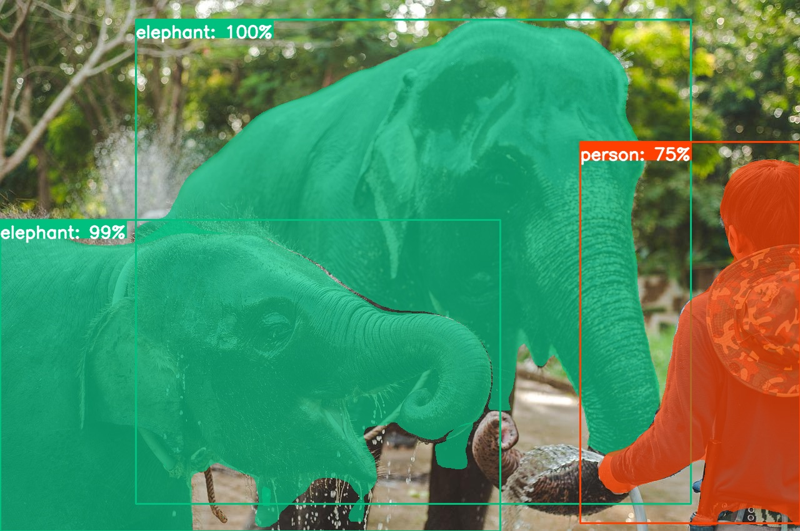

# YOLACT Inference Pipelines
DeepSparse allows accelerated inference, serving, and benchmarking of sparsified YOLACT models [YOLACT] ([original codebase](https://github.com/dbolya/yolact) and [paper](https://arxiv.org/abs/1904.02689)).  
This integration allows for leveraging the DeepSparse Engine to run the sparsified YOLACT inference with GPU-class performance directly on the CPU.

The DeepSparse Engine is taking advantage of sparsity within neural networks to 
reduce compute required as well as accelerate memory-bound workloads. The engine is particularly effective when leveraging sparsification
methods such as [pruning](https://neuralmagic.com/blog/pruning-overview/) and [quantization](https://arxiv.org/abs/1609.07061). 
These techniques result in significantly more performant and smaller models with limited to no effect on the baseline metrics. 


## Getting Started
Before you start your adventure with the DeepSparse Engine, make sure that your machine is 
compatible with our [hardware requirements](https://docs.neuralmagic.com/deepsparse/source/hardware.html).

### Installation

```pip install deepsparse```

### Model Format
By default, to deploy YOLACT using DeepSparse Engine it is required to supply the model in the ONNX format. 
This grants the engine the flexibility to serve any model in a framework-agnostic environment. 

Below we describe two possibilities to obtain the required ONNX model.

### Exporting the ONNX File From the Contents of a Local Directory
This pathway is relevant if you intend to deploy a model created using the [SparseML](https://github.com/neuralmagic/sparseml) library. 
For more information refer to the [appropriate YOLACT integration documentation in SparseML](https://github.com/neuralmagic/sparseml/tree/main/integrations/dbolya-yolact)

After training your model with `SparseML`, locate the `.pth` file for the model you'd like to export and run the `SparseML` integrated YOLACT ONNX export script below.

```bash
sparseml.yolact.export_onnx --checkpoint PATH_TO_YOLACT_PTH_CHECKPOINT
```
For additional options invoke the command-line callable with `--help` option like `sparseml.yolact.export_onnx --help`

####  SparseZoo Stub
Alternatively, you can skip the process of the ONNX model export by using Neural Magic's [SparseZoo](https://sparsezoo.neuralmagic.com/). The SparseZoo contains pre-sparsified models and SparseZoo stubs enable you to reference any model on the SparseZoo in a convenient and predictable way.
All of DeepSparse's pipelines and APIs can use a SparseZoo stub in place of a local folder. The Deployment APIs examples use SparseZoo stubs to highlight this pathway.

## Deployment APIs
DeepSparse provides both a Python Pipeline API and an out-of-the-box model server
that can be used for end-to-end inference in either existing Python workflows or as an HTTP endpoint.
Both options provide similar specifications for configurations and support annotation serving for all 
YOLACT models.

### Python Pipelines
Pipelines are the default interface for running inference with the DeepSparse Engine.

Once a model is obtained, either through SparseML training or directly from SparseZoo, `deepsparse.Pipeline` can be used to easily facilitate end-to-end inference and deployment of the sparsified neural networks.

If no model is specified to the Pipeline for a given task, the Pipeline will automatically select a pruned and quantized model for the task from the SparseZoo that can be used for accelerated inference. Note that other models in the SparseZoo will have different tradeoffs between speed, size, and accuracy.

### DeepSparse Server
As an alternative to Python API, the DeepSparse Server allows you to serve ONNX models and pipelines in HTTP.
Both configuring and making requests to the server follow the same parameters and schemas as the
Pipelines enabling simple deployment.  Once launched, a `/docs` endpoint is created with full
endpoint descriptions and support for making sample requests.

An example of starting and requesting a DeepSparse Server for YOLACT is given below.

#### Installation
The Deepsparse Server requirements can be installed by specifying the `server` extra dependency when installing
DeepSparse.

```bash
pip install deepsparse[server]
```

## Deployment Example
The following example uses pipelines to run a pruned and quantized YOLACT model for inference, downloaded by default from the SparseZoo. 
As input the pipeline ingests an image (or a list of images) and returns for each image the detection boxes, classification labels, probability scores and segmentation masks. 

[List of the YOLACT SparseZoo Models](
https://sparsezoo.neuralmagic.com/?domain=cv&sub_domain=segmentation&page=1)

If you don't have an image ready, pull a sample image down with

```bash
wget -O thailand.jpg https://raw.githubusercontent.com/neuralmagic/deepsparse/main/src/deepsparse/yolact/sample_images/thailand.jpg
```

```python
from deepsparse.pipeline import Pipeline

model_stub = "zoo:cv/segmentation/yolact-darknet53/pytorch/dbolya/coco/pruned82_quant-none"
images = ["thailand.jpg"]

yolact_pipeline = Pipeline.create(
    task="yolact",
    model_path=model_stub,
    class_names="coco",
)

predictions = yolact_pipeline(images=images, confidence_threshold=0.2,nms_threshold = 0.5)
# predictions has attributes `boxes`, `classes`, `masks` and `scores`
predictions.classes[0]
>> ['elephant', 'elephant', 'person', ...]

```

#### Annotate CLI
You can also use the annotate command to have the engine save an annotated photo on disk.
```bash
deepsparse.instance_segmentation.annotate --source thailand.jpg #Try --source 0 to annotate your live webcam feed
```

Running the above command will create an `annotation-results` folder and save the annotated image inside.

<p align = "center">
 
</p>
<p align = "center">
Image annotated with 82.8% sparse and quantized YOLACT
</p>

If a `--model_filepath` arg isn't provided, then `zoo:cv/segmentation/yolact-darknet53/pytorch/dbolya/coco/pruned82_quant-none` will be used by default.


#### HTTP Server
Spinning up:
```bash
deepsparse.server \
    --task yolact \
    --model_path "zoo:cv/segmentation/yolact-darknet53/pytorch/dbolya/coco/pruned82_quant-none"
```

Making a request:
```python
import requests
import json

url = 'http://0.0.0.0:5543/predict/from_files'
path = ['thailand.jpg'] # list of images for inference
files = [('request', open(img, 'rb')) for img in path]
resp = requests.post(url=url, files=files)
annotations = json.loads(resp.text) # dictionary of annotation results
boxes, classes, masks, scores = annotations["boxes"], annotations["classes"], annotations["masks"], annotations["scores"]
```

### Benchmarking
The mission of Neural Magic is to enable GPU-class inference performance on commodity CPUs. Want to find out how fast our sparse YOLOv5 ONNX models perform inference? 
You can quickly do benchmarking tests on your own with a single CLI command!

You only need to provide the model path of a SparseZoo ONNX model or your own local ONNX model to get started:

```bash
deepsparse.benchmark \
    zoo:cv/segmentation/yolact-darknet53/pytorch/dbolya/coco/pruned82_quant-none \
    --scenario sync 
```

Output:

```bash
2022-07-05 10:47:09 deepsparse.benchmark.benchmark_model INFO     Thread pinning to cores enabled
DeepSparse Engine, Copyright 2021-present / Neuralmagic, Inc. version: 0.13.0.20220628 (51925ae2) (release) (optimized) (system=avx2, binary=avx2)
2022-07-05 10:47:23 deepsparse.benchmark.benchmark_model INFO     num_streams default value chosen of 12. This requires tuning and may be sub-optimal
2022-07-05 10:47:23 deepsparse.benchmark.benchmark_model INFO     deepsparse.engine.Engine:
	onnx_file_path: /home/damian/.cache/sparsezoo/099e086b-1e84-450c-ab3b-90038c591554/model.onnx
	batch_size: 1
	num_cores: 24
	num_streams: 0
	scheduler: Scheduler.default
	cpu_avx_type: avx2
	cpu_vnni: False
2022-07-05 10:47:23 deepsparse.utils.onnx INFO     Generating input 'input', type = float32, shape = [1, 3, 550, 550]
2022-07-05 10:47:23 deepsparse.benchmark.benchmark_model INFO     Starting 'singlestream' performance measurements for 10 seconds
Original Model Path: zoo:cv/segmentation/yolact-darknet53/pytorch/dbolya/coco/pruned82_quant-none
Batch Size: 1
Scenario: sync
Throughput (items/sec): 26.8650
Latency Mean (ms/batch): 37.2062
Latency Median (ms/batch): 37.2043
Latency Std (ms/batch): 0.0741
Iterations: 269
```

To learn more about benchmarking, refer to the appropriate documentation.
Also, check out our [Benchmarking tutorial](https://github.com/neuralmagic/deepsparse/tree/main/src/deepsparse/benchmark)!

## Tutorials:
For a deeper dive into using YOLACT within the Neural Magic ecosystem, refer to the detailed tutorials on our [website](https://neuralmagic.com/use-cases/#computervision).

## Support
For Neural Magic Support, sign up or log in to our [Deep Sparse Community Slack](https://join.slack.com/t/discuss-neuralmagic/shared_invite/zt-q1a1cnvo-YBoICSIw3L1dmQpjBeDurQ). Bugs, feature requests, or additional questions can also be posted to our [GitHub Issue Queue](https://github.com/neuralmagic/deepsparse/issues).
