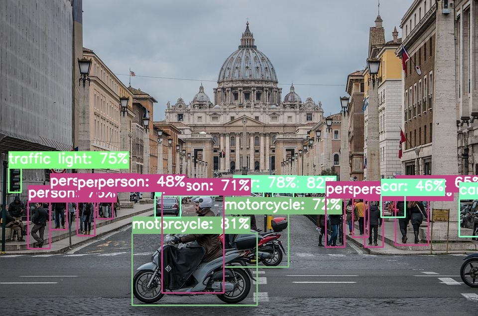

# YOLOv5 Inference Pipelines


DeepSparse allows accelerated inference, serving, and benchmarking of sparsified [Ultralytics YOLOv5](https://github.com/ultralytics/yolo) models.  
This integration allows for leveraging the DeepSparse Engine to run the sparsified YOLOv5 inference with GPU-class performance directly on the CPU.

The DeepSparse Engine is taking advantage of sparsity within neural networks to 
reduce compute required as well as accelerate memory-bound workloads. The engine is particularly effective when leveraging sparsification
methods such as [pruning](https://neuralmagic.com/blog/pruning-overview/) and [quantization](https://arxiv.org/abs/1609.07061). 
These techniques result in significantly more performant and smaller models with limited to no effect on the baseline metrics. 

This integration currently supports the original YOLOv5 and updated V6.1 architectures.

## Getting Started

Before you start your adventure with the DeepSparse Engine, make sure that your machine is 
compatible with our [hardware requirements](https://docs.neuralmagic.com/deepsparse/source/hardware.html).

### Installation

```pip install deepsparse[yolo]```

### Model Format
By default, to deploy YOLOv5 using DeepSparse Engine it is required to supply the model in the ONNX format. 
This grants the engine the flexibility to serve any model in a framework-agnostic environment. 

Below we describe two possibilities to obtain the required ONNX model.

### Exporting the ONNX File From the Contents of a Local Directory
This pathway is relevant if you intend to deploy a model created using the [SparseML](https://github.com/neuralmagic/sparseml) library. 
For more information refer to the [appropriate YOLOv5 integration documentation in SparseML](https://github.com/neuralmagic/sparseml/tree/main/src/sparseml/yolov5).

After training your model with `SparseML`, locate the `.pt` file for the model you'd like to export and run the `SparseML` integrated YOLOv5 ONNX export script below.

```bash
sparseml.yolov5.export_onnx \
    --weights path/to/your/model \
    --dynamic \ #Allows for dynamic input shape
```
This creates `model.onnx` file, in the directory of your `weights` (e.g. `runs/train/weights/model.onnx`).

####  SparseZoo Stub
Alternatively, you can skip the process of the ONNX model export by using Neural Magic's [SparseZoo](https://sparsezoo.neuralmagic.com/). The SparseZoo contains pre-sparsified models and SparseZoo stubs enable you to reference any model on the SparseZoo in a convenient and predictable way.
All of DeepSparse's pipelines and APIs can use a SparseZoo stub in place of a local folder. The Deployment APIs examples use SparseZoo stubs to highlight this pathway.
## Deployment APIs

DeepSparse provides both a Python Pipeline API and an out-of-the-box model server
that can be used for end-to-end inference in either existing Python workflows or as an HTTP endpoint.
Both options provide similar specifications for configurations and support annotation serving for all 
YOLOv5 models.

### Python Pipelines
Pipelines are the default interface for running inference with the DeepSparse Engine.

Once a model is obtained, either through SparseML training or directly from SparseZoo, `deepsparse.Pipeline` can be used to easily facilitate end-to-end inference and deployment of the sparsified transformers model.

If no model is specified to the Pipeline for a given task, the Pipeline will automatically select a pruned and quantized model for the task from the SparseZoo that can be used for accelerated inference. Note that other models in the SparseZoo will have different tradeoffs between speed, size, and accuracy.

### DeepSparse Server
As an alternative to Python API, the DeepSparse Server allows you to serve ONNX models and pipelines in HTTP.
Both configuring and making requests to the server follow the same parameters and schemas as the
Pipelines enabling simple deployment.  Once launched, a `/docs` endpoint is created with full
endpoint descriptions and support for making sample requests.

An example of starting and requesting a DeepSparse Server for YOLOv5 is given below.

#### Installation
The Deepsparse Server requirements can be installed by specifying the `server` extra dependency when installing
DeepSparse.

```bash
pip install deepsparse[yolo,server]
```

## Deployment Example
The follow example uses pipelines to run a pruned and quantized YOLOv5l model for inference, downloaded by default from the SparseZoo. As input the pipeline ingests a list of images and returns for each image the detection boxes in numeric form. 

[List of the YOLOv5 SparseZoo Models](
https://sparsezoo.neuralmagic.com/?domain=cv&sub_domain=detection&page=1)

If you don't have an image ready, pull a sample image down with

```
wget -O basilica.jpg https://raw.githubusercontent.com/neuralmagic/deepsparse/main/src/deepsparse/yolo/sample_images/bascilica.jpg
```

```python
from deepsparse.pipeline import Pipeline

model_stub = "zoo:cv/detection/yolov5-l/pytorch/ultralytics/coco/pruned-aggressive_98"
images = ["basilica.jpg"]

yolo_pipeline = Pipeline.create(
    task="yolo",
    model_path=model_stub,
)

pipeline_outputs = yolo_pipeline(images=images, iou_thres=0.6, conf_thres=0.001)
```

#### Annotate CLI
You can also use the annotate command to have the engine save an annotated photo on disk.
```bash
deepsparse.object_detection.annotate --source basilica.jpg #Try --source 0 to annotate your live webcam feed
```

Running the above command will create an `annotation-results` folder and save the annotated image inside.

<p align = "center">
 
</p>
<p align = "center">
Image annotated with 96% sparse YOLOv5s
</p>

If a `--model_filepath` arg isn't provided, then `zoo:cv/detection/yolov5-s/pytorch/ultralytics/coco/pruned-aggressive_96` will be used by default.


#### HTTP Server
Spinning up:
```bash
deepsparse.server \
    --task yolo \
    --model_path "zoo:cv/detection/yolov5-s/pytorch/ultralytics/coco/pruned_quant-aggressive_94"
```

Once the server is running, it will print a local address to the terminal which you can use in your browser to access the server GUI. You can use the interface to upload images
for inference. 

Alternatively, you can use the following bash command to upload the images, with an additional `-F 'request=@...` line for each image:

```bash
curl -X 'POST' \
  'http://localhost:5543/predict/from_files' \
  -H 'accept: application/json' \
  -H 'Content-Type: multipart/form-data' \
  -F 'request=@basilica.jpg;type=image/jpeg'
```

### Benchmarking
The mission of Neural Magic is to enable GPU-class inference performance on commodity CPUs. Want to find out how fast our sparse YOLOv5 ONNX models perform inference? 
You can quickly do benchmarking tests on your own with a single CLI command!

You only need to provide the model path of a SparseZoo ONNX model or your own local ONNX model to get started:

```bash
deepsparse.benchmark \
    zoo:cv/detection/yolov5-s/pytorch/ultralytics/coco/pruned_quant-aggressive_94 \
    --scenario sync 

>> Original Model Path: zoo:cv/detection/yolov5-s/pytorch/ultralytics/coco/pruned_quant-aggressive_94
>> Batch Size: 1
>> Scenario: sync
>> Throughput (items/sec): 74.0355
>> Latency Mean (ms/batch): 13.4924
>> Latency Median (ms/batch): 13.4177
>> Latency Std (ms/batch): 0.2166
>> Iterations: 741
```

To learn more about benchmarking, refer to the appropriate documentation.
Also, check out our [Benchmarking tutorial](https://github.com/neuralmagic/deepsparse/tree/main/src/deepsparse/benchmark)!

## Tutorials:
For a deeper dive into using YOLOv5 within the Neural Magic ecosystem, refer to the detailed tutorials on our [website](https://neuralmagic.com/use-cases/#computervision).

## Support
For Neural Magic Support, sign up or log in to our [Deep Sparse Community Slack](https://join.slack.com/t/discuss-neuralmagic/shared_invite/zt-q1a1cnvo-YBoICSIw3L1dmQpjBeDurQ). Bugs, feature requests, or additional questions can also be posted to our [GitHub Issue Queue](https://github.com/neuralmagic/deepsparse/issues).